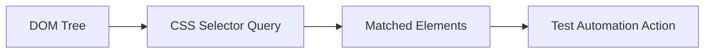

## Introduction
CSS (Cascading Style Sheets) Selectors are powerful patterns used to select and style HTML elements. In test automation, CSS selectors provide a fast, readable, and maintainable way to locate web elements. This comprehensive guide will take you from basic CSS selector concepts to advanced techniques used by expert test automation engineers.

### Why CSS Selectors for Test Automation?
- **Fast Performance**: CSS selectors are generally faster than XPath in most browsers
- **Readable Syntax**: Cleaner and more concise than XPath for many common patterns
- **Native Browser Support**: Built into all modern browsers' rendering engines
- **Framework Support**: Supported by all major test automation tools (Selenium, Playwright, Cypress, Puppeteer)
- **Familiar to Developers**: Uses same syntax as CSS styling, making collaboration easier

### CSS Selectors in Test Automation Tools
CSS selectors are supported across all major test automation frameworks:
- **Selenium WebDriver**: `driver.findElement(By.cssSelector("input#username"))`
- **Playwright**: `await page.locator("input#username")`
- **Cypress**: `cy.get("input#username")`
- **Puppeteer**: `await page.$("input#username")`

### CSS Selectors vs XPath
| Feature | CSS Selectors | XPath |
| --- | --- | --- |
| Performance | Faster | Slower |
| Readability | More readable | More verbose |
| Parent Navigation | Not supported | Supported |
| Text Content | Limited support | Full support |
| Attribute Matching | Excellent | Excellent |
| Browser Support | Native | Via JavaScript |

---
