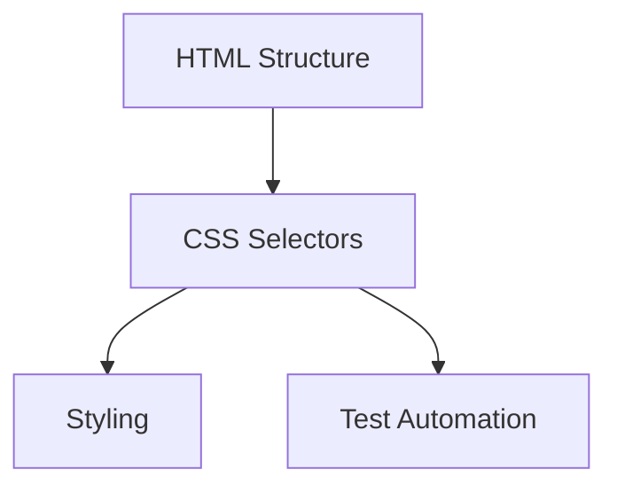

## Chapter 1: Foundations of CSS Selectors

### 1.1 Understanding CSS in Web Development
CSS selectors were originally designed to apply styles to HTML elements. The same patterns used for styling are perfectly suited for locating elements in test automation.

**Key Concepts:**
- HTML elements have tags, attributes, and hierarchical relationships
- CSS selectors use patterns to match elements based on their properties
- Selectors can match single or multiple elements
- The browser's CSS engine is highly optimized for performance

### 1.2 CSS Selector Levels
CSS has evolved through multiple specifications:
- **CSS1** (1996): Basic selectors
- **CSS2** (1998): Added pseudo-classes and combinators
- **CSS3** (Current): Advanced selectors including attribute operators and structural pseudo-classes
- **CSS4** (Draft): Future enhancements

Most test automation tools support CSS3 selectors, which provide all the power needed for element location.

### 1.3 Basic Selector Types
CSS selectors can be categorized into several types:
1. **Type Selectors**: Select by tag name (`div`, `input`, `button`)
2. **Class Selectors**: Select by class attribute (`.className`)
3. **ID Selectors**: Select by ID attribute (`#elementId`)
4. **Attribute Selectors**: Select by any attribute (`[type="text"]`)
5. **Pseudo-class Selectors**: Select by state (`:hover`, `:nth-child()`)
6. **Combinators**: Define relationships between selectors (`>`, `+`, `~`)

---
