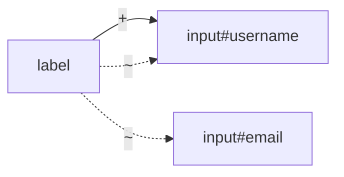

## Chapter 3: Intermediate CSS Selector Techniques

### 3.1 Attribute Selector Variations

**Partial Attribute Match (Contains)**
```css
[class*="btn"]              /* Class contains "btn" */
[id*="user"]                /* ID contains "user" */
[href*="google"]            /* Href contains "google" */
```

**Attribute Starts With**
```css
[class^="btn-"]             /* Class starts with "btn-" */
[id^="user"]                /* ID starts with "user" */
[href^="https"]             /* Href starts with "https" */
```

**Attribute Ends With**
```css
[class$="primary"]          /* Class ends with "primary" */
[src$=".jpg"]               /* Src ends with ".jpg" */
[href$=".pdf"]              /* Href ends with ".pdf" */
```

**Attribute Contains Word (Space-separated)**
```css
[class~="active"]           /* Class contains word "active" */
```
This matches `class="item active"` but not `class="item-active"`.

**Attribute Value with Dash Prefix**
```css
[lang|="en"]                /* lang="en" or lang="en-US" */
```

### 3.2 Descendant and Child Combinators

**Descendant Combinator (Space)**
```css
div input                   /* Input anywhere inside div */
form .error                 /* Element with class "error" inside form */
.container button           /* Button anywhere inside container */
```

**Direct Child Combinator (>)**
```css
div > input                 /* Input that is direct child of div */
form > .row                 /* Element with class "row" as direct child of form */
ul > li                     /* List items that are direct children of ul */
```

**Example showing the difference:**
```html
<div class="parent">
  <input id="direct" type="text">
  <div class="child">
    <input id="nested" type="text">
  </div>
</div>
```
```css
.parent input               /* Matches both #direct and #nested */
.parent > input             /* Matches only #direct */
```

### 3.3 Sibling Combinators

**Adjacent Sibling Combinator (+)**
```css
label + input               /* Input immediately after label */
h2 + p                      /* Paragraph immediately after h2 */
.error + button             /* Button immediately after element with class "error" */
```

**General Sibling Combinator (~)**
```css
label ~ input               /* All inputs that are siblings after label */
h2 ~ p                      /* All paragraphs that are siblings after h2 */
```

**Example:**
```html
<form>
  <label for="username">Username</label>
  <input id="username" type="text">
  <input id="email" type="email">
  <button type="submit">Submit</button>
</form>
```
```css
label + input               /* Matches #username only */
label ~ input               /* Matches both #username and #email */
```



### 3.4 Combining Multiple Selectors

**Intersection (No space between)**
```css
div.card.active             /* Div with both "card" and "active" classes */
input[type="text"].error    /* Text input with "error" class */
button#submit.btn.disabled  /* Button with specific ID, classes, and disabled */
```

**Complex Combinations**
```css
form.login div.form-group > input[type="text"]
/* Text input that is direct child of div.form-group inside form.login */

.container > .row .col-md-6 input[required]
/* Required input inside .col-md-6 inside .row (direct child of .container) */
```

---
