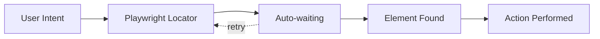

## Introduction

Playwright is a modern test automation framework that provides powerful, resilient, and user-centric locator strategies. Unlike traditional approaches that rely heavily on XPath or CSS selectors, Playwright prioritizes locators based on how users interact with web applications—by role, text, and label.

### Why Playwright Locators?

- **Auto-waiting**: Built-in smart waiting eliminates most timing issues
- **Auto-retry**: Automatically retries assertions and actions
- **User-centric**: Focus on how users interact with elements (roles, labels, text)
- **Resilient**: Less brittle than traditional selectors
- **Powerful filtering**: Chain and filter locators for precise targeting
- **Shadow DOM support**: First-class support for modern web components
- **Accessibility-first**: Encourages accessible web practices



### Playwright Philosophy

Playwright encourages you to think like a user, not like a developer inspecting the DOM. Instead of:
```javascript
// Traditional approach
await page.locator('#submit-btn-123').click();
```

Playwright recommends:
```javascript
// User-centric approach
await page.getByRole('button', { name: 'Submit' }).click();
```

### Framework Comparison

| Feature | Playwright | Selenium | Cypress |
| --- | --- | --- | --- |
| Auto-waiting | ✅ Built-in | ❌ Manual | ✅ Built-in |
| Role-based locators | ✅ Yes | ❌ No | ⚠️ Limited |
| Shadow DOM | ✅ Native | ⚠️ Complex | ⚠️ Limited |
| Multiple browsers | ✅ All major | ✅ All major | ⚠️ Limited |
| Auto-retry | ✅ Yes | ❌ No | ✅ Yes |
| Performance | ⚡ Fast | Medium | ⚡ Fast |

### Playwright in Test Automation Tools

Playwright is a complete framework, typically used standalone:
- **Playwright Test**: `import { test, expect } from '@playwright/test';`
- **With Jest**: `import { chromium } from 'playwright';`
- **With Cucumber**: Combined with @cucumber/cucumber for BDD
- **Component Testing**: `@playwright/experimental-ct-react` for React components

---