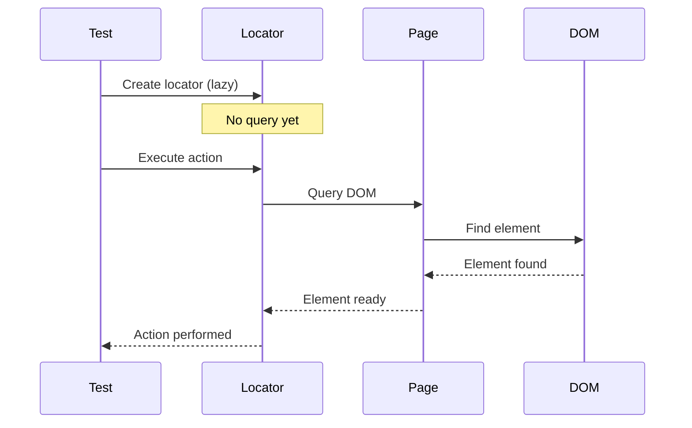
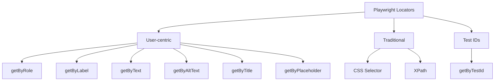

## Chapter 1: Foundations of Playwright Locators

### 1.1 What is a Locator?

A Playwright Locator represents a way to find element(s) on the page. Locators are the central piece of Playwright's auto-waiting and retry-ability. They are **strict** by default, meaning they throw an error if more than one element matches.

**Key Characteristics:**
- **Lazy**: Created instantly, but queries run only when needed
- **Strict**: Ensures single element match by default
- **Resilient**: Auto-waits and retries
- **Composable**: Can be chained and filtered

```javascript
// Creating a locator (lazy - doesn't query yet)
const submitButton = page.getByRole('button', { name: 'Submit' });

// Querying happens when action is performed
await submitButton.click(); // NOW the query runs
```



### 1.2 Locator vs ElementHandle

**Locators (Recommended):**
```javascript
// Locator - resilient, auto-waits, retries
const button = page.getByRole('button', { name: 'Submit' });
await button.click(); // Auto-waits for element
```

**ElementHandles (Legacy, Avoid):**
```javascript
// ElementHandle - reference to DOM node (brittle)
const button = await page.$('button'); // Immediate query
await button.click(); // May be stale
```

**Why Locators are Better:**
- Auto-waiting for element to be actionable
- Auto-retry on failures
- No stale element issues
- Better error messages
- Encourages modern practices

**Comparison Table:**

| Feature | Locator | ElementHandle |
| --- | --- | --- |
| Evaluation | Lazy (on action) | Immediate |
| Auto-waiting | ✅ Yes | ❌ No |
| Auto-retry | ✅ Yes | ❌ No |
| Stale element | ✅ Never | ❌ Common |
| Error messages | Clear & helpful | Generic |
| Recommended | ✅ Always | ❌ Legacy only |

### 1.3 Strict Mode

By default, Playwright locators are strict—they require exactly one matching element.

```javascript
// If multiple buttons exist, this throws an error
await page.getByRole('button').click(); 
// Error: strict mode violation: locator resolved to 3 elements

// Solutions:
// 1. Make locator more specific
await page.getByRole('button', { name: 'Submit' }).click();

// 2. Use first() for first match
await page.getByRole('button').first().click();

// 3. Use nth() for specific position
await page.getByRole('button').nth(1).click();

// 4. Use filter to narrow down
await page.getByRole('button').filter({ hasText: 'Submit' }).click();
```

**Why Strict Mode?**
- Prevents accidental interactions with wrong elements
- Makes tests more explicit and readable
- Catches bugs early in development
- Encourages writing precise locators

### 1.4 Playwright Locator Types

Playwright provides multiple locator strategies:

1. **Recommended (User-centric)**
   - `getByRole()` - By ARIA role
   - `getByLabel()` - By form label
   - `getByPlaceholder()` - By input placeholder
   - `getByText()` - By text content
   - `getByAltText()` - By image alt text
   - `getByTitle()` - By title attribute

2. **CSS and XPath**
   - `locator()` - CSS or XPath selectors

3. **Test IDs**
   - `getByTestId()` - By data-testid attribute



### 1.5 Understanding Auto-waiting

Playwright automatically waits for elements to be actionable before performing actions. This eliminates the need for explicit waits in most cases.

**What Playwright Waits For:**
- Element is attached to DOM
- Element is visible
- Element is stable (not animating)
- Element receives events (not obscured)
- Element is enabled (for form controls)

```javascript
// No explicit wait needed!
await page.getByRole('button', { name: 'Submit' }).click();

// Playwright automatically:
// 1. Waits for button to be attached to DOM
// 2. Waits for button to be visible
// 3. Waits for button to stop animating
// 4. Waits for button not to be obscured
// 5. Waits for button to be enabled
// 6. Then clicks
```

**Default Timeouts:**
- Action timeout: 30 seconds
- Navigation timeout: 30 seconds
- Custom timeout: Configure per action or globally

```javascript
// Custom timeout for specific action
await page.getByRole('button').click({ timeout: 10000 }); // 10 seconds

// Configure globally
// playwright.config.ts
use: {
  actionTimeout: 15000, // 15 seconds for all actions
}
```

---