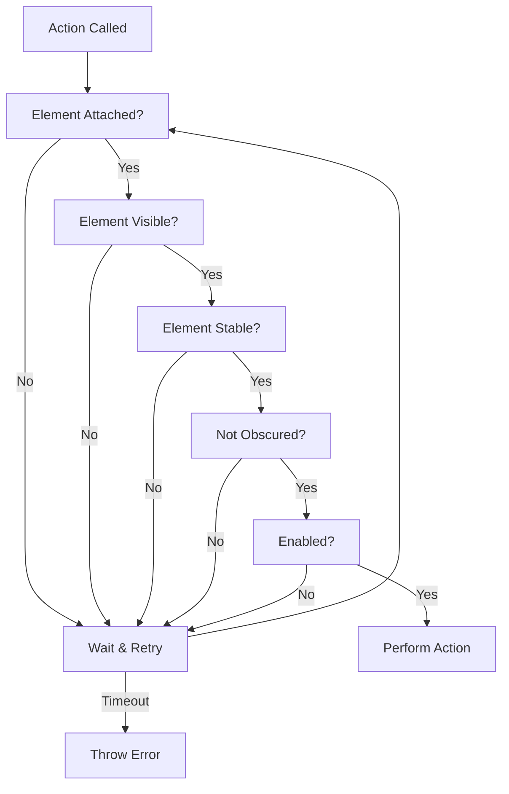

## Chapter 6: Assertions and Auto-waiting

### 6.1 Understanding Auto-waiting

**What is Auto-waiting?**

Auto-waiting is Playwright's built-in mechanism that automatically waits for elements to be ready before performing actions. This eliminates the need for explicit waits in most cases.

**What Playwright Waits For:**

Before performing any action, Playwright automatically waits for elements to:

1. **Be attached to DOM** - Element exists in the page structure
2. **Be visible** - Element is not hidden (display: none, visibility: hidden, or opacity: 0)
3. **Be stable** - Element is not animating or moving
4. **Receive events** - Element is not covered by other elements
5. **Be enabled** - Element is not disabled (for form controls)

**Actions with Auto-waiting:**

All these actions have built-in auto-waiting:
- `click()`, `dblclick()`, `tap()`
- `fill()`, `type()`, `press()`
- `check()`, `uncheck()`
- `selectOption()`
- `setInputFiles()`
- `hover()`, `focus()`
- `dragTo()`

**Example:**

```javascript
// Traditional approach (Selenium-style)
await page.waitForSelector('#button');
await page.waitForElementToBeVisible('#button');
await page.waitForElementToBeEnabled('#button');
await page.click('#button');

// Playwright approach
await page.getByRole('button').click();  // All waiting automatic!
```

**Auto-waiting Flow:**



**Real Examples:**

```javascript
// Example 1: Button that appears after AJAX call
await page.getByRole('button', { name: 'Load More' }).click();
// Playwright waits for:
// - Button to exist
// - Button to be visible  
// - Button to stop animating
// - Button to be clickable
// Then clicks

// Example 2: Form that becomes enabled after validation
await page.getByLabel('Email').fill('user@example.com');
await page.getByLabel('Password').fill('password123');
await page.getByRole('button', { name: 'Submit' }).click();
// Playwright waits for button to be enabled before clicking

// Example 3: Modal that animates in
await page.getByRole('button', { name: 'Open Modal' }).click();
await page.getByRole('dialog').getByRole('button', { name: 'Confirm' }).click();
// Playwright waits for dialog to:
// - Appear
// - Stop animating
// - Button inside to be clickable
```

**Default Timeouts:**

- **Action timeout**: 30 seconds (default)
- **Navigation timeout**: 30 seconds (default)
- **Assertion timeout**: 5 seconds (default)

**Custom Timeouts:**

```javascript
// Per-action timeout
await page.getByRole('button').click({ timeout: 10000 });  // 10 seconds

// Global configuration (playwright.config.ts)
export default {
  use: {
    actionTimeout: 10000,  // 10 seconds for all actions
    navigationTimeout: 30000,  // 30 seconds for navigation
  },
  expect: {
    timeout: 5000,  // 5 seconds for assertions
  }
};
```

**When Auto-waiting May Not Be Enough:**

```javascript
// Scenario: Element exists but data is loading
await page.getByRole('table').waitFor({ state: 'visible' });
await page.locator('.loading-spinner').waitFor({ state: 'hidden' });  // Wait for loading
await page.getByRole('row').first().click();  // Now safe to interact

// Scenario: Complex animation or transition
await page.getByRole('dialog').waitFor({ state: 'visible' });
await page.waitForTimeout(300);  // Allow CSS animation to complete
await page.getByRole('dialog').getByRole('button').click();
```

**Benefits of Auto-waiting:**

✅ **Less code** - No explicit waits needed  
✅ **More reliable** - Handles timing issues automatically  
✅ **Better errors** - Clear messages when waits timeout  
✅ **Faster tests** - Only waits as long as needed  
✅ **Easier maintenance** - Less brittle timing logic  

### 6.2 Built-in Assertions (20+ assertion methods)

Playwright Test provides auto-retrying assertions through `expect()`. These assertions automatically wait and retry until the condition is met or timeout occurs.

**Import:**
```javascript
import { test, expect } from '@playwright/test';
```

**Visibility Assertions:**

```javascript
// Element is visible
await expect(page.getByRole('button')).toBeVisible();
await expect(page.getByText('Welcome')).toBeVisible();
await expect(page.locator('.modal')).toBeVisible();

// Element is hidden
await expect(page.locator('.loading')).toBeHidden();
await expect(page.getByRole('dialog')).toBeHidden();
await expect(page.getByText('Error')).not.toBeVisible();

// With timeout
await expect(page.getByRole('alert')).toBeVisible({ timeout: 10000 });

// With custom message
await expect(page.getByText('Success')).toBeVisible({
  timeout: 5000,
  message: 'Success message should appear after form submission'
});
```

**Text Content Assertions:**

```javascript
// Exact text match
await expect(page.getByRole('heading')).toHaveText('Welcome to Playwright');
await expect(page.locator('.message')).toHaveText('Operation completed');

// Regex match (case-insensitive)
await expect(page.getByRole('heading')).toHaveText(/welcome/i);
await expect(page.locator('.price')).toHaveText(/\$\d+\.\d{2}/);

// Contains text (substring)
await expect(page.getByRole('main')).toContainText('Products');
await expect(page.locator('p')).toContainText('important information');

// Array of expected texts (for multiple elements)
await expect(page.getByRole('listitem')).toHaveText([
  'Item 1',
  'Item 2',
  'Item 3'
]);

// Partial array match
await expect(page.getByRole('listitem')).toContainText([
  'Item 1',
  'Item 3'
]);
```

**Input Value Assertions:**

```javascript
// Has specific value
await expect(page.getByLabel('Username')).toHaveValue('admin');
await expect(page.locator('input[name="email"]')).toHaveValue('user@example.com');

// Regex match
await expect(page.getByLabel('Phone')).toHaveValue(/\d{3}-\d{3}-\d{4}/);

// Empty value
await expect(page.getByLabel('Search')).toHaveValue('');

// Not empty
await expect(page.getByLabel('Required Field')).not.toHaveValue('');
```

**Attribute Assertions:**

```javascript
// Has specific attribute value
await expect(page.getByRole('link')).toHaveAttribute('href', '/home');
await expect(page.locator('button')).toHaveAttribute('type', 'submit');
await expect(page.getByRole('img')).toHaveAttribute('alt', 'Logo');

// Attribute with regex
await expect(page.getByRole('link')).toHaveAttribute('href', /\/products\/.+/);

// Has attribute (regardless of value)
await expect(page.locator('button')).toHaveAttribute('disabled');
await expect(page.locator('input')).toHaveAttribute('required');

// Multiple attributes
await expect(page.locator('input')).toHaveAttribute('type', 'text');
await expect(page.locator('input')).toHaveAttribute('maxlength', '50');
```

**Class Assertions:**

```javascript
// Has specific class string
await expect(page.getByRole('button')).toHaveClass('btn btn-primary active');

// Contains class (regex)
await expect(page.getByRole('button')).toHaveClass(/active/);
await expect(page.locator('div')).toHaveClass(/container/);

// Has multiple classes
await expect(page.locator('div')).toHaveClass('card shadow-lg rounded-lg');

// Does not have class
await expect(page.getByRole('button')).not.toHaveClass(/disabled/);
```

**Count Assertions:**

```javascript
// Exact count
await expect(page.getByRole('button')).toHaveCount(5);
await expect(page.locator('.product-card')).toHaveCount(20);

// Count with JavaScript comparison
const count = await page.getByRole('listitem').count();
expect(count).toBeGreaterThan(0);
expect(count).toBeLessThan(100);
expect(count).toBeGreaterThanOrEqual(10);
expect(count).toBeLessThanOrEqual(50);

// No elements
await expect(page.getByText('Error')).toHaveCount(0);
```

**State Assertions:**

```javascript
// Enabled/Disabled
await expect(page.getByRole('button')).toBeEnabled();
await expect(page.getByRole('button', { name: 'Submit' })).toBeDisabled();
await expect(page.locator('input')).not.toBeDisabled();

// Checked (checkbox/radio)
await expect(page.getByRole('checkbox')).toBeChecked();
await expect(page.getByRole('checkbox', { name: 'I agree' })).toBeChecked();
await expect(page.getByRole('radio', { name: 'Option 1' })).not.toBeChecked();

// Editable
await expect(page.getByLabel('Email')).toBeEditable();
await expect(page.getByLabel('Read-only Field')).not.toBeEditable();

// Focused
await expect(page.getByLabel('Search')).toBeFocused();
await expect(page.getByLabel('Username')).not.toBeFocused();

// Attached to DOM
await expect(page.getByRole('dialog')).toBeAttached();
await expect(page.locator('.modal')).not.toBeAttached();

// In viewport
await expect(page.getByRole('heading')).toBeInViewport();
await expect(page.locator('footer')).not.toBeInViewport();
```

**CSS Assertions:**

```javascript
// Has CSS property
await expect(page.locator('button')).toHaveCSS('color', 'rgb(255, 0, 0)');
await expect(page.getByRole('heading')).toHaveCSS('font-size', '24px');
await expect(page.locator('.card')).toHaveCSS('display', 'flex');

// Background color
await expect(page.locator('.error')).toHaveCSS('background-color', 'rgb(255, 0, 0)');

// Border
await expect(page.locator('input:focus')).toHaveCSS('border-color', 'rgb(0, 123, 255)');
```

**ID Assertions:**

```javascript
// Has specific ID
await expect(page.getByRole('button')).toHaveId('submit-btn');
await expect(page.locator('div')).toHaveId(/modal-\d+/);
```

**JavaScript Property Assertions:**

```javascript
// Has JS property
await expect(page.getByRole('checkbox')).toHaveJSProperty('checked', true);
await expect(page.locator('input')).toHaveJSProperty('value', 'test');
await expect(page.locator('select')).toHaveJSProperty('selectedIndex', 0);
```

**URL and Title Assertions:**

```javascript
// Page URL
await expect(page).toHaveURL('https://example.com/products');
await expect(page).toHaveURL(/.*products.*/);
await expect(page).not.toHaveURL(/.*login/);

// Page title
await expect(page).toHaveTitle('Products | Example Store');
await expect(page).toHaveTitle(/Products/);
```

**Screenshot Assertions (Visual Regression):**

```javascript
// Compare screenshot
await expect(page).toHaveScreenshot('homepage.png');

// Compare element screenshot
await expect(page.getByRole('button')).toHaveScreenshot('button.png');

// With options
await expect(page).toHaveScreenshot('page.png', {
  maxDiffPixels: 100,
  threshold: 0.2
});
```

### 6.3 Soft Assertions

Soft assertions don't immediately fail the test - they collect all failures and report them at the end.

**When to Use:**
- Validating multiple independent properties
- Comprehensive UI validation
- Non-critical checks
- Collecting all issues in one run

**Syntax:**

```javascript
// Soft assertion (test continues even if it fails)
await expect.soft(page.getByRole('heading')).toHaveText('Welcome');
await expect.soft(page.locator('.price')).toBeVisible();
await expect.soft(page.getByRole('button')).toBeEnabled();

// Hard assertion (test stops if it fails)
await expect(page).toHaveURL('/dashboard');
```

**Complete Example:**

```javascript
test('validate product page with soft assertions', async ({ page }) => {
  await page.goto('https://example.com/product/123');
  
  // Soft assertions - test continues even if these fail
  await expect.soft(page.getByRole('heading')).toHaveText('iPhone 15 Pro');
  await expect.soft(page.locator('.product-price')).toHaveText('$999');
  await expect.soft(page.locator('.product-rating')).toBeVisible();
  await expect.soft(page.locator('.product-stock')).toContainText('In Stock');
  await expect.soft(page.getByRole('button', { name: 'Add to Cart' })).toBeEnabled();
  await expect.soft(page.locator('.product-description')).toContainText('smartphone');
  
  // Hard assertion - test stops here if it fails
  await expect(page.getByRole('img', { name: /product/i })).toBeVisible();
  
  // This runs only if hard assertion passed
  await page.getByRole('button', { name: 'Add to Cart' }).click();
});
```

**Output with Soft Assertion Failures:**

```
✗ validate product page with soft assertions
  - Expected "iPhone 15" but got "iPhone 14"  [soft]
  - Expected "$999" but got "$899"  [soft]
  - Expected element to be visible  [soft]
  ✓ Product image is visible
  ✗ Test failed with 3 soft assertion failures
```

**Use Cases:**

```javascript
// Validate form fields
test('validate registration form', async ({ page }) => {
  await page.goto('/register');
  
  await expect.soft(page.getByLabel('First Name')).toBeVisible();
  await expect.soft(page.getByLabel('Last Name')).toBeVisible();
  await expect.soft(page.getByLabel('Email')).toBeVisible();
  await expect.soft(page.getByLabel('Password')).toBeVisible();
  await expect.soft(page.getByLabel('Confirm Password')).toBeVisible();
  await expect.soft(page.getByLabel('Phone')).toBeVisible();
  await expect.soft(page.getByLabel('Terms')).toBeVisible();
  
  // All failures reported together
});

// Validate navigation menu
test('validate nav menu items', async ({ page }) => {
  await page.goto('/');
  
  const nav = page.getByRole('navigation');
  await expect.soft(nav.getByRole('link', { name: 'Home' })).toBeVisible();
  await expect.soft(nav.getByRole('link', { name: 'Products' })).toBeVisible();
  await expect.soft(nav.getByRole('link', { name: 'About' })).toBeVisible();
  await expect.soft(nav.getByRole('link', { name: 'Contact' })).toBeVisible();
  await expect.soft(nav.getByRole('link', { name: 'Cart' })).toBeVisible();
});
```

### 6.4 Negation Assertions

Use `.not` to invert any assertion.

```javascript
// Element not visible
await expect(page.getByRole('dialog')).not.toBeVisible();
await expect(page.locator('.error-message')).not.toBeVisible();

// Text not present
await expect(page.getByText('Error occurred')).not.toBeVisible();
await expect(page.locator('.message')).not.toHaveText('Failed');

// Value not equal
await expect(page.getByLabel('Status')).not.toHaveValue('inactive');

// Not checked
await expect(page.getByRole('checkbox', { name: 'Optional' })).not.toBeChecked();

// Not disabled
await expect(page.getByRole('button', { name: 'Submit' })).not.toBeDisabled();

// Not in DOM
await expect(page.locator('.temporary-notification')).not.toBeAttached();

// Not have class
await expect(page.getByRole('button')).not.toHaveClass(/disabled/);

// URL does not match
await expect(page).not.toHaveURL(/.*error/);
```

**Combined with Soft Assertions:**

```javascript
test('validate clean state', async ({ page }) => {
  await page.goto('/');
  
  // Verify no error states
  await expect.soft(page.getByText(/error/i)).not.toBeVisible();
  await expect.soft(page.locator('.error-banner')).not.toBeVisible();
  await expect.soft(page.locator('.alert-danger')).not.toBeAttached();
  
  // Verify no loading states
  await expect.soft(page.locator('.loading-spinner')).not.toBeVisible();
  await expect.soft(page.getByText('Loading...')).not.toBeVisible();
  
  // Verify form is not disabled
  await expect.soft(page.getByRole('button', { name: 'Submit' })).not.toBeDisabled();
});
```

### 6.5 Custom Assertions

Create reusable assertion patterns for common validation scenarios.

**Simple Custom Assertions:**

```javascript
// Function-based custom assertion
async function expectValidEmail(locator) {
  const value = await locator.inputValue();
  expect(value).toMatch(/^[^\s@]+@[^\s@]+\.[^\s@]+$/);
  await expect(locator).toBeEditable();
  await expect(locator).not.toHaveAttribute('aria-invalid', 'true');
}

// Usage
await expectValidEmail(page.getByLabel('Email'));
```

**Complex Custom Assertions:**

```javascript
// Validate product card
async function expectValidProductCard(card) {
  await expect.soft(card.locator('.product-name')).toBeVisible();
  await expect.soft(card.locator('.product-price')).toBeVisible();
  await expect.soft(card.locator('.product-image')).toBeVisible();
  await expect.soft(card.getByRole('button', { name: /add to cart/i })).toBeEnabled();
  
  const price = await card.locator('.product-price').textContent();
  expect(price).toMatch(/\$\d+(\.\d{2})?/);
}

// Usage
const products = await page.locator('.product-card').all();
for (const product of products) {
  await expectValidProductCard(product);
}
```

**Form Validation Assertions:**

```javascript
async function expectValidForm(formLocator) {
  // Check all required fields filled
  const requiredInputs = await formLocator.locator('input[required]').all();
  for (const input of requiredInputs) {
    const value = await input.inputValue();
    expect(value.length).toBeGreaterThan(0);
  }
  
  // Check submit button enabled
  await expect(formLocator.getByRole('button', { name: /submit/i })).toBeEnabled();
  
  // Check no error messages
  await expect(formLocator.locator('.error-message')).toHaveCount(0);
}

// Usage
await expectValidForm(page.locator('form.registration'));
```

**User Profile Assertions:**

```javascript
async function expectCompleteProfile(page) {
  await expect(page.getByLabel('First Name')).not.toHaveValue('');
  await expect(page.getByLabel('Last Name')).not.toHaveValue('');
  await expect(page.getByLabel('Email')).toHaveValue(/@/);
  await expect(page.locator('.profile-avatar')).toBeVisible();
  await expect(page.locator('.profile-bio')).not.toHaveValue('');
}

// Usage
await expectCompleteProfile(page);
```

**Data Table Assertions:**

```javascript
async function expectValidTableRow(row, expectedData) {
  const cells = await row.getByRole('cell').all();
  
  for (let i = 0; i < expectedData.length; i++) {
    const cellText = await cells[i].textContent();
    if (expectedData[i] instanceof RegExp) {
      expect(cellText).toMatch(expectedData[i]);
    } else {
      expect(cellText).toBe(expectedData[i]);
    }
  }
}

// Usage
const firstRow = page.getByRole('row').nth(1);
await expectValidTableRow(firstRow, ['John Doe', 'john@example.com', /\d{3}-\d{3}-\d{4}/]);
```

### 6.6 Polling and Retry

Playwright assertions automatically poll and retry until the condition is met or timeout occurs.

**How Polling Works:**

```javascript
// This assertion checks every ~100ms for up to 5 seconds (default)
await expect(page.getByText('Loading complete')).toBeVisible();

// Timeline:
// 0ms: Check - not visible yet
// 100ms: Check - not visible yet
// 200ms: Check - not visible yet
// 300ms: Check - VISIBLE! ✓ Assertion passes
```

**Configuring Polling:**

```javascript
// Custom timeout for specific assertion
await expect(page.getByText('Processing...')).toBeHidden({ timeout: 30000 });

// Global assertion timeout (playwright.config.ts)
export default {
  expect: {
    timeout: 10000,  // 10 seconds for all assertions
  }
};
```

**Real-world Examples:**

```javascript
// Wait for API response
test('data loads from API', async ({ page }) => {
  await page.goto('/dashboard');
  
  // Polling automatically waits for data to load
  await expect(page.locator('.data-table')).toBeVisible({ timeout: 10000 });
  await expect(page.getByRole('row')).toHaveCount.toBeGreaterThan(0);
});

// Wait for background process
test('file export completes', async ({ page }) => {
  await page.getByRole('button', { name: 'Export' }).click();
  
  // Polls until export button re-enables
  await expect(page.getByRole('button', { name: 'Export' })).toBeEnabled({ 
    timeout: 60000  // 1 minute for export
  });
  
  await expect(page.getByText('Export complete')).toBeVisible();
});

// Wait for animation
test('modal animates in', async ({ page }) => {
  await page.getByRole('button', { name: 'Open' }).click();
  
  // Polls until modal is fully visible and stable
  await expect(page.getByRole('dialog')).toBeVisible();
  await expect(page.getByRole('dialog')).toBeInViewport();
});
```

**Custom Polling Logic:**

```javascript
// Wait for specific condition with custom logic
await page.waitForFunction(() => {
  const element = document.querySelector('.status');
  return element && element.textContent === 'Ready';
}, { timeout: 15000 });

// Or use assertions
await expect(async () => {
  const status = await page.locator('.status').textContent();
  expect(status).toBe('Ready');
}).toPass({ timeout: 15000 });
```

### 6.7 Real-world Assertion Examples

**Login Flow:**

```javascript
test('successful login flow', async ({ page }) => {
  await page.goto('/login');
  
  // Fill and submit form
  await page.getByLabel('Username').fill('admin');
  await page.getByLabel('Password').fill('password123');
  await page.getByRole('button', { name: 'Login' }).click();
  
  // Assert redirect
  await expect(page).toHaveURL(/.*dashboard/);
  
  // Assert welcome message
  await expect(page.getByText('Welcome, Admin!')).toBeVisible();
  
  // Assert logout button present
  await expect(page.getByRole('button', { name: 'Logout' })).toBeVisible();
  
  // Assert no error messages
  await expect(page.locator('.error-message')).not.toBeVisible();
  
  // Assert user menu available
  await expect(page.getByRole('button', { name: 'User Menu' })).toBeEnabled();
});
```

**Form Validation:**

```javascript
test('form validation errors', async ({ page }) => {
  await page.goto('/register');
  
  // Submit empty form
  await page.getByRole('button', { name: 'Register' }).click();
  
  // Assert validation errors
  await expect(page.getByText('Email is required')).toBeVisible();
  await expect(page.getByText('Password is required')).toBeVisible();
  await expect(page.getByText('Name is required')).toBeVisible();
  
  // Assert form still on same page
  await expect(page).toHaveURL(/.*register/);
  
  // Assert submit button still enabled (for retry)
  await expect(page.getByRole('button', { name: 'Register' })).toBeEnabled();
  
  // Fill form partially
  await page.getByLabel('Email').fill('invalid-email');
  await page.getByRole('button', { name: 'Register' }).click();
  
  // Assert email validation error
  await expect(page.getByText('Please enter a valid email')).toBeVisible();
  await expect(page.getByLabel('Email')).toHaveAttribute('aria-invalid', 'true');
});
```

**E-commerce Cart:**

```javascript
test('add to cart updates', async ({ page }) => {
  await page.goto('/products');
  
  // Initial state
  await expect(page.getByTestId('cart-count')).toHaveText('0');
  await expect(page.locator('.cart-empty')).toBeVisible();
  
  // Add first product
  await page.locator('.product-card').first()
    .getByRole('button', { name: 'Add to Cart' }).click();
  
  // Assert cart updated
  await expect(page.getByTestId('cart-count')).toHaveText('1');
  await expect(page.getByRole('alert')).toContainText('Added to cart');
  await expect(page.locator('.cart-empty')).not.toBeVisible();
  
  // Add second product
  await page.locator('.product-card').nth(1)
    .getByRole('button', { name: 'Add to Cart' }).click();
  
  // Assert count increased
  await expect(page.getByTestId('cart-count')).toHaveText('2');
  
  // View cart
  await page.getByRole('link', { name: 'Cart' }).click();
  await expect(page).toHaveURL(/.*cart/);
  await expect(page.getByRole('heading', { name: 'Shopping Cart' })).toBeVisible();
  await expect(page.locator('.cart-item')).toHaveCount(2);
});
```

**Loading States:**

```javascript
test('data loading states', async ({ page }) => {
  await page.goto('/dashboard');
  
  // Initial loading state
  await expect(page.locator('.loading-spinner')).toBeVisible();
  await expect(page.getByText('Loading data...')).toBeVisible();
  await expect(page.locator('.data-table')).not.toBeVisible();
  
  // Wait for loading to complete
  await expect(page.locator('.loading-spinner')).toBeHidden({ timeout: 10000 });
  await expect(page.getByText('Loading data...')).not.toBeVisible();
  
  // Data loaded state
  await expect(page.locator('.data-table')).toBeVisible();
  await expect(page.getByRole('row')).toHaveCount.toBeGreaterThan(1);  // Header + data
  
  // Verify no error state
  await expect(page.getByText(/error/i)).not.toBeVisible();
  await expect(page.locator('.error-message')).not.toBeAttached();
});
```

**Search Functionality:**

```javascript
test('search with results', async ({ page }) => {
  await page.goto('/');
  
  // Perform search
  await page.getByPlaceholder('Search').fill('laptop');
  await page.getByRole('button', { name: 'Search' }).click();
  
  // Assert results page
  await expect(page).toHaveURL(/.*search\?q=laptop/);
  await expect(page.getByRole('heading', { name: 'Search Results' })).toBeVisible();
  
  // Assert results present
  await expect(page.locator('.search-result')).toHaveCount.toBeGreaterThan(0);
  
  // Assert result content
  const results = page.locator('.search-result');
  await expect(results.first()).toContainText(/laptop/i);
  
  // Assert result count displayed
  await expect(page.getByText(/\d+ results found/)).toBeVisible();
});
```

**Modal Interactions:**

```javascript
test('modal dialog lifecycle', async ({ page }) => {
  await page.goto('/');
  
  // Modal not visible initially
  await expect(page.getByRole('dialog')).not.toBeVisible();
  
  // Open modal
  await page.getByRole('button', { name: 'Open Settings' }).click();
  
  // Modal visible
  await expect(page.getByRole('dialog')).toBeVisible();
  await expect(page.getByRole('dialog')).toHaveAttribute('aria-modal', 'true');
  await expect(page.getByRole('heading', { name: 'Settings' })).toBeVisible();
  
  // Background should be obscured
  await expect(page.locator('.modal-backdrop')).toBeVisible();
  
  // Interact with modal
  await page.getByRole('dialog').getByLabel('Theme').selectOption('Dark');
  await page.getByRole('dialog').getByRole('button', { name: 'Save' }).click();
  
  // Modal closes
  await expect(page.getByRole('dialog')).not.toBeVisible();
  await expect(page.locator('.modal-backdrop')).not.toBeVisible();
  
  // Success message
  await expect(page.getByText('Settings saved')).toBeVisible();
});
```

### 6.8 Assertion Best Practices

**✅ DO:**

1. **Use specific assertions**
```javascript
// Good - specific assertion
await expect(page.getByRole('heading')).toHaveText('Dashboard');

// Less good - generic assertion
await expect(page.getByRole('heading')).toBeVisible();
```

2. **Assert on user-visible behavior**
```javascript
// Good - what user sees
await expect(page.getByText('Order confirmed')).toBeVisible();

// Avoid - implementation detail
await expect(page.locator('[data-order-status="confirmed"]')).toBeAttached();
```

3. **Use appropriate timeouts**
```javascript
// Good - longer timeout for slow operation
await expect(page.getByText('Export complete')).toBeVisible({ timeout: 60000 });

// Good - shorter timeout for fast operation
await expect(page.getByRole('dialog')).toBeVisible({ timeout: 2000 });
```

4. **Group related assertions with soft assertions**
```javascript
// Good - collect all validation failures
await expect.soft(page.getByLabel('Name')).toBeVisible();
await expect.soft(page.getByLabel('Email')).toBeVisible();
await expect.soft(page.getByLabel('Phone')).toBeVisible();
```

5. **Add helpful error messages**
```javascript
await expect(page.getByText('Success')).toBeVisible({
  timeout: 10000,
  message: 'Success message should appear after form submission completes'
});
```

**❌ DON'T:**

1. **Don't over-assert**
```javascript
// Bad - too many assertions on same thing
await expect(button).toBeVisible();
await expect(button).toBeAttached();
await expect(button).toBeInViewport();
await expect(button).toBeEnabled();

// Good - just what's needed
await expect(button).toBeVisible();
await expect(button).toBeEnabled();
```

2. **Don't assert on implementation details**
```javascript
// Bad - testing implementation
await expect(page.locator('div.class-abc123')).toBeVisible();

// Good - testing behavior
await expect(page.getByRole('alert')).toContainText('Success');
```

3. **Don't use fixed waits instead of assertions**
```javascript
// Bad
await page.waitForTimeout(5000);
// Hope it loaded?

// Good
await expect(page.getByRole('table')).toBeVisible({ timeout: 5000 });
```

4. **Don't ignore assertion failures**
```javascript
// Bad - swallowing errors
try {
  await expect(page.getByText('Success')).toBeVisible();
} catch (e) {
  // Ignore
}

// Good - let it fail or handle properly
await expect(page.getByText('Success')).toBeVisible();
```

5. **Don't duplicate assertions**
```javascript
// Bad - redundant
await expect(page.getByRole('button')).toBeVisible();
await page.getByRole('button').click();  // Already checks visibility

// Good
await page.getByRole('button').click();  // Auto-waits for visibility
```

**When to Use Each Type:**

| Scenario | Assertion Type |
|----------|----------------|
| Critical path verification | Hard assertion |
| Comprehensive validation | Soft assertions |
| Multiple independent checks | Soft assertions |
| Must-pass prerequisite | Hard assertion |
| Optional features | Soft assertions |
| Error states | Hard assertions |

**Assertion Patterns:**

```javascript
// Pattern: Check state before action
await expect(page.getByRole('button')).toBeEnabled();
await page.getByRole('button').click();

// Pattern: Verify result after action
await page.getByRole('button').click();
await expect(page.getByText('Success')).toBeVisible();

// Pattern: Assert multiple related properties
await expect.soft(product.locator('.name')).toHaveText('iPhone 15');
await expect.soft(product.locator('.price')).toHaveText('$999');
await expect.soft(product.locator('.stock')).toContainText('In Stock');

// Pattern: Chain related assertions
await expect(page).toHaveURL('/dashboard');
await expect(page).toHaveTitle('Dashboard | My App');
await expect(page.getByRole('heading')).toHaveText('Dashboard');
```

---


# Playwright Locators - Missing Chapters Expansion