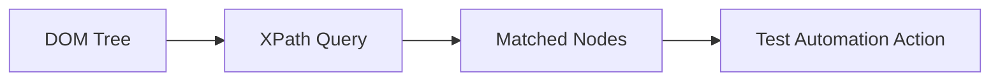

## Introduction
XPath (XML Path Language) is a powerful query language used to navigate and select nodes in XML and HTML documents. In the context of test automation, XPath is an essential tool for locating web elements with precision and flexibility. This comprehensive guide will take you from basic XPath concepts to advanced techniques used by expert test automation engineers.

### Why XPath for Test Automation?
- Powerful element location capabilities beyond simple IDs and class names
- Navigate through complex DOM structures using parent, child, and sibling relationships
- Support for dynamic and partial matching of attributes and text
- Compatible with major test automation tools like Selenium, Playwright, Cypress, and Appium
- Provides fallback when other locators fail

### XPath in Test Automation Tools
XPath is supported across all major test automation frameworks. While this book uses general XPath syntax, here are framework-specific implementations:
- Selenium WebDriver: `driver.findElement(By.xpath("//input[@id='username']"))`
- Playwright: `await page.locator("//input[@id='username']")`
- Cypress: `cy.xpath("//input[@id='username']")`
- Appium: `driver.findElement(By.xpath("//input[@id='username']"))`

---
