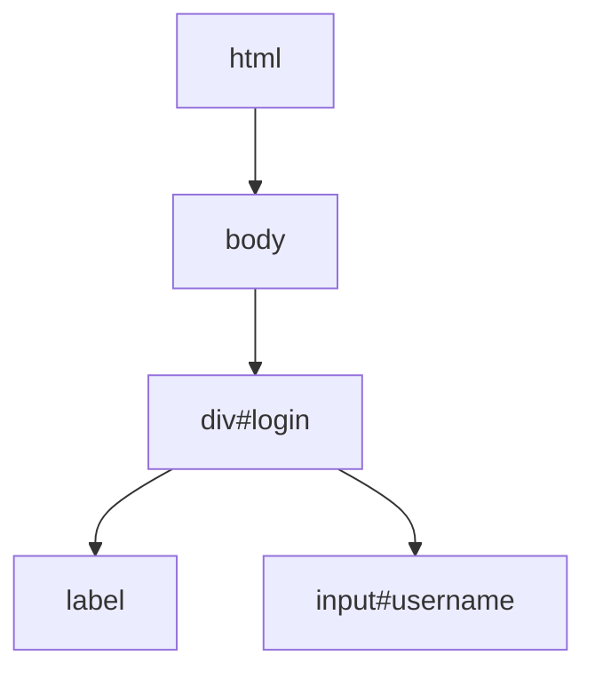
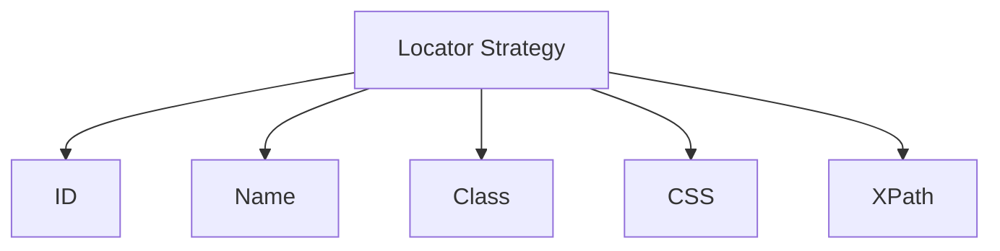

## Chapter 1: Foundations of XPath

### 1.1 Understanding HTML and XML
XPath was originally designed for XML documents, but HTML is a type of XML document, making XPath perfectly suited for web automation. Understanding the structure of HTML is essential for effective XPath usage.

Key Concepts:
- HTML documents are tree structures with parent-child relationships
- Elements have tags (like `
`, `<input>`, `<button>`)
- Elements can have attributes (like `id`, `class`, `name`, `type`)
- Elements can contain text content
- CSS works with HTML to style elements
- JavaScript can manipulate HTML dynamically

### 1.2 XPath Versions
Most test automation tools use XPath 1.0, though XPath 2.0 and 3.0 exist with additional features. This book focuses on XPath 1.0, which is universally supported across all major automation tools including Selenium, Playwright, and Cypress.

### 1.3 Basic Locator Strategies
Before diving into XPath, it's important to understand when to use it versus other locator strategies:
- ID: Best choice when available and unique (e.g., `id='username'`)
- Name: Good for form elements (e.g., `name='email'`)
- Class Name: Useful for styled elements (e.g., `class='btn-primary'`)
- Tag Name: Basic element selection (e.g., `'button'`, `'input'`)
- Link Text: For anchor elements with specific text
- CSS Selectors: Alternative to XPath with different syntax
- XPath: Most flexible, can traverse in any direction, use functions

---
