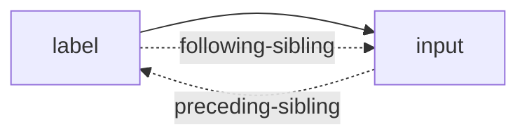

## Chapter 3: Intermediate XPath Techniques

### 3.1 Multiple Conditions with AND/OR
**Using AND Operator**
```text
//input[@id='searchBtn' and @type='button']
//div[@class='srvceNO' and normalize-space()='1297']
```
Alternative syntax using multiple attribute brackets:
```text
//input[@id='searchBtn'][@type='button']
```
**Using OR Operator**
```text
//input[@id='searchBtn' or @type='button']
//button[text()='Submit' or text()='Login']
```

### 3.2 Combining Multiple XPaths with Pipe (|)
The pipe operator allows you to combine multiple XPath expressions:
```text
//input[@id='searchBtn'] | //input[@id='searchBtn1']
//input[@type='text'] | //input[@type='password']
```

### 3.3 Partial Matching Functions
**contains() Function**
```text
//div[contains(text(),'Welcome')]
//input[contains(@type,'pass')]
//div[contains(@class,'btn-')]
```
**starts-with() Function**
```text
//input[starts-with(@id,'user')]
//div[starts-with(@class,'btn-')]
```
**ends-with() Function (XPath 2.0)**  
Note: This function is not available in XPath 1.0 used by most automation tools:
```text
//input[ends-with(@id,'name')]
```

### 3.4 Working with Parent Elements
**Direct Parent with /..**
```text
//input[@id='username']/..
//button[text()='Submit']/..
```
**Parent Axis**
```text
//input[@id='username']/parent::div
//input[@id='username']/parent::*
```
**Parent to Child Navigation**
```text
//div[@id='form']/input
//div[@class='container']//button
```

### 3.5 Working with Child Elements
**Child Axis**
```text
//div[@id='form']/child::input
```
Simplified syntax (`/` is shortcut for `child::`):
```text
//div[@id='form']/input
```
**Descendant Axis**
```text
//form[@id='loginForm']/descendant::input
```
Simplified syntax (`//` is shortcut for `descendant::`):
```text
//form[@id='loginForm']//input
```

### 3.6 Working with Siblings
**Following Sibling**
```text
//label[@for='username']/following-sibling::input
//label[@for='username']/following-sibling::input[@type='text']
```
**Preceding Sibling**
```text
//input[@id='username']/preceding-sibling::label
//input[@id='username']/preceding-sibling::label[text()='Username']
```



---
