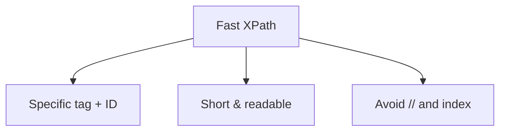

## Chapter 6: Expert-Level XPath Patterns

### 6.1 Dynamic XPath with Variables
While XPath itself doesn't support variables, you can construct dynamic XPath in your test code:
```text
// Selenium Java example
String username = "admin";
String xpath = "//div[text()='" + username + "']";
```
```text
// Playwright JavaScript example
const rowNumber = 3;
await page.locator(`//table//tr[${rowNumber}]//td[2]`).click();
```

### 6.2 Working with SVG Elements
SVG elements require special handling with namespaces. Use local-name() or name() functions:
```text
//*[local-name()='svg']//*[local-name()='circle']
//*[name()='svg']//*[name()='path']
//*[local-name()='svg' and @class='icon']
```

### 6.3 Writing XPath Inside XPath
Use nested conditions to create powerful queries:
```text
//div[@class='parent' and .//span[text()='Required']]
//table[.//th[text()='Name']]/tbody//tr[.//td[text()='John']]
//form[.//input[@type='email'] and .//button[text()='Submit']]
```

### 6.4 Complex Table Navigation
**Select Cell by Row and Column**
```text
//*[@id='TestTable']//tr[3]//td[2]
```
**Select Row by Cell Content**
```text
//table//tr[td[text()='John Smith']]
//table//tr[td[contains(text(),'Engineer')]]
```
**Select Cell Following Another Cell**
```text
//td[preceding-sibling::td[text()='Name']]
//td[preceding-sibling::td[contains(.,'Total')]]
```

### 6.5 Handling Dynamic Elements
**Elements with Dynamic IDs**
When IDs are generated dynamically (e.g., `id='user_12345'`), use contains() or starts-with():
```text
//input[starts-with(@id,'user_')]
//div[contains(@id,'_dynamic_')]
```
**Elements with Multiple Classes**
Match one class from multiple classes using contains():
```text
//div[contains(@class,'active')]
```
Match exact class within multiple classes:
```text
//div[contains(concat(' ', @class, ' '), ' active ')]
```

### 6.6 Performance Optimization Tips
1. Use specific tag names instead of `//` when possible  
2. Prefer ID-based locators for fastest performance  
3. Avoid overly complex XPath expressions  
4. Use index as last resort due to brittleness  
5. Cache frequently used XPath expressions  
6. Minimize the use of descendant axis (`//`)  



### 6.7 Relative XPath From an Element Context
When you already have a parent element, use `.//` to search within it instead of `//` which starts from the document root.
```text
// Given a context node "card"
.//button[text()='Buy']          // Search only inside the card
//button[text()='Buy']            // Search entire document
```

### 6.8 Wildcards and Node Tests
Use node tests for flexible or diagnostic queries:
```text
//*[@data-testid='submit-button']      // Any element with attribute
//div/node()                             // All child nodes (elements + text)
//div/text()                             // Direct text nodes
//comment()                              // Comments (rarely used)
```

---
