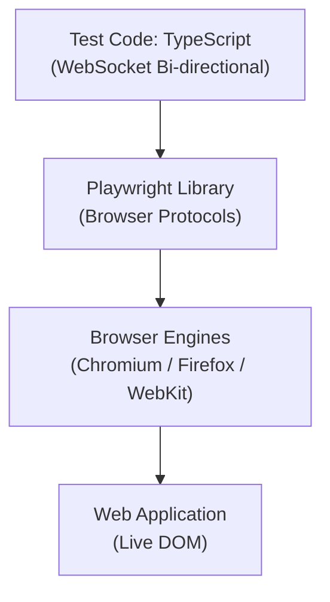

# Chapter 01: Introduction & Installation - Complete Guide

## The Concept of Modern Automation

The web has evolved from simple static pages to complex, dynamic applications. Traditional automation tools often struggle with this complexity, leading to "flaky" tests that fail without reason. **Playwright** was built from the ground up to solve these modern challenges, offering a faster, more reliable, and more powerful way to automate browsers.

**Purpose**: This chapter introduces the core features of Playwright and guides you through the process of setting up a clean, professional environment for automation.

**Why is it required?**
1. **Industry Shift**: To understand why major companies are moving from Selenium/Cypress to Playwright for its superior speed and built-in capabilities.
2. **Reliability**: To learn how Playwright's architecture eliminates the need for manual waits, which is the #1 cause of test failure in older tools.
3. **Productivity**: To get your machine ready with the right tools (Node.js, VS Code, Playwright) to start building enterprise-grade tests immediately.

## What is Playwright?

Playwright is a modern, open-source end-to-end testing framework developed and maintained by Microsoft. It enables reliable testing of web applications across all modern browsers (Chromium, Firefox, and WebKit) with a single API.

### Key Characteristics

**Cross-Browser Support**
- **Chromium**: Chrome, Edge, Opera, Brave
- **Firefox**: Mozilla Firefox
- **WebKit**: Safari (desktop and mobile)

**Architecture**
- Uses browser automation protocols (Chrome DevTools Protocol, Firefox Remote Protocol, WebKit Inspector Protocol)
- Direct browser communication without intermediate drivers
- Built-in auto-waiting and retry mechanisms

**Modern Web Support**
- Single Page Applications (SPAs)
- Progressive Web Apps (PWAs)
- Shadow DOM
- Web Components
- iframes and nested frames

### Architecture: Out-of-Process Execution

Unlike older tools like Selenium, Playwright runs **outside** the browser process. It communicates with browser engines via binary protocols (WebSocket/CDP), allowing for a more stable and high-performance connection.

**Architecture Overview:**



**Architectural Benefits:**
1.  **Immutability**: Since it's out-of-process, if a page crashes, the test script remains alive to handle the error.
2.  **Browser Context Isolation**: Allows launching a single browser process and creating hundreds of "incognito" contexts, drastically speeding up execution.
3.  **Low Latency**: WebSocket communication is significantly faster than HTTP-based WebDriver.

---

## Why Choose Playwright?

### Comparison Matrix: Playwright vs Other Tools

| Feature | Playwright | Selenium WebDriver | Cypress | Puppeteer |
|---------|-----------|-------------------|---------|-----------|
| **Browser Support** | Chromium, Firefox, WebKit | All major browsers | Chrome, Firefox, Edge | Chrome, Firefox |
| **Language Support** | JS/TS, Python, Java, C# | Multiple languages | JS / TypeScript | JS / TypeScript |
| **Auto-Waiting** | Built-in, intelligent | Manual waits needed | Built-in | Manual waits needed |
| **Network Interception** | Full control | Limited | Full control | Full control |
| **Parallel Execution** | Out of the box | Requires setup | Paid feature (Cloud) | Manual setup |
| **Trace Viewer** | Advanced debugging | No | Time travel debugging | No |
| **API Testing** | Built-in | Requires libraries | Built-in | Limited |
| **AI Self-Healing** | Advanced AI Agents | Via 3rd party plugins | Cloud-based (Paid) | Community plugins |
| **AI Code Generation** | Native MCP/Copilot | Community tools | Built-in AI tools | Limited |
| **AI Debugging** | GenAI Trace Analysis | No | AI Recommendations | No |
| **Installation** | Single command | Multi-step | Single command | Single command |
| **Learning Curve** | Moderate | Steep | Moderate | Moderate |
| **Community** | Growing rapidly | Largest | Large | Large |
| **Maintenance** | Microsoft-backed | Community | Cypress.io | Google-backed |

### Playwright's Unique Advantages

**1. True Cross-Browser Testing**
```typescript
// Same code works across all browsers
test('works everywhere', async ({ page }) => {
  await page.goto('https://example.com');
  await expect(page).toHaveTitle(/Example/);
});
// Runs on Chromium, Firefox, AND WebKit automatically
```

**2. Auto-Waiting Eliminates Flakiness**
```typescript
// ❌ Selenium/Puppeteer - Manual waits needed
await driver.wait(until.elementLocated(By.id('button')), 5000);
await driver.findElement(By.id('button')).click();

// ✅ Playwright - Automatic waiting
await page.click('#button');
```

**3. Visual Regression & Trace Viewer**
Playwright captures snapshots, screenshots, and videos automatically on failure, allowing you to "travel back in time" to see exactly what happened in the DOM.

---

## Prerequisites

Before installing Playwright, ensure your machine has the following tools:

### 1. Node.js
Playwright requires Node.js (Version 18 or higher).
- **Check version**: `node -v`
- **Download**: [nodejs.org](https://nodejs.org/) (Recommend LTS version)

### 2. VS Code (Recommended Editor)
Visual Studio Code offers the best developer experience for Playwright.
- **Download**: [code.visualstudio.com](https://code.visualstudio.com/)
- **Essential Extension**: "Playwright Test for VSCode" by Microsoft

---

## Installation Methods

### Method 1: New Project (Recommended)
This is the easiest way to start a new automation project.

```bash
# Create a new directory
mkdir playwright-tests
cd playwright-tests

# Initialize Playwright
npm init playwright@latest
```

**What happens during initialization?**
1.  **Project Structure**: Creates `tests/`, `tests-examples/`, and `playwright.config.ts`.
2.  **Dependencies**: Installs `@playwright/test` package.
3.  **Browsers**: Downloads Chromium, Firefox, and WebKit binaries (approx. 300-500MB).
4.  **GitHub Actions**: Creates a `.github/workflows/playwright.yml` for CI/CD.

### Method 2: Adding to Existing Project
If you already have a `package.json`:

```bash
npm install -D @playwright/test
npx playwright install
```

---

## Understanding the Project Structure

A standard Playwright project looks like this:

```text
my-project/
├── node_modules/
├── tests/
│   └── example.spec.ts      # Your test files live here
├── playwright.config.ts     # Global configuration file
├── package.json             # Dependencies and scripts
└── .gitignore               # Files to exclude from Git
```

### Key Files:
- **playwright.config.ts**: The brain of your project. Here you define timeouts, browsers, and reporters.
- **tests/*.spec.ts**: Your actual test scripts.
- **package.json**: Manages your Node packages and custom terminal commands.

---

## Running Your First Test

Playwright comes with a default example test. Let's run it:

```bash
# Run tests in headless mode (invisible)
npx playwright test

# Run tests in headed mode (visible browser)
npx playwright test --headed

# Run tests in UI Mode (highly recommended for development)
npx playwright test --ui
```

### Opening the Test Report
After running tests, Playwright generates a beautiful HTML report:

```bash
npx playwright show-report
```

---

## Troubleshooting Installation

| Issue | Potential Solution |
| :--- | :--- |
| **Node version error** | Update Node.js to v18+. Use `nvm` to manage versions. |
| **Browser download fails** | Check your internet proxy or run `npx playwright install` again. |
| **Permission denied** | (Linux/Mac) Use `sudo` or check folder ownership. |
| **WSL Issues** | If using Windows Subsystem for Linux, ensure you have browser dependencies installed (`npx playwright install-deps`). |

---

## Conclusion

You now have a working Playwright environment. You've learned about the architecture that makes Playwright so stable and installed the tools necessary for modern automation. In the next chapter, we will dive into the core objects of Playwright: **Browsers, Contexts, and Pages.**
