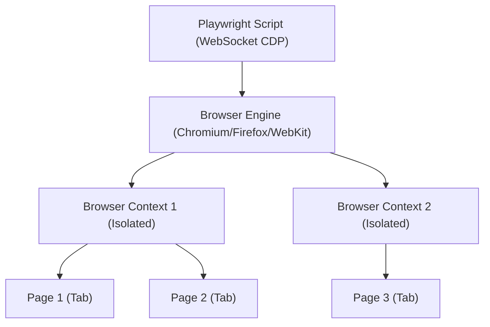

# Chapter 02: Core Concepts & Architecture

## The Concept of Browser Automation

Automation is often treated like a "magic wand" that clicks buttons, but under the hood, it's a series of complex communications between your code and the browser engine. To write great tests, you must understand the **Architecture**—how Playwright "talks" to the browser—and the **Core Objects** that manage sessions.

**Purpose**: This chapter explains the technical foundation of Playwright, including its WebSocket-based communication and the hierarchy of Browser, Context, and Page.

**Why is it required?**
1. **Efficiency**: To learn about **Browser Contexts**, which allow you to run thousands of tests in total isolation while reusing a single browser process.
2. **Troubleshooting**: To understand the relationship between your script and the browser, making it easier to debug issues when a test doesn't behave as expected.
3. **Advanced Control**: To prepare for complex scenarios like handling multiple tabs, incognito sessions, and network permissions.

## Playwright Architecture

Before writing tests, it is crucial to understand how Playwright talks to the browser. Unlike older tools like Selenium which use an intermediate HTTP Server (WebDriver), Playwright uses a **WebSocket** connection to communicate directly with the browser's engine (CDP for Chrome, similar protocols for Firefox/WebKit).

### Key Advantages
1.  **Speed**: No HTTP overhead for each command.
2.  **Reliability**: Bi-directional communication allows Playwright to know exactly when the browser is busy (Auto-Waiting).
3.  **Control**: Access to network permissions, geolocation, and browser events.

---

## The Big Three: Browser, Context, Page

Every Playwright command generally flows through this hierarchy:



### 1. Browser
The **Browser** refers to an instance of Chromium, Firefox, or WebKit. Launching a browser is an expensive operation (like clicking the Chrome icon on your desktop). In automation, we typically launch the browser once.

### 2. BrowserContext
A **Context** is like an incognito window. It is fast to create and cheap to destroy.
*   **Isolated**: Contexts do not share cookies, local storage, or cache.
*   **Parallel functionality**: You can run multiple contexts in a single browser instance simultaneously, completely independent of each other.

### 3. Page
A **Page** is a single tab or window within a context. This is where you perform actions like `click` or `fill`.

---

## Manual Browser Launching

While the Playwright Test runner (which we will learn later) handles this for you, learning to do it manually is the best way to understand the mechanics.

### The Library Import
Using Playwright as a library (no test runner):

```typescript
import { chromium } from 'playwright';

// Launch the browser
const browser = await chromium.launch({ 
  headless: false // Show the browser (default is true)
});

// Create a context (Incognito-like session)
const context = await browser.newContext();

// Create a page (Tab)
const page = await context.newPage();

// Perform actions
await page.goto('https://example.com');

// Teardown
await browser.close();
```

### Launch Options

```typescript
const browser = await chromium.launch({
  headless: false,  // Visible UI
  slowMo: 100,      // Slow down operations by 100ms (great for debugging)
  devtools: true    // Open Developer Tools automatically
});
```

---

## Understanding Isolation

The power of Playwright comes from **Contexts**.

If you were testing a chat application between two users, you don't need two machines. You just need two contexts:

```typescript
// User 1
const contextA = await browser.newContext();
const pageA = await contextA.newPage();
await pageA.goto('https://chat-app.com');
await pageA.fill('#login', 'UserA');

// User 2 (Testing simultaneously!)
const contextB = await browser.newContext();
const pageB = await contextB.newPage();
await pageB.goto('https://chat-app.com');
await pageB.fill('#login', 'UserB'); // Completely fresh session
```

Because contexts are lightweight, Playwright creates a **fresh context for every single test** by default. This solves the "flaky test" problem where one test fails because a previous test left the browser in a bad state.

---

## Writing Your First Script

Let's create a standalone NodeJS script to automate a simple flow.

**file: `automation.js`**

```javascript
const { chromium } = require('playwright');

(async () => {
  // 1. Launch
  const browser = await chromium.launch({ headless: false });
  const context = await browser.newContext();
  const page = await context.newPage();

  // 2. Action
  console.log('Navigating...');
  await page.goto('https://playwright.dev');
  
  await page.click('text=Get started');
  
  // 3. Validation (Manual check)
  // Since we aren't using the Test Runner yet, we use simple if/else logic
  const url = await page.url();
  
  if (url === 'https://playwright.dev/docs/intro') {
    console.log('✅ PASS: Navigation Successful!');
  } else {
    console.error('❌ FAIL: Expected docs/intro, got: ' + url);
    process.exit(1); // Exit with error code
  }

  // 4. Close
  await browser.close();
})();
```

**Run it:**
```bash
node automation.js
```

**Summary**: You have learned the fundamental hierarchy of Playwright: **Browser > Context > Page**. You know how to launch a browser manually and understand why Contexts are critical for isolation. Next, we will learn how to find elements on the page using **Locators**.
