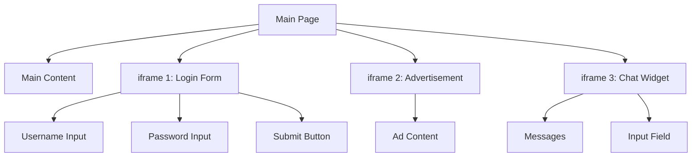

# Chapter 08: Handling Frames & Dialogs (Complete Guide)

## The Concept of Frames & Dialogs

Modern web architecture often uses isolation to manage complexity or security. **Frames (iframes)** allow embedding one website inside another, while **Dialogs** (alerts, confirms, prompts) are browser-level interruptions. To a tester, these represent "unreachable" areas if not handled with the correct scope.

**Purpose**: This chapter teaches you how to "break out" of the main page scope to interact with embedded content and respond to browser-level popups.

**Why is it required?**
1. **Third-Party Integration**: Payment gateways (Stripe), Chat widgets, and Ads often live in iframes.
2. **Security**: iframes provide a sandbox that prevents the main page from accessing sensitive data (like credit card inputs).
3. **User Feedback**: Standard browser dialogs are still used for critical confirmations (e.g., "Are you sure you want to delete?").

### What are Frames?

**Frames (iframes)** are HTML elements that embed another HTML document within the current page. They create isolated browsing contexts.

### Frame Hierarchy



### Why Frames are Challenging

| Challenge | Description | Playwright Solution |
|-----------|-------------|-------------------|
| **Separate DOM** | iframe has its own DOM | `frameLocator()` |
| **Cross-origin** | Different domain restrictions | Automatic handling |
| **Dynamic Loading** | Frames load asynchronously | Auto-waiting |
| **Nested Frames** | Frames within frames | Chaining locators |

---

## Working with iframes

### The frameLocator Method (Recommended)

**frameLocator** returns a locator that works inside the frame:

```typescript
// Basic frame selection
const frame = page.frameLocator('iframe#login-frame');

// Interact with elements inside frame
await frame.getByLabel('Username').fill('user');
await frame.getByLabel('Password').fill('pass');
await frame.getByRole('button', { name: 'Login' }).click();
```

### Selecting Frames

**By CSS Selector:**
```typescript
// By ID
const frame = page.frameLocator('#my-frame');

// By class
const frame = page.frameLocator('.embedded-form');

// By name attribute
const frame = page.frameLocator('iframe[name="login"]');

// By src attribute
const frame = page.frameLocator('iframe[src*="login"]');
```

**By URL Pattern:**
```typescript
// Frame with specific URL
const frame = page.frameLocator('iframe[src*="example.com/widget"]');
```

**Nested Frames:**
```typescript
// Frame inside another frame
const outerFrame = page.frameLocator('#outer-frame');
const innerFrame = outerFrame.frameLocator('#inner-frame');

// Interact with element in nested frame
await innerFrame.getByLabel('Email').fill('user@example.com');
```

---

## Frame Locators

### Complete Example

```typescript
test('interact with iframe form', async ({ page }) => {
  await page.goto('https://example.com');
  
  // Locate the iframe
  const loginFrame = page.frameLocator('#login-iframe');
  
  // Fill form inside iframe
  await loginFrame.getByLabel('Username').fill('testuser');
  await loginFrame.getByLabel('Password').fill('password123');
  await loginFrame.getByRole('checkbox', { name: 'Remember me' }).check();
  
  // Click button inside iframe
  await loginFrame.getByRole('button', { name: 'Sign In' }).click();
  
  // Verify success message inside iframe
  await expect(loginFrame.getByText('Welcome back!')).toBeVisible();
});
```

### Chaining Frame Locators

```typescript
// Find element inside frame, then inside that element
const frame = page.frameLocator('#payment-frame');
const cardSection = frame.locator('.card-details');
await cardSection.getByLabel('Card Number').fill('4111111111111111');
await cardSection.getByLabel('CVV').fill('123');
```

### Multiple Frames

```typescript
test('interact with multiple frames', async ({ page }) => {
  await page.goto('/page-with-frames');
  
  // Frame 1: Login
  const loginFrame = page.frameLocator('#login-frame');
  await loginFrame.getByLabel('Email').fill('user@example.com');
  
  // Frame 2: Chat
  const chatFrame = page.frameLocator('#chat-frame');
  await chatFrame.getByPlaceholder('Type message').fill('Hello!');
  await chatFrame.getByRole('button', { name: 'Send' }).click();
  
  // Frame 3: Advertisement
  const adFrame = page.frameLocator('#ad-frame');
  await expect(adFrame.getByRole('img')).toBeVisible();
});
```

---

## Frame Objects

### When to Use Frame Objects
Use frame objects when you need:
- Direct access to frame methods
- Multiple operations on same frame
- Frame-level navigation

### Getting Frame Object

```typescript
// Get frame by name
const frame = page.frame('frame-name');

// Get frame by URL
const frame = page.frame({ url: /.*domain.*/ });

// Get frame by selector
const frameElement = page.locator('iframe#my-frame');
const frame = await frameElement.contentFrame();
```

### Frame Object Methods

```typescript
// Get frame by name
const frame = page.frame('login-frame');

if (frame) {
  // Navigate within frame
  await frame.goto('https://example.com/login');
  
  // Interact with elements
  await frame.fill('#username', 'user');
  await frame.click('#submit');
  
  // Get frame URL
  console.log('Frame URL:', frame.url());
  
  // Get frame name
  console.log('Frame name:', frame.name());
  
  // Check if frame is detached
  console.log('Is detached:', frame.isDetached());
}
```

### All Frames

```typescript
// Get all frames on page
const frames = page.frames();
console.log('Total frames:', frames.length);

// Iterate through frames
for (const frame of frames) {
  console.log('Frame URL:', frame.url());
  console.log('Frame name:', frame.name());
}

// Find specific frame
const loginFrame = frames.find(f => f.url().includes('login'));
if (loginFrame) {
  await loginFrame.fill('#username', 'user');
}
```

### Main Frame

```typescript
// Get main frame (the page itself)
const mainFrame = page.mainFrame();

// This is equivalent to using page directly
await mainFrame.click('button');
// Same as:
await page.click('button');
```

---

## Browser Dialogs

### Types of Dialogs

| Type | JavaScript | Purpose | User Actions |
|------|-----------|---------|--------------|
| **Alert** | `alert('message')` | Show message | OK |
| **Confirm** | `confirm('question')` | Yes/No question | OK, Cancel |
| **Prompt** | `prompt('question')` | Get user input | OK, Cancel, Input |
| **BeforeUnload** | `beforeunload` event | Prevent page close | Stay, Leave |

### Default Behavior

**By default, Playwright auto-dismisses all dialogs:**

```typescript
// This won't hang - dialog is auto-dismissed
await page.click('button#show-alert');
// Alert is automatically dismissed
```

---

## Alert Dialogs

### Handling Alerts

```typescript
// Listen for dialog before triggering it
page.on('dialog', async dialog => {
  console.log('Alert message:', dialog.message());
  await dialog.accept();
});

// Trigger the alert
await page.click('button#show-alert');
```

### Alert Example

```typescript
test('handle alert dialog', async ({ page }) => {
  await page.goto('/alerts');
  
  // Set up dialog handler
  page.on('dialog', async dialog => {
    // Verify dialog type
    expect(dialog.type()).toBe('alert');
    
    // Verify message
    expect(dialog.message()).toBe('Operation successful!');
    
    // Accept the alert
    await dialog.accept();
  });
  
  // Trigger alert
  await page.click('button#success-button');
  
  // Continue test after alert
  await expect(page.locator('.status')).toHaveText('Alert handled');
});
```

---

## Confirm Dialogs

### Handling Confirm Dialogs

```typescript
// Accept (OK)
page.on('dialog', async dialog => {
  expect(dialog.type()).toBe('confirm');
  await dialog.accept();
});

// Dismiss (Cancel)
page.on('dialog', async dialog => {
  expect(dialog.type()).toBe('confirm');
  await dialog.dismiss();
});
```

### Confirm Example

```typescript
test('handle confirm dialog - accept', async ({ page }) => {
  await page.goto('/confirm');
  
  page.on('dialog', async dialog => {
    expect(dialog.type()).toBe('confirm');
    expect(dialog.message()).toBe('Are you sure you want to delete?');
    
    // Click OK
    await dialog.accept();
  });
  
  await page.click('button#delete');
  await expect(page.locator('.message')).toHaveText('Item deleted');
});

test('handle confirm dialog - dismiss', async ({ page }) => {
  await page.goto('/confirm');
  
  page.on('dialog', async dialog => {
    expect(dialog.type()).toBe('confirm');
    
    // Click Cancel
    await dialog.dismiss();
  });
  
  await page.click('button#delete');
  await expect(page.locator('.message')).toHaveText('Deletion cancelled');
});
```

---

## Prompt Dialogs

### Handling Prompts

```typescript
// Accept with input
page.on('dialog', async dialog => {
  expect(dialog.type()).toBe('prompt');
  await dialog.accept('My input value');
});

// Dismiss prompt
page.on('dialog', async dialog => {
  expect(dialog.type()).toBe('prompt');
  await dialog.dismiss();
});
```

### Prompt Example

```typescript
test('handle prompt dialog', async ({ page }) => {
  await page.goto('/prompt');
  
  page.on('dialog', async dialog => {
    expect(dialog.type()).toBe('prompt');
    expect(dialog.message()).toBe('What is your name?');
    
    // Get default value
    console.log('Default value:', dialog.defaultValue());
    
    // Enter value
    await dialog.accept('John Doe');
  });
  
  await page.click('button#ask-name');
  await expect(page.locator('.greeting')).toHaveText('Hello, John Doe!');
});
```

---

## BeforeUnload Dialogs

### What is BeforeUnload?

The `beforeunload` event fires when the user tries to leave the page (close tab, navigate away, refresh).

### Handling BeforeUnload

```typescript
test('handle beforeunload dialog', async ({ page }) => {
  await page.goto('/form');
  
  // Fill form (triggers unsaved changes)
  await page.fill('#name', 'John Doe');
  
  // Set up dialog handler
  page.on('dialog', async dialog => {
    expect(dialog.type()).toBe('beforeunload');
    
    // Stay on page
    await dialog.dismiss();
    // OR leave page
    // await dialog.accept();
  });
  
  // Try to close page
  await page.close({ runBeforeUnload: true });
});
```

---

## Best Practices

### DO's and DON'Ts

```typescript
// ✅ DO: Use frameLocator for iframes
const frame = page.frameLocator('#my-frame');
await frame.getByLabel('Email').fill('user@example.com');

// ❌ DON'T: Try to interact with iframe content directly
await page.getByLabel('Email').fill('user@example.com'); // Won't find it!

// ✅ DO: Set up dialog handler BEFORE triggering
page.on('dialog', async dialog => await dialog.accept());
await page.click('button#show-alert');

// ❌ DON'T: Set up handler AFTER triggering
await page.click('button#show-alert');
page.on('dialog', async dialog => await dialog.accept()); // Too late!

// ✅ DO: Always handle dialogs (accept or dismiss)
page.on('dialog', async dialog => {
  await dialog.accept(); // or dialog.dismiss()
});

// ❌ DON'T: Just log without handling
page.on('dialog', dialog => {
  console.log(dialog.message()); // Test will hang!
});

// ✅ DO: Verify dialog properties
page.on('dialog', async dialog => {
  expect(dialog.type()).toBe('confirm');
  expect(dialog.message()).toContain('delete');
  await dialog.accept();
});

// ❌ DON'T: Accept blindly
page.on('dialog', async dialog => {
  await dialog.accept(); // What if it's the wrong dialog?
});
```

### Frame Patterns

**Pattern 1: Login in iframe**
```typescript
test('login through iframe', async ({ page }) => {
  await page.goto('/');
  
  const loginFrame = page.frameLocator('#login-iframe');
  await loginFrame.getByLabel('Email').fill('user@example.com');
  await loginFrame.getByLabel('Password').fill('password123');
  await loginFrame.getByRole('button', { name: 'Login' }).click();
  
  // Verify success in main page
  await expect(page.locator('.welcome')).toBeVisible();
});
```

**Pattern 2: Payment form in iframe**
```typescript
test('fill payment form in iframe', async ({ page }) => {
  await page.goto('/checkout');
  
  const paymentFrame = page.frameLocator('#payment-iframe');
  await paymentFrame.getByLabel('Card Number').fill('4111111111111111');
  await paymentFrame.getByLabel('Expiry').fill('12/25');
  await paymentFrame.getByLabel('CVV').fill('123');
  await paymentFrame.getByRole('button', { name: 'Pay' }).click();
  
  await expect(page.locator('.success')).toBeVisible();
});
```

### Dialog Patterns

**Pattern 1: Conditional dialog handling**
```typescript
test('handle dialog conditionally', async ({ page }) => {
  await page.goto('/');
  
  page.on('dialog', async dialog => {
    if (dialog.message().includes('delete')) {
      await dialog.accept(); // Confirm deletion
    } else {
      await dialog.dismiss(); // Cancel others
    }
  });
  
  await page.click('button#action');
});
```

**Pattern 2: Multiple dialogs**
```typescript
test('handle multiple dialogs', async ({ page }) => {
  await page.goto('/');
  
  let dialogCount = 0;
  
  page.on('dialog', async dialog => {
    dialogCount++;
    console.log(`Dialog ${dialogCount}:`, dialog.message());
    await dialog.accept();
  });
  
  await page.click('button#show-dialogs');
  expect(dialogCount).toBe(3);
});
```

**Summary**: You now understand how to work with iframes and handle browser dialogs. The next chapter covers Playwright's intelligent auto-waiting mechanism and timeout configuration.
