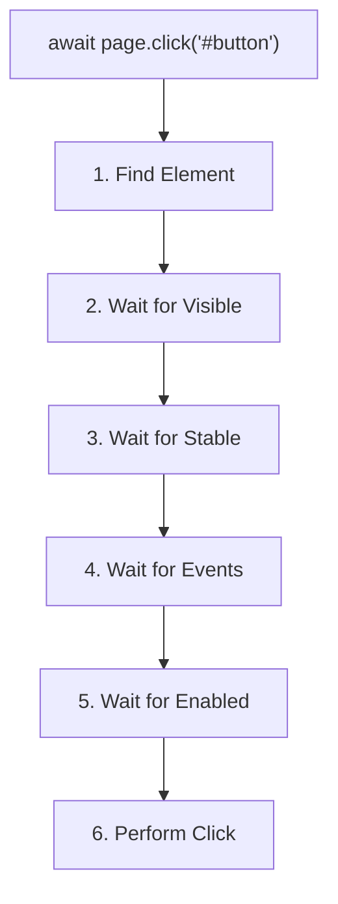
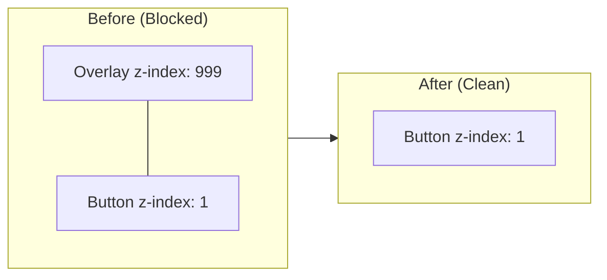

# Chapter 09: Auto-waiting & Timeouts (Complete Guide)


## The Concept of Auto-waiting & Timeouts

In the world of web automation, "Flakiness" is the #1 enemy. Most test failures are not caused by bugs in the application, but by tests trying to interact with elements that haven't appeared yet. Playwright's "Auto-waiting" is designed to eliminate this problem entirely.

**Purpose**: This chapter explains how Playwright handles timing issues automatically and how you can fine-tune these behaviors using custom timeouts.

**Why is it required?**
1. **Stability**: To prevent "NoSuchElementException" errors common in older tools.
2. **Performance**: To avoid hard-coding "sleeps" (e.g., `waitForTimeout(5000)`) which slow down test suites.
3. **Customization**: To handle slow network conditions or complex UI transitions that exceed default limits.

### What is Auto-Waiting?

**Auto-waiting** is Playwright's built-in mechanism that automatically waits for elements to be ready before performing actions. This eliminates the need for manual waits and makes tests more reliable.

### The Problem Auto-Waiting Solves

**❌ Without Auto-Waiting (Selenium style):**
```typescript
// Manual waiting nightmare
await driver.wait(until.elementLocated(By.id('button')), 5000);
await driver.wait(until.elementIsVisible(driver.findElement(By.id('button'))), 5000);
await driver.wait(until.elementIsEnabled(driver.findElement(By.id('button'))), 5000);
const element = await driver.findElement(By.id('button'));
await driver.wait(until.elementIsClickable(element), 5000);
await element.click();
```

**✅ With Auto-Waiting (Playwright):**
```typescript
// Just one line - Playwright handles everything
await page.click('#button');
```

### Auto-Waiting Benefits

| Benefit | Description | Impact |
|---------|-------------|--------|
| **No Race Conditions** | Waits for elements automatically | Reliable tests |
| **Cleaner Code** | No manual wait statements | Readable tests |
| **Adaptive** | Works on slow and fast machines | Consistent results |
| **Smart Retrying** | Keeps checking until ready | No flaky tests |
| **Built-in** | Works out of the box | Zero configuration |

---

## How Auto-Waiting Works

### The Auto-Waiting Flow



### What Gets Checked

Different actions require different checks:

| Action | Attached | Visible | Stable | Receives Events | Enabled | Editable |
|--------|----------|---------|--------|----------------|---------|----------|
| `click()` | ✅ | ✅ | ✅ | ✅ | ✅ | - |
| `fill()` | ✅ | ✅ | - | - | ✅ | ✅ |
| `check()` | ✅ | ✅ | ✅ | ✅ | ✅ | - |
| `hover()` | ✅ | ✅ | ✅ | ✅ | - | - |
| `selectOption()` | ✅ | ✅ | - | - | ✅ | - |
| `press()` | - | - | - | - | - | - |
| `focus()` | - | - | - | - | - | - |

---

## Actionability Checks Deep Dive

### 1. Attached Check

**What it checks:** Element exists in the DOM

```typescript
// Element must be in DOM
await page.click('#button');

// If element is removed and re-added, Playwright re-queries
// ✅ Works even if DOM updates
```

**Why it matters:**
- SPAs frequently update DOM
- Elements can be removed and re-created
- Playwright automatically re-queries

### 2. Visible Check

**What it checks:**
- Element has non-empty bounding box
- Element is NOT `display: none`
- Element is NOT `visibility: hidden`

**Important notes:**
```typescript
// ✅ These ARE considered visible:
// - opacity: 0
// - Elements outside viewport (will scroll into view)
// - Elements with very small size (1px × 1px)

// ❌ These are NOT visible:
// - display: none
// - visibility: hidden
// - Zero width or height
```

**Example:**
```typescript
test('visibility check', async ({ page }) => {
  await page.goto('/');
  
  // Button is initially hidden
  // <button style="display: none">Click me</button>
  
  // This waits for button to become visible
  await page.click('button');
  // Playwright keeps checking until display changes to block/inline
});
```

### 3. Stable Check

**What it checks:** Element bounding box hasn't changed for 2 consecutive animation frames

**Why it matters:**
- Prevents clicking moving elements
- Waits for animations to complete
- Ensures accurate click position

**Example:**
```typescript
test('stability check', async ({ page }) => {
  await page.goto('/');
  
  // Button slides in from left (CSS animation)
  // Playwright waits for animation to complete
  await page.click('.animated-button');
  // ✅ Clicks after animation finishes
});
```

**How stability is determined:**
```
Frame 1 (0ms):    Position: x=0,   y=100  (Moving)
Frame 2 (16ms):   Position: x=50,  y=100  (Moving)
Frame 3 (32ms):   Position: x=100, y=100  (Moving)
Frame 4 (48ms):   Position: x=150, y=100  (Moving)
Frame 5 (64ms):   Position: x=200, y=100  (Stable)
Frame 6 (80ms):   Position: x=200, y=100  (Stable) ✅ 2 frames stable!
Click happens here
```

### 4. Receives Events Check

**What it checks:** Element is the topmost element at click position (not covered by overlay)

**Why it matters:**
- Prevents clicking through overlays
- Ensures click reaches intended element
- Handles loading spinners automatically

**Example:**
```typescript
test('receives events check', async ({ page }) => {
  await page.goto('/');
  
  // Click button
  // Loading overlay appears temporarily
  // <div class="overlay" style="position: fixed; top: 0; left: 0; right: 0; bottom: 0;">
  
  await page.click('#submit');
  // ✅ Playwright waits for overlay to disappear
  // Then clicks the button
});
```

**Visual representation:**



### 5. Enabled Check

**What it checks:** Element is not disabled

**Element is disabled when:**
```typescript
// HTML disabled attribute
<button disabled>Click me</button>
<input type="text" disabled>

// Fieldset disabled
<fieldset disabled>
  <input type="text"> <!-- Also disabled -->
</fieldset>

// ARIA disabled
<div role="button" aria-disabled="true">Click me</div>
```

**Example:**
```typescript
test('enabled check', async ({ page }) => {
  await page.goto('/form');
  
  // Submit button is disabled until form is valid
  // <button disabled id="submit">Submit</button>
  
  await page.fill('#email', 'user@example.com');
  // JavaScript removes disabled attribute
  
  await page.click('#submit');
  // ✅ Playwright waits for button to be enabled
});
```

### 6. Editable Check

**What it checks:** Element is not readonly

**Element is readonly when:**
```typescript
// HTML readonly attribute
<input type="text" readonly>
<textarea readonly></textarea>

// ARIA readonly
<div role="textbox" aria-readonly="true"></div>
```

**Example:**
```typescript
test('editable check', async ({ page }) => {
  await page.goto('/form');
  
  // Input is readonly initially
  // <input readonly id="username">
  
  await page.fill('#username', 'john');
  // ✅ Playwright waits for readonly to be removed
});
```

---

## Timeout Types

### 1. Test Timeout

**Default:** 30 seconds  
**What it controls:** Maximum time for entire test

```typescript
// In playwright.config.ts
export default defineConfig({
  timeout: 60_000, // 60 seconds per test
});

// Per test
test('slow test', async ({ page }) => {
  test.setTimeout(120_000); // 2 minutes
  // ... test code
});

// Triple timeout for slow test
test('very slow test', async ({ page }) => {
  test.slow(); // 3x timeout
  // ... test code
});
```

**What counts toward test timeout:**
- Test function execution
- `beforeEach` hooks
- Fixture setup
- All actions and assertions

### 2. Expect Timeout

**Default:** 5 seconds  
**What it controls:** How long assertions retry

```typescript
// In playwright.config.ts
export default defineConfig({
  expect: {
    timeout: 10_000, // 10 seconds for assertions
  },
});

// Per assertion
await expect(page.locator('.status')).toHaveText('Success', {
  timeout: 15_000 // 15 seconds
});
```

**Example:**
```typescript
// This assertion retries for 5 seconds
await expect(page.locator('.message')).toBeVisible();

// Timeline:
// 0ms:    Check 1 - Not visible
// 100ms:  Check 2 - Not visible
// 200ms:  Check 3 - Not visible
// ...
// 4900ms: Check 50 - Not visible
// 5000ms: ❌ Timeout! Assertion fails
```

### 3. Action Timeout

**Default:** No timeout (inherits from test timeout)  
**What it controls:** How long individual actions wait

```typescript
// In playwright.config.ts
export default defineConfig({
  use: {
    actionTimeout: 10_000, // 10 seconds for actions
  },
});

// Per action
await page.click('#button', { timeout: 5_000 });
await page.fill('#input', 'text', { timeout: 3_000 });
```

### 4. Navigation Timeout

**Default:** No timeout (inherits from test timeout)  
**What it controls:** How long navigation waits

```typescript
// In playwright.config.ts
export default defineConfig({
  use: {
    navigationTimeout: 30_000, // 30 seconds for navigation
  },
});

// Per navigation
await page.goto('https://example.com', { timeout: 60_000 });
```

### Timeout Hierarchy

```
Priority (highest to lowest):
1. Action/Assertion-level timeout
   await page.click('#button', { timeout: 5000 });

2. Config-level timeout
   use: { actionTimeout: 10000 }

3. Test timeout (fallback)
   timeout: 30000

4. Default (30 seconds)
```

---

## Configuring Timeouts

### Global Configuration

```typescript
// playwright.config.ts
import { defineConfig } from '@playwright/test';

export default defineConfig({
  // Test timeout
  timeout: 60_000, // 60 seconds per test
  
  // Expect timeout
  expect: {
    timeout: 10_000, // 10 seconds for assertions
  },
  
  use: {
    // Action timeout
    actionTimeout: 15_000, // 15 seconds for actions
    
    // Navigation timeout
    navigationTimeout: 30_000, // 30 seconds for navigation
  },
});
```

### Per-Test Configuration

```typescript
// Set timeout for specific test
test('custom timeout', async ({ page }) => {
  test.setTimeout(120_000); // 2 minutes
  await page.goto('https://slow-site.com');
});

// Triple the timeout
test('slow test', async ({ page }) => {
  test.slow(); // 3x default timeout
  await page.goto('https://very-slow-site.com');
});
```

### Per-Action Configuration

```typescript
// Custom timeout for specific action
await page.click('#button', { timeout: 5_000 });

// Custom timeout for navigation
await page.goto('https://example.com', { timeout: 60_000 });

// Custom timeout for assertion
await expect(page.locator('.status')).toBeVisible({ timeout: 10_000 });
```

### Environment-Based Configuration

```typescript
// playwright.config.ts
export default defineConfig({
  timeout: process.env.CI ? 60_000 : 30_000,
  
  expect: {
    timeout: process.env.CI ? 10_000 : 5_000,
  },
  
  use: {
    actionTimeout: process.env.SLOW_NETWORK ? 30_000 : 10_000,
  },
});
```

---

## When Auto-Waiting Isn't Enough

### Manual Waiting Methods

**1. waitForSelector()**
```typescript
// Wait for element to appear
await page.waitForSelector('.dynamic-content');

// With state
await page.waitForSelector('.element', { state: 'visible' });
await page.waitForSelector('.element', { state: 'hidden' });
await page.waitForSelector('.element', { state: 'attached' });
await page.waitForSelector('.element', { state: 'detached' });
```

**2. waitForURL()**
```typescript
// Wait for URL to match
await page.waitForURL('**/dashboard');
await page.waitForURL(/\/dashboard$/);
await page.waitForURL('https://example.com/dashboard');
```

**3. waitForLoadState()**
```typescript
// Wait for page load state
await page.waitForLoadState('load');
await page.waitForLoadState('domcontentloaded');
await page.waitForLoadState('networkidle');
```

**4. waitForResponse()**
```typescript
// Wait for specific API response
await page.waitForResponse('**/api/users');
await page.waitForResponse(resp => resp.url().includes('/api/'));
await page.waitForResponse(resp => resp.status() === 200);
```

**5. waitForRequest()**
```typescript
// Wait for specific request
await page.waitForRequest('**/api/data');
await page.waitForRequest(req => req.method() === 'POST');
```

**6. waitForFunction()**
```typescript
// Wait for custom condition
await page.waitForFunction(() => window.myAppReady === true);
await page.waitForFunction(() => document.querySelectorAll('.item').length > 5);
```

**7. waitForTimeout()** ⚠️
```typescript
// Hard wait (NOT RECOMMENDED)
await page.waitForTimeout(5000); // Wait 5 seconds

// ❌ BAD: Arbitrary wait
await page.waitForTimeout(2000);
await page.click('button');

// ✅ GOOD: Wait for specific condition
await expect(page.locator('button')).toBeVisible();
await page.click('button');
```

---

## Common Timeout Scenarios

### Scenario 1: Slow API Response

```typescript
test('handle slow API', async ({ page }) => {
  await page.goto('/dashboard');
  
  // API takes 10 seconds to respond
  // Increase assertion timeout
  await expect(page.locator('.data')).toBeVisible({ timeout: 15_000 });
});
```

### Scenario 2: File Upload

```typescript
test('upload large file', async ({ page }) => {
  await page.goto('/upload');
  
  // Large file upload takes time
  await page.setInputFiles('#file', 'large-file.zip', { timeout: 60_000 });
  
  // Wait for upload to complete
  await expect(page.locator('.success')).toBeVisible({ timeout: 120_000 });
});
```

### Scenario 3: Complex Animation

```typescript
test('wait for complex animation', async ({ page }) => {
  await page.goto('/animated-page');
  
  // Multiple animations in sequence
  await page.waitForLoadState('networkidle');
  await page.waitForFunction(() => {
    const element = document.querySelector('.animated');
    return element && getComputedStyle(element).animationPlayState === 'paused';
  });
  
  await page.click('.animated-button');
});
```

### Scenario 4: Polling for Updates

```typescript
test('wait for status update', async ({ page }) => {
  await page.goto('/job-status');
  await page.click('#start-job');
  
  // Poll for status change
  await expect(page.locator('.status')).toHaveText('Completed', {
    timeout: 60_000 // Check for 60 seconds
  });
});
```

---

## 5. Advanced: Smart Waiting with ML (Learning Patterns)

For ultra-reliable enterprise frameworks, you can implement a "Smart Waiter" that learns from previous runs. If an element usually takes 2 seconds to appear but sometimes takes 8, the AI-Native framework adjusts its timeout dynamically.

### Intelligent Wait Utility
```typescript
class SmartWaiter {
  private waitHistory: Map<string, number[]> = new Map();

  async wait(page: Page, selector: string) {
    const history = this.waitHistory.get(selector) || [5000]; // Default 5s
    const averageWait = history.reduce((a, b) => a + b) / history.length;
    
    const start = Date.now();
    await page.waitForSelector(selector, { timeout: averageWait * 1.5 }); // Buffer
    
    const actual = Date.now() - start;
    this.waitHistory.set(selector, [...history.slice(-10), actual]); // Keep last 10 runs
  }
}
```

---

## 6. Best Practices

### DO's and DON'Ts

```typescript
// ✅ DO: Trust auto-waiting
await page.click('#button');

// ❌ DON'T: Add unnecessary waits
await page.waitForTimeout(1000);
await page.click('#button');

// ✅ DO: Use web-first assertions
await expect(page.locator('.status')).toHaveText('Success');

// ❌ DON'T: Get value then assert
await page.waitForTimeout(2000);
const text = await page.locator('.status').textContent();
expect(text).toBe('Success');

// ✅ DO: Increase timeout for slow operations
await page.click('#submit', { timeout: 30_000 });

// ❌ DON'T: Use same timeout for everything
test.setTimeout(300_000); // 5 minutes for simple test

// ✅ DO: Wait for specific conditions
await page.waitForResponse('**/api/data');

// ❌ DON'T: Use arbitrary waits
await page.waitForTimeout(5000);

// ✅ DO: Use waitForLoadState when needed
await page.goto('/');
await page.waitForLoadState('networkidle');

// ❌ DON'T: Assume page is ready after goto
await page.goto('/');
await page.click('button'); // Might fail
```

### Timeout Configuration Strategy

```typescript
// playwright.config.ts
export default defineConfig({
  // Base timeout: Reasonable default
  timeout: 30_000,
  
  // Expect timeout: Quick for most assertions
  expect: {
    timeout: 5_000,
  },
  
  use: {
    // Action timeout: Only for slow actions
    actionTimeout: 0, // Inherit from test timeout
    
    // Navigation timeout: Generous for slow sites
    navigationTimeout: 30_000,
  },
  
  // CI: More generous timeouts
  ...(process.env.CI && {
    timeout: 60_000,
    expect: { timeout: 10_000 },
  }),
});
```

**Summary**: You now understand Playwright's powerful auto-waiting mechanism, timeout types, and when to use manual waits. The next chapter covers debugging tools to troubleshoot test failures efficiently.
