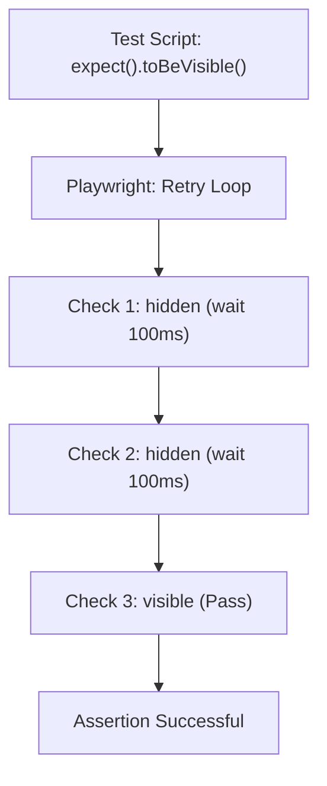

# Chapter 11: Assertions - Web-First Assertions (Complete Guide)

## The Concept of Web-First Assertions

A test without an assertion is just a script. To truly "test," we must verify that the application is in the expected state. Playwright introduces **Web-First Assertions**, which are designed specifically for the dynamic nature of modern web apps.

**Purpose**: This chapter focuses on how to validate your application's state using resilient, auto-retrying assertions.

**Why is it required?**
1. **Correctness**: To ensure that "Success" actually means the success message is visible and the data is saved.
2. **Wait-Free Validation**: Traditional assertions fail immediately if the element isn't ready; Web-First assertions wait for the state to be reached.
3. **Readability**: To make test outcomes clear to anyone reading the reports (e.g., "Expected element to be visible").

## Understanding Web-First Assertions

### What are Web-First Assertions?

Web-first assertions are Playwright's specialized assertion methods designed specifically for testing web applications. Unlike traditional assertions, they **automatically retry** until the condition is met or a timeout occurs.

### Traditional vs Web-First Assertions

**❌ Traditional Assertions (Flaky):**
```typescript
// Selenium/Jest style - Single check, no retry
const text = await page.locator('.status').textContent();
expect(text).toBe('Success');
// ❌ Fails if element hasn't updated yet
// ❌ No retry mechanism
// ❌ Race condition prone
```

**✅ Web-First Assertions (Reliable):**
```typescript
// Playwright style - Auto-retry until condition met
await expect(page.locator('.status')).toHaveText('Success');
// ✅ Keeps checking until text appears
// ✅ Waits up to 5 seconds (default)
// ✅ No race conditions
```

### How Auto-Retry Works



### Comparison Table

| Aspect | Traditional | Web-First |
|--------|------------|-----------|
| **Retry** | No | Yes (automatic) |
| **Timeout** | None | 5 seconds (configurable) |
| **Flakiness** | High | Low |
| **Error Messages** | Generic | Detailed with screenshots |
| **Waiting** | Manual | Automatic |
| **Use Case** | Static values | Dynamic web content |

---

## Why Auto-Retry Matters

### The Flakiness Problem

**Scenario: Button appears after API call**

```typescript
// ❌ FLAKY: Traditional approach
await page.click('#load-data');
const button = await page.locator('#submit').isVisible();
expect(button).toBe(true);
// Fails if API is slow! 🐛

// ✅ RELIABLE: Web-first approach
await page.click('#load-data');
await expect(page.locator('#submit')).toBeVisible();
// Waits for button to appear! ✅
```

### Real-World Example

```typescript
test('user can submit form after validation', async ({ page }) => {
  await page.goto('/form');
  
  // Fill form
  await page.fill('#email', 'user@example.com');
  
  // ❌ WRONG: Immediate check
  expect(await page.locator('#submit').isEnabled()).toBe(true);
  // Fails if validation is async!
  
  // ✅ CORRECT: Auto-retry assertion
  await expect(page.locator('#submit')).toBeEnabled();
  // Waits for validation to complete!
  
  await page.click('#submit');
});
```

### Benefits of Auto-Retry

| Benefit | Description | Impact |
|---------|-------------|--------|
| **Eliminates Race Conditions** | Waits for dynamic content | No flaky tests |
| **Handles Async Operations** | Waits for API responses | Reliable assertions |
| **Adapts to Performance** | Works on slow/fast machines | Consistent results |
| **Better Error Messages** | Shows expected vs actual | Easier debugging |
| **No Manual Waits** | Built-in waiting | Cleaner code |

---

## Locator Assertions

### Visibility Assertions

**toBeVisible()**
```typescript
// Wait for element to be visible
await expect(page.locator('.success-message')).toBeVisible();

// What it checks:
// - Element exists in DOM
// - Element has non-zero size
// - Element is not display:none
// - Element is not visibility:hidden
// Note: opacity:0 is still considered visible

// Use cases:
// - Success messages
// - Modal dialogs
// - Dropdown menus
// - Dynamic content
```

**toBeHidden()**
```typescript
// Wait for element to be hidden
await expect(page.locator('.loading-spinner')).toBeHidden();

// What it checks:
// - Element doesn't exist, OR
// - Element has zero size, OR
// - Element is display:none, OR
// - Element is visibility:hidden

// Use cases:
// - Loading indicators
// - Error messages (after fix)
// - Collapsed sections
```

### Text Assertions

**toHaveText()**
```typescript
// Exact text match
await expect(page.locator('.status')).toHaveText('Success');

// Regex match
await expect(page.locator('.status')).toHaveText(/success/i);

// Array of texts (for multiple elements)
await expect(page.locator('.item')).toHaveText([
  'Item 1',
  'Item 2',
  'Item 3'
]);

// Ignores case
await expect(page.locator('.status')).toHaveText('success', { ignoreCase: true });

// Use cases:
// - Verify messages
// - Check labels
// - Validate content
```

**toContainText()**
```typescript
// Partial text match
await expect(page.locator('.message')).toContainText('Success');
// Matches: "Success!", "Operation successful", "Success: Saved"

// Multiple partial matches
await expect(page.locator('.description')).toContainText([
  'feature',
  'available'
]);

// Use cases:
// - Dynamic content with variable parts
// - Long text with specific keywords
// - Internationalized content
```

**toHaveValue()**
```typescript
// For input elements
await expect(page.locator('#email')).toHaveValue('user@example.com');

// For textarea
await expect(page.locator('textarea')).toHaveValue('Multi-line\ntext');

// For select
await expect(page.locator('select')).toHaveValue('option-1');

// Use cases:
// - Form validation
// - Pre-filled forms
// - Input persistence
```

### Attribute Assertions

**toHaveAttribute()**
```typescript
// Check attribute exists with specific value
await expect(page.locator('a')).toHaveAttribute('href', '/home');

// Check attribute exists (any value)
await expect(page.locator('button')).toHaveAttribute('disabled');

// Regex match
await expect(page.locator('img')).toHaveAttribute('src', /logo\.png$/);

// Use cases:
// - Link verification
// - Image sources
// - Data attributes
// - ARIA attributes
```

**toHaveClass()**
```typescript
// Check for specific class
await expect(page.locator('button')).toHaveClass('btn-primary');

// Check for multiple classes
await expect(page.locator('button')).toHaveClass(['btn', 'btn-primary', 'active']);

// Regex match
await expect(page.locator('div')).toHaveClass(/^container/);

// Use cases:
// - CSS class validation
// - Active states
// - Theme classes
```

**toHaveId()**
```typescript
// Check element ID
await expect(page.locator('button')).toHaveId('submit-btn');

// Use cases:
// - Unique identifier verification
// - Anchor links
```

**toHaveCSS()**
```typescript
// Check computed CSS property
await expect(page.locator('button')).toHaveCSS('background-color', 'rgb(0, 123, 255)');

// Check font size
await expect(page.locator('h1')).toHaveCSS('font-size', '32px');

// Use cases:
// - Visual regression
// - Theme validation
// - Responsive design
```

### State Assertions

**toBeEnabled() / toBeDisabled()**
```typescript
// Check if enabled
await expect(page.locator('#submit')).toBeEnabled();

// Check if disabled
await expect(page.locator('#submit')).toBeDisabled();

// Use cases:
// - Form validation
// - Button states
// - Input accessibility
```

**toBeChecked()**
```typescript
// Check if checkbox/radio is checked
await expect(page.locator('#agree')).toBeChecked();

// Check if not checked
await expect(page.locator('#agree')).not.toBeChecked();

// Use cases:
// - Checkbox validation
// - Radio button selection
// - Toggle states
```

**toBeFocused()**
```typescript
// Check if element has focus
await expect(page.locator('#username')).toBeFocused();

// Use cases:
// - Accessibility testing
// - Form navigation
// - Keyboard interactions
```

**toBeEditable()**
```typescript
// Check if input is editable
await expect(page.locator('#email')).toBeEditable();

// Check if readonly
await expect(page.locator('#email')).not.toBeEditable();

// Use cases:
// - Form field states
// - Readonly validation
```

### Count Assertions

**toHaveCount()**
```typescript
// Check exact count
await expect(page.locator('.item')).toHaveCount(5);

// Check zero items
await expect(page.locator('.error')).toHaveCount(0);

// Use cases:
// - List validation
// - Search results
// - Dynamic content
```

### Attachment Assertions

**toBeAttached()**
```typescript
// Check if element is in DOM
await expect(page.locator('#element')).toBeAttached();

// Check if removed from DOM
await expect(page.locator('#element')).not.toBeAttached();

// Use cases:
// - Dynamic content
// - SPA navigation
// - Element removal
```

**toBeInViewport()**
```typescript
// Check if element is in viewport
await expect(page.locator('#section')).toBeInViewport();

// Check with ratio (50% visible)
await expect(page.locator('#section')).toBeInViewport({ ratio: 0.5 });

// Use cases:
// - Scroll validation
// - Lazy loading
// - Infinite scroll
```

### Empty Assertions

**toBeEmpty()**
```typescript
// Check if container is empty
await expect(page.locator('.container')).toBeEmpty();

// Check if input is empty
await expect(page.locator('#search')).toBeEmpty();

// Use cases:
// - Empty states
// - Cleared inputs
// - No results
```

---

## Page Assertions

### URL Assertions

**toHaveURL()**
```typescript
// Exact URL match
await expect(page).toHaveURL('https://example.com/dashboard');

// Regex match
await expect(page).toHaveURL(/\/dashboard$/);

// Partial match
await expect(page).toHaveURL(/dashboard/);

// Use cases:
// - Navigation verification
// - Route validation
// - Redirect checking
```

### Title Assertions

**toHaveTitle()**
```typescript
// Exact title match
await expect(page).toHaveTitle('Dashboard - My App');

// Regex match
await expect(page).toHaveTitle(/Dashboard/);

// Use cases:
// - Page title validation
// - SEO verification
// - Tab identification
```

---

## Generic Assertions

### When to Use Generic Assertions

Use generic assertions for **non-retrying** checks on static values:

```typescript
// ✅ GOOD: Static value
const count = await page.locator('.item').count();
expect(count).toBeGreaterThan(0);

// ❌ WRONG: Dynamic value (use web-first instead)
const text = await page.locator('.status').textContent();
expect(text).toBe('Success'); // Flaky!
// Better: await expect(page.locator('.status')).toHaveText('Success');
```

### Available Generic Assertions

```typescript
// Equality
expect(value).toBe(expected);
expect(value).toEqual(expected);
expect(value).toStrictEqual(expected);

// Truthiness
expect(value).toBeTruthy();
expect(value).toBeFalsy();
expect(value).toBeNull();
expect(value).toBeUndefined();
expect(value).toBeDefined();

// Numbers
expect(value).toBeGreaterThan(5);
expect(value).toBeGreaterThanOrEqual(5);
expect(value).toBeLessThan(10);
expect(value).toBeLessThanOrEqual(10);
expect(value).toBeCloseTo(5.5, 1); // Within 0.1

// Strings
expect(value).toMatch(/pattern/);
expect(value).toContain('substring');

// Arrays
expect(array).toContain(item);
expect(array).toHaveLength(5);
expect(array).toEqual(expect.arrayContaining([1, 2]));

// Objects
expect(obj).toHaveProperty('key');
expect(obj).toMatchObject({ key: 'value' });
```

---

## Negating Assertions

### Using .not

```typescript
// Negate any assertion with .not
await expect(page.locator('.error')).not.toBeVisible();
await expect(page.locator('#submit')).not.toBeDisabled();
await expect(page.locator('.message')).not.toHaveText('Error');
await expect(page).not.toHaveURL('/login');

// Common negations
await expect(page.locator('#checkbox')).not.toBeChecked();
await expect(page.locator('.container')).not.toBeEmpty();
await expect(page.locator('#input')).not.toHaveValue('');
```

---

## Soft Assertions

### What are Soft Assertions?

Soft assertions **don't stop test execution** when they fail. All assertions are checked, and failures are reported at the end.

### When to Use Soft Assertions

**Use soft assertions when:**
-- Checking multiple independent conditions
-- Validating form fields
-- Testing multiple elements on a page
-- You want to see all failures, not just the first

**Don't use soft assertions when:**
-- Subsequent steps depend on assertion passing
-- Test should stop on first failure
-- Assertion failure makes rest of test meaningless

### Soft Assertion Syntax

```typescript
test('validate user profile', async ({ page }) => {
  await page.goto('/profile');
  
  // All these will be checked, even if some fail
  await expect.soft(page.locator('.name')).toHaveText('John Doe');
  await expect.soft(page.locator('.email')).toHaveText('john@example.com');
  await expect.soft(page.locator('.phone')).toHaveText('123-456-7890');
  await expect.soft(page.locator('.address')).toContainText('New York');
  
  // Test continues even if assertions above failed
  // All failures reported at end
});
```

### Soft vs Hard Assertions

```typescript
test('hard assertions (stops on first failure)', async ({ page }) => {
  await expect(page.locator('.field1')).toHaveText('Value 1');
  // ❌ Test stops here if this fails
  await expect(page.locator('.field2')).toHaveText('Value 2');
  await expect(page.locator('.field3')).toHaveText('Value 3');
});

test('soft assertions (checks all)', async ({ page }) => {
  await expect.soft(page.locator('.field1')).toHaveText('Value 1');
  await expect.soft(page.locator('.field2')).toHaveText('Value 2');
  await expect.soft(page.locator('.field3')).toHaveText('Value 3');
  // ✅ All three are checked, all failures reported
});
```

---

## Custom Error Messages

### Adding Custom Messages

```typescript
// Add custom message to any assertion
await expect(page.locator('.status'), 'Status should show success').toHaveText('Success');

// With soft assertions
await expect.soft(page.locator('.name'), 'User name should be displayed').toBeVisible();

// Multiple assertions with messages
await expect(page.locator('#email'), 'Email field should be filled').toHaveValue('user@example.com');
await expect(page.locator('#submit'), 'Submit button should be enabled').toBeEnabled();
```

### Error Message Example

```typescript
// Without custom message
await expect(page.locator('.status')).toHaveText('Success');
// Error: Locator('.status') expected to have text 'Success'

// With custom message
await expect(page.locator('.status'), 'Payment status should show success').toHaveText('Success');
// Error: Payment status should show success
//        Locator('.status') expected to have text 'Success'
```

---

## Assertion Timeouts

### Default Timeout

```typescript
// Default: 5 seconds
await expect(page.locator('.status')).toBeVisible();
// Waits up to 5000ms
```

### Custom Timeout per Assertion

```typescript
// Custom timeout for specific assertion
await expect(page.locator('.slow-element')).toBeVisible({ timeout: 10000 });
// Waits up to 10 seconds

// Shorter timeout
await expect(page.locator('.fast-element')).toBeVisible({ timeout: 1000 });
// Waits up to 1 second
```

### Global Timeout Configuration

```typescript
// playwright.config.ts
export default defineConfig({
  expect: {
    timeout: 10_000, // 10 seconds for all assertions
  },
});
```

### Timeout Hierarchy

```
1. Assertion-level timeout (highest priority)
   await expect(locator).toBeVisible({ timeout: 10000 });

2. Config-level timeout
   expect: { timeout: 5000 }

3. Default timeout (5000ms)
```

---

## Best Practices

### DO's and DON'Ts

```typescript
// ✅ DO: Use web-first assertions for dynamic content
await expect(page.locator('.status')).toHaveText('Success');

// ❌ DON'T: Get value then assert (flaky)
const text = await page.locator('.status').textContent();
expect(text).toBe('Success');

// ✅ DO: Use specific assertions
await expect(page.locator('#submit')).toBeEnabled();

// ❌ DON'T: Use generic assertions for element state
const isEnabled = await page.locator('#submit').isEnabled();
expect(isEnabled).toBe(true);

// ✅ DO: Use soft assertions for independent checks
await expect.soft(page.locator('.field1')).toBeVisible();
await expect.soft(page.locator('.field2')).toBeVisible();

// ❌ DON'T: Use soft assertions when order matters
await expect.soft(page.locator('#login')).toBeVisible();
await page.click('#login'); // Might fail if login not visible!

// ✅ DO: Add custom messages for clarity
await expect(page.locator('.total'), 'Cart total should be correct').toHaveText('$99.99');

// ❌ DON'T: Skip error messages for complex assertions
await expect(page.locator('.complex-selector')).toHaveText('Value');

// ✅ DO: Use appropriate timeout
await expect(page.locator('.slow-api-result')).toBeVisible({ timeout: 10000 });

// ❌ DON'T: Use same timeout for everything
await expect(page.locator('.instant')).toBeVisible({ timeout: 30000 }); // Too long
```

### Assertion Patterns

**Pattern 1: Form Validation**
```typescript
test('validate form submission', async ({ page }) => {
  await page.goto('/form');
  
  // Fill form
  await page.fill('#name', 'John Doe');
  await page.fill('#email', 'john@example.com');
  await page.click('#submit');
  
  // Verify success
  await expect(page.locator('.success')).toBeVisible();
  await expect(page.locator('.success')).toHaveText('Form submitted successfully');
  await expect(page).toHaveURL('/success');
});
```

**Pattern 2: List Validation**
```typescript
test('validate search results', async ({ page }) => {
  await page.goto('/search');
  await page.fill('#query', 'playwright');
  await page.press('#query', 'Enter');
  
  // Verify results
  await expect(page.locator('.result')).toHaveCount(10);
  await expect(page.locator('.result').first()).toContainText('playwright');
  await expect(page.locator('.no-results')).not.toBeVisible();
});
```

**Pattern 3: State Validation**
```typescript
test('validate button states', async ({ page }) => {
  await page.goto('/form');
  
  // Initially disabled
  await expect(page.locator('#submit')).toBeDisabled();
  
  // Fill required field
  await page.fill('#email', 'user@example.com');
  
  // Now enabled
  await expect(page.locator('#submit')).toBeEnabled();
});
```

**Summary**: You now understand Playwright's powerful web-first assertions that eliminate flaky tests through automatic retrying. The next chapter covers the centralized control center of your test suite: the configuration file.
