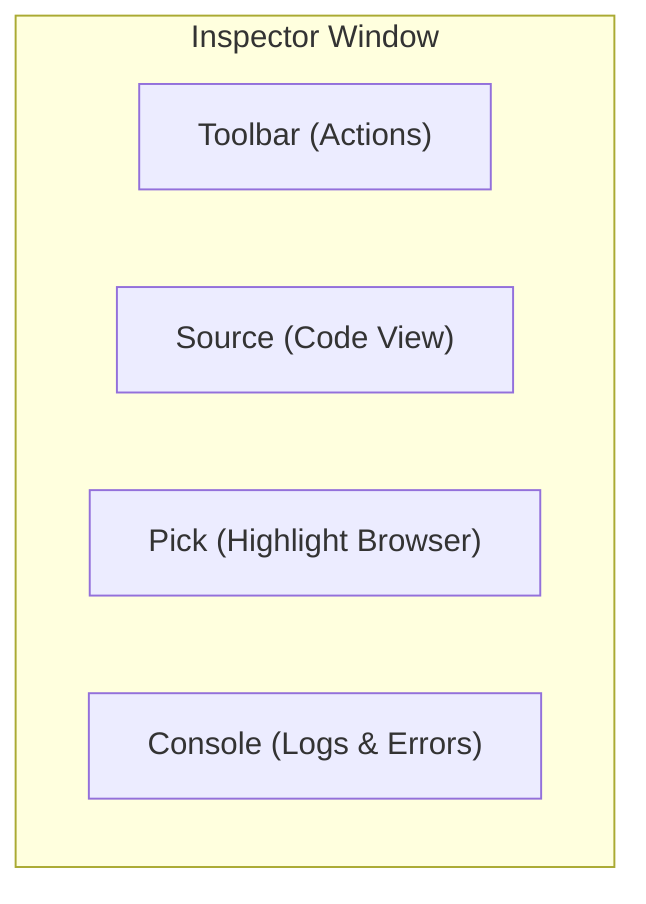
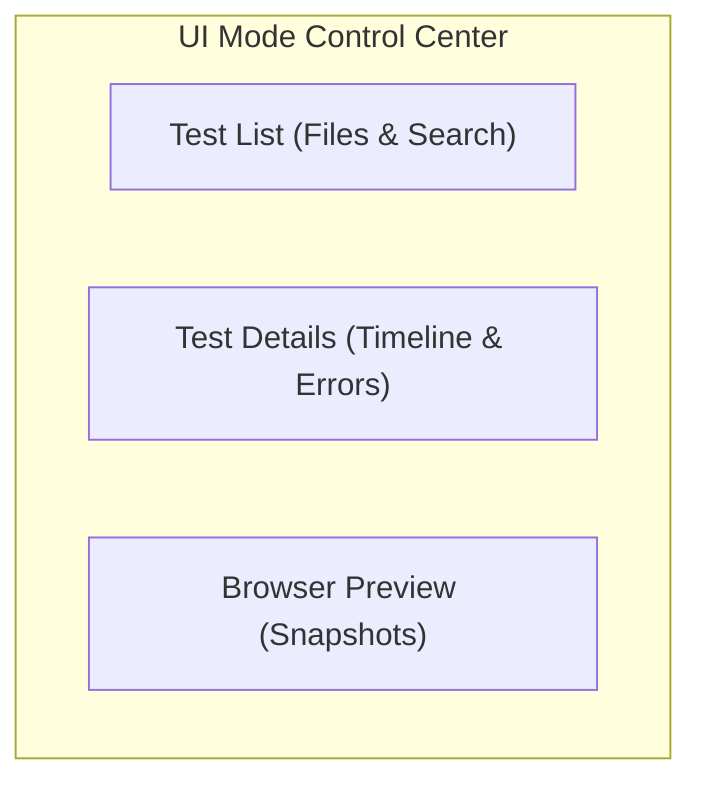
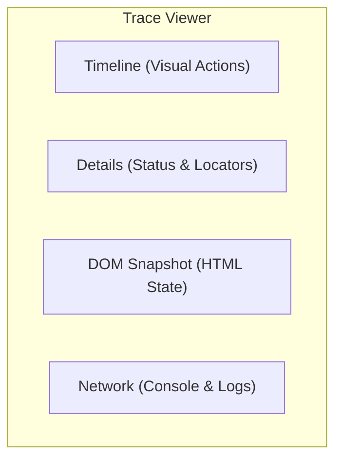

# Chapter 13: Debugging & Tooling (Complete Guide)

## The Concept of Debugging & Tooling

Even the most perfectly written tests will fail. The key to being a high-performing automation engineer is not avoid errors, but to **diagnose them quickly**. Playwright provides a suite of visual and programmatic tools that take the guesswork out of debugging.

**Purpose**: This chapter introduces you to the debugging ecosystem—Trace Viewer, UI Mode, and the VS Code extension—enabling you to see exactly what happened during a failure.

**Why is it required?**
1. **Efficiency**: To stop guessing why a test failed by visually "time-traveling" through the execution steps.
2. **CI Insight**: To debug failures that happen on remote servers (CI) as if they were happening on your local machine.
3. **Resilience**: To find the exact reason for flakiness (e.g., a hidden overlay or a slow network request) and fix it permanently.

### Event Handling: The `page.on()` Pattern

Playwright allows you to "subscribe" to browser events. This is critical for capturing intermittent errors, console warnings, or tracking asynchronous interactions.

#### 1. Monitoring Console Messages
```typescript
page.on('console', msg => {
  if (msg.type() === 'error') {
    console.log(`Page Error: "${msg.text()}"`);
  }
});
```

#### 2. Handling Page Crashes (pageerror)
If the application has an unhandled exception (JS crash), Playwright captures it here:
```typescript
page.on('pageerror', exception => {
  console.log(`Uncaught Exception: ${exception.message}`);
});
```

#### 3. Request/Response Monitoring
(Covered in Chapter 20, but important here for debugging data flow issues).

### Why Debugging Matters

Even with Playwright's reliability, tests fail. Effective debugging tools help you:
- Understand why tests fail
- Reproduce issues consistently
- Fix problems quickly
- Prevent future failures

### Debugging Tool Comparison

| Tool | Use Case | Speed | Detail Level | When to Use |
|------|----------|-------|--------------|-------------|
| **VS Code** | Development | ⚡ Fast | High | Writing tests |
| **Inspector** | Step-through | 🏃 Medium | Very High | Understanding flow |
| **UI Mode** | Interactive | 🏃 Medium | High | Exploring tests |
| **Trace Viewer** | Post-mortem | 🐌 Slow | Extreme | Failed CI tests |
| **DevTools** | DOM inspection | ⚡ Fast | Medium | Element issues |
| **Logs** | Quick check | ⚡ Fast | Low | Simple issues |

---

## VS Code Debugging

### Setup

**1. Install Extension**
- Extension: "Playwright Test for VSCode"
- Publisher: Microsoft
-- Features: Run, debug, pick locators

**2. Extension Features**

| Feature | Description | Shortcut |
|---------|-------------|----------|
| **Run Test** | Execute single test | Click ▶️ icon |
| **Debug Test** | Debug with breakpoints | Click 🐛 icon |
| **Show Browser** | Watch test execute | Toggle in settings |
| **Pick Locator** | Generate locators | Click 📍 icon |
| **Record Test** | Record actions | Click ⏺️ icon |

### Setting Breakpoints

```typescript
test('debug example', async ({ page }) => {
  await page.goto('https://example.com');
  
  // Click line number to set breakpoint ⬅️
  await page.click('button');
  
  await expect(page).toHaveURL('/success');
});
```

**Breakpoint Actions:**
- **Continue (F5)**: Run until next breakpoint
- **Step Over (F10)**: Execute current line
- **Step Into (F11)**: Enter function
- **Step Out (Shift+F11)**: Exit function
- **Restart (Ctrl+Shift+F5)**: Restart debugging

### Debug Console

```typescript
test('inspect variables', async ({ page }) => {
  await page.goto('/');
  
  const title = await page.title();
  // Set breakpoint here
  // In Debug Console, type: title
  // Shows: "Example Domain"
  
  const count = await page.locator('button').count();
  // Type: count
  // Shows: 5
});
```

### Watch Expressions

Add expressions to watch:
```
page.url()
await page.title()
await page.locator('button').count()
```

### Live Debugging

**Show Browser Mode:**
```json
// .vscode/settings.json
{
  "playwright.showBrowser": true
}
```

**Benefits:**
- See test execute in real browser
- Hover over locators to highlight elements
- Edit locators and see changes live
- Pick elements interactively

---

## Playwright Inspector

### What is the Inspector?

A GUI tool for step-by-step debugging with:
- Test code viewer
- Action timeline
- Locator picker
- DOM snapshot
- Console logs

### Launching Inspector

```bash
# Debug all tests
npx playwright test --debug

# Debug specific test
npx playwright test example.spec.ts:10 --debug

# Debug on specific browser
npx playwright test --project=chromium --debug
```

**What happens:**
- Browser launches in headed mode
- Inspector window opens
- Timeout set to 0 (infinite)
- Test pauses at first action

### Inspector Interface



### Inspector Controls

**Toolbar:**
- **▶️ Resume**: Continue to next pause
- **⏭️ Step Over**: Execute current action
- **⏸️ Pause**: Pause on next action
- **🔄 Restart**: Restart test
- **⏹️ Stop**: Stop debugging

**Pick Locator:**
1. Click "Pick Locator" button
2. Hover over elements in browser
3. Click element to select
4. Locator appears in Inspector
5. Press Enter to copy

### Using page.pause()

```typescript
test('pause at specific point', async ({ page }) => {
  await page.goto('/');
  await page.click('button');
  
  // Inspector opens here
  await page.pause();
  
  // Continue manually from Inspector
  await expect(page).toHaveURL('/success');
});
```

**When to use page.pause():**
- Skip to specific point in test
- Inspect page state at exact moment
- Avoid stepping through entire test

---

## UI Mode

### What is UI Mode?

An interactive test runner with:
- Visual test execution
- Time-travel debugging
- Watch mode
- Filter and search
- Detailed error messages

### Launching UI Mode

```bash
# Start UI Mode
npx playwright test --ui

# UI Mode with specific browser
npx playwright test --ui --project=chromium
```

### UI Mode Interface



### UI Mode Features

**1. Time-Travel Debugging**
- Click any action in timeline
- See page state at that moment
- Inspect DOM snapshot
- View network requests

**2. Watch Mode**
- Automatically re-runs tests on file changes
- Instant feedback
- Great for TDD

**3. Filtering**
```
Filter by:
- Test name
- File name
- Status (passed/failed)
- Browser
- Tag
```

**4. Action Details**
For each action, see:
- Locator used
- Actionability checks
- Duration
- Before/after screenshots
- Console logs
- Network activity

---

## Trace Viewer

### What is Trace Viewer?

A post-mortem debugging tool that records:
- Every action
- DOM snapshots
- Network requests
- Console logs
- Screenshots
- Source code

### Enabling Traces

**In playwright.config.ts:**
```typescript
export default defineConfig({
  use: {
    trace: 'on-first-retry', // Recommended
    // OR
    trace: 'on', // Always record (slower)
    // OR
    trace: 'retain-on-failure', // Keep only failures
    // OR
    trace: 'off', // No traces
  },
});
```

**Trace Options:**

| Option | When Recorded | Use Case |
|--------|--------------|----------|
| `on` | Every test | Development |
| `off` | Never | Production |
| `on-first-retry` | Failed tests (on retry) | CI/CD (recommended) |
| `retain-on-failure` | Failed tests | Debugging failures |

### Viewing Traces

```bash
# View trace from HTML report
npx playwright show-report

# View specific trace file
npx playwright show-trace trace.zip
```

### Trace Viewer Interface



### Trace Viewer Tabs

**1. Actions Tab**
- All test actions
- Click to see details
- Actionability checks
- Timing information

**2. Metadata Tab**
- Browser version
- Test file
- Test name
- Duration
- Errors

**3. Source Tab**
- Test source code
- Highlighted current line
- Stack trace

**4. Network Tab**
- All network requests
- Request/response headers
- Response body
- Timing

**5. Console Tab**
- Console.log messages
- Errors
- Warnings

**6. Call Tab**
- API calls made
- Parameters
- Return values

### Trace Example

```typescript
test('trace example', async ({ page }) => {
  // All these actions are recorded
  await page.goto('https://example.com');
  await page.fill('#email', 'user@example.com');
  await page.click('#submit');
  await expect(page).toHaveURL('/dashboard');
  
  // If test fails, trace is saved
  // View with: npx playwright show-trace trace.zip
});
```

---

## Browser DevTools

### Accessing DevTools

**Method 1: PWDEBUG=console**
```bash
# Windows PowerShell
$env:PWDEBUG="console"
npx playwright test

# Mac/Linux
PWDEBUG=console npx playwright test
```

**Method 2: page.pause() + F12**
```typescript
test('use devtools', async ({ page }) => {
  await page.goto('/');
  await page.pause(); // Opens Inspector
  // Press F12 in browser to open DevTools
});
```

### DevTools Features

**1. Elements Tab**
- Inspect DOM
- Find selectors
- Test CSS selectors
- View computed styles

**2. Console Tab**
```typescript
// playwright object available in console
playwright.$('button') // Find element
playwright.$$('button') // Find all elements
playwright.inspect('button') // Inspect in Elements
playwright.locator('.class') // Create locator
playwright.selector($0) // Generate selector for selected element
```

**3. Network Tab**
- Monitor requests
- Check response status
- View headers
- Inspect payloads

**4. Sources Tab**
- Set JavaScript breakpoints
- Step through page code
- Debug page scripts

### Playwright Console API

```javascript
// In browser DevTools console

// Find element
playwright.$('button')
// Returns: <button>Click me</button>

// Find all elements
playwright.$$('li')
// Returns: [<li>, <li>, <li>]

// Inspect element
playwright.inspect('text=Submit')
// Opens Elements tab

// Create locator
playwright.locator('.card', { hasText: 'Product' })
// Returns: Locator object

// Generate selector
playwright.selector($0)
// Returns: "div.card:nth-child(2)"
```

---

## Verbose Logging

### API Logs

```bash
# Windows PowerShell
$env:DEBUG="pw:api"
npx playwright test

# Mac/Linux
DEBUG=pw:api npx playwright test
```

**Output:**
```
pw:api page.goto(https://example.com) +0ms
pw:api   navigated to https://example.com +250ms
pw:api page.click(button) +250ms
pw:api   waiting for locator('button') +0ms
pw:api   locator resolved to <button>Click me</button> +50ms
pw:api   attempting click action +0ms
pw:api   waiting for element to be visible +0ms
pw:api   element is visible +10ms
pw:api   waiting for element to be stable +10ms
pw:api   element is stable +20ms
pw:api   scrolling into view if needed +0ms
pw:api   done scrolling +5ms
pw:api   performing click action +0ms
pw:api   click action done +15ms
```

### Browser Logs

```bash
# All logs
DEBUG=pw:* npx playwright test

# Specific categories
DEBUG=pw:api,pw:browser npx playwright test
```

### Custom Logging

```typescript
test('custom logging', async ({ page }) => {
  // Log page events
  page.on('console', msg => console.log('PAGE LOG:', msg.text()));
  page.on('pageerror', err => console.error('PAGE ERROR:', err));
  page.on('request', req => console.log('REQUEST:', req.url()));
  page.on('response', res => console.log('RESPONSE:', res.url(), res.status()));
  
  await page.goto('/');
});
```

---

## Headed Mode

### Running in Headed Mode

```bash
# Run with visible browser
npx playwright test --headed

# Specific browser
npx playwright test --headed --project=chromium
```

**In config:**
```typescript
export default defineConfig({
  use: {
    headless: false,
  },
});
```

### Slow Motion

```typescript
export default defineConfig({
  use: {
    headless: false,
    slowMo: 500, // 500ms delay between actions
  },
});
```

**Use cases:**
- Watch test execute
- Understand test flow
- Demo tests
- Debugging visual issues

---

## Debugging Strategies

### Strategy 1: Start Simple

```typescript
// 1. Add console.log
test('debug', async ({ page }) => {
  await page.goto('/');
  console.log('URL:', page.url());
  
  const count = await page.locator('button').count();
  console.log('Button count:', count);
});

// 2. If still failing, add page.pause()
test('debug', async ({ page }) => {
  await page.goto('/');
  await page.pause(); // Inspect here
});

// 3. If still unclear, enable traces
// playwright.config.ts: trace: 'on'
```

### Strategy 2: Isolate the Problem

```typescript
// Comment out code to find issue
test('isolate problem', async ({ page }) => {
  await page.goto('/');
  // await page.click('button'); // Comment this
  // await page.fill('#input', 'text'); // And this
  await expect(page).toHaveURL('/'); // Does this pass?
});
```

### Strategy 3: Check Actionability

```typescript
test('check actionability', async ({ page }) => {
  await page.goto('/');
  
  const button = page.locator('button');
  
  // Check each condition
  console.log('Is attached:', await button.isAttached());
  console.log('Is visible:', await button.isVisible());
  console.log('Is enabled:', await button.isEnabled());
  
  // Check bounding box
  const box = await button.boundingBox();
  console.log('Bounding box:', box);
});
```

### Strategy 4: Screenshot on Failure

```typescript
test('screenshot on failure', async ({ page }, testInfo) => {
  try {
    await page.goto('/');
    await page.click('button');
  } catch (error) {
    await page.screenshot({ 
      path: `failure-${testInfo.title}.png` 
    });
    throw error;
  }
});
```

---

## Best Practices

### DO's and DON'Ts

```typescript
// ✅ DO: Use VS Code extension for development
// Click debug icon, set breakpoints, step through

// ❌ DON'T: Debug with console.log only
console.log('value:', value);

// ✅ DO: Use page.pause() to inspect at specific point
await page.pause();

// ❌ DON'T: Add waits to "fix" issues
await page.waitForTimeout(5000);

// ✅ DO: Enable traces for CI
trace: 'on-first-retry'

// ❌ DON'T: Always record traces (slow)
trace: 'on'

// ✅ DO: Use Trace Viewer for failed CI tests
npx playwright show-trace trace.zip

// ❌ DON'T: Try to debug without traces on CI

// ✅ DO: Use headed mode to watch tests
npx playwright test --headed

// ❌ DON'T: Run headed mode in CI
```

**Summary**: You now have a complete debugging toolkit—from VS Code integration to Trace Viewer. The next chapter deep dives into Fixtures and Hooks, the backbone of setup and teardown in Playwright.
