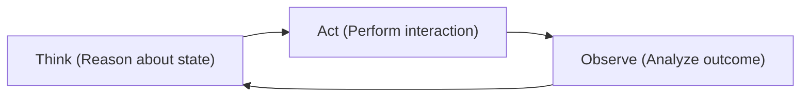
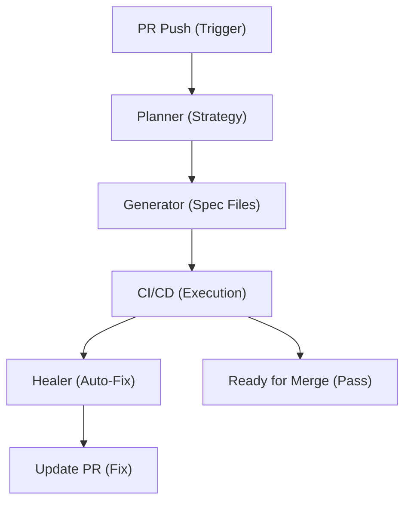

# Chapter 28: Playwright Agents 🕵️‍♂️

## The Concept of Autonomous Testing Agents

A "script" follows a fixed path. An **Agent** uses an LLM as its "brain" to reason, observe, and adapt. In Playwright, an AI Agent can dynamically look at a failed test, analyze the DOM, and decide how to fix the locator without human intervention.

**Purpose**: This chapter explores the transition from manual automation scripts to autonomous agents that can plan, generate, and heal tests.

**Why is it required?**
1. **Self-Healing**: To build tests that don't break when a developer changes a button's ID, as the agent can "find" the button based on visual or semantic context.
2. **Autonomous Planning**: To explore how AI can look at a user story and automatically generate the necessary BDD scenarios and step definitions.
3. **Productivity Multiplier**: To shift from "Automating the App" to "Automating the Automation," allowing testers to focus on strategy while agents handle the maintenance.

## 1. What are AI Agents?

An **AI Agent** is an autonomous system that uses an LLM as its "brain" to perceive, reason, and act. Unlike a simple prompt ("Generate code"), an Agent loops through a cycle:



In Playwright context, we can build Agents to handle specific stages of the automation lifecycle.

---

## 2. The Agent Trinity

We classify Playwright Agents into three roles:

### 2.1 The Planner Agent 📝
*   **Input**: User stories, JIRA tickets, or Figma designs.
*   **Goal**: Define *what* to test.
*   **Output**: A list of test scenarios, covering positive, negative, and edge cases.
*   **Logic**:
    1.  Read Requirement.
    2.  Break down into flows.
    3.  Identify boundary values.
    4.  Output BDD/Gherkin or plain text scenarios.

### 2.2 The Generator Agent 🏗️
*   **Input**: Test Scenarios (from Planner) and existing Framework context (Project structure).
*   **Goal**: Generate the code.
*   **Output**: Page Object files (`.po.ts`) and Spec files (`.spec.ts`).
*   **Logic**:
    1.  Read Scenario.
    2.  Check if Page Objects already exist for the screens involved.
    3.  If yes, reuse methods. If no, generate new Page Class.
    4.  Write the test script adhering to linting rules.

### 2.3 The Healer Agent 🚑
*   **Input**: Error logs, Trace files, and DOM snapshots from a failed test.
*   **Goal**: Fix the broken test.
*   **Output**: A corrected locator or code snippet.
*   **Logic**:
    1.  Catch test failure.
    2.  Extract the failed locator (e.g., `text='Submit'`).
    3.  Analyze the current DOM snapshot.
    4.  Find the element that *looks* like the intended one (e.g., `role='button', name='Submit Order'`).
    5.  Update the code automatically.

---

## 3. Advanced Strategy: Similarity-Based Healing

Sometimes standard AI prompts are too slow. You can build "lightweight" healing using semantic similarity.

```typescript
import { test, expect } from '@playwright/test';

// Simple Levenshtein or Jaro-Winkler implementation
async function findBySimilarity(page, targetText, threshold = 0.8) {
  const allButtons = await page.locator('button').all();
  
  for (const btn of allButtons) {
    const text = await btn.textContent();
    const score = calculateSimilarity(targetText, text);
    
    if (score >= threshold) {
      console.log(`✅ Found semantically similar element: "${text}" (Score: ${score})`);
      return btn;
    }
  }
}
```

---

## 4. Model Context Protocol (MCP) in Testing

**MCP** is an open standard that allows AI models to safely access external data (like your local Playwright trace or DOM) and tools.

### Why MCP for Playwright?
*   **Tool Usage**: AI can "invoke" a Playwright command directly.
*   **Structured Context**: Instead of messy prompts, MCP provides a clean protocol for the AI to understand your test state.

### 4.2 Using MCP for Autonomous Steps
```typescript
import { MCPClient } from '@modelcontextprotocol/sdk';

test('Agent: Find and add products', async ({ page }) => {
  const client = new MCPClient('http://localhost:3000');
  
  // The AI "chooses" the best tool for the next step based on the goal
  await client.callTool('agentic_navigation', { 
    goal: 'Add the most expensive laptop to cart',
    currentUrl: page.url()
  });
});
```

---

## 5. Intelligent Test Maintenance: Error Analysis

Instead of just logging `Error: Timeout`, a Mastery framework sends the error and a DOM snapshot to an LLM to get a human-readable explanation and a code fix.

### AI Error Analyzer Utility
```typescript
async function analyzePlaywrightError(error: Error, page: Page) {
  const domSnapshot = await page.content();
  const screenshot = await page.screenshot({ encoding: 'base64' });

  const fix = await openai.chat.completions.create({
    model: 'gpt-4o',
    messages: [
      { role: 'user', content: `Test failed: ${error.message}. Snippet: ${domSnapshot}` }
    ]
  });

  console.log(`💡 AI Suggested Fix: ${fix.choices[0].message.content}`);
}
```

---

## 6. Orchestrating the Workflow: The Productivity AI

Beyond writing and healing code, AI helps manage the **Testing Lifecycle**.

### 6.1 Flaky Test Detection (Statistical AI)
An AI can analyze 100 runs of a test and determine if a failure is a "Real Bug" or "Environment Noise" (Flakiness).

```typescript
function calculateFlakiness(results: TestResult[]): boolean {
  const passRate = results.filter(r => r.status === 'passed').length / results.length;
  // If pass rate is between 20% and 80%, it's likely flaky
  return passRate > 0.2 && passRate < 0.8;
}
```

### 6.2 Smart Test Prioritization (Predictive AI)
Instead of running ALL tests for every PR, use AI to run only the tests that have the highest probability of failure based on changed files.

```typescript
function prioritizeTests(tests: TestMetadata[]): TestMetadata[] {
  return tests.sort((a, b) => {
    // Score based on: Recent Failure Count * 10 + Last Modified Correlation
    return calculatePriorityScore(b) - calculatePriorityScore(a);
  });
}
```

---

## 7. The Future of Playwright Engineering

The true power comes from chaining these agents:



**Summary**: You've explored the world of autonomous agents—Planners, Generators, and Healers. The next chapter pivots to a different challenge: how to test applications that have AI inside them.
