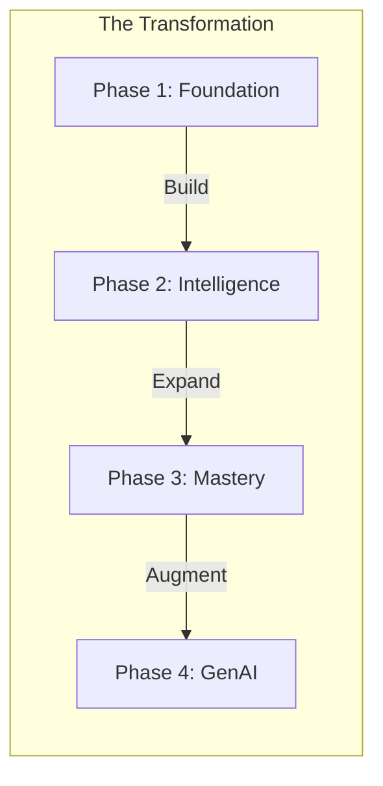

# Chapter 31: Capstone Project 🎓

## The Concept of Mastery through Application

Knowledge without application is just information. The **Capstone Project** is designed to pull together everything you've learned—from basic locators to AI agents—into a single, enterprise-grade automation framework. This is where you prove you can architect a solution, not just write a script.

**Purpose**: To challenge you to build a complete, end-to-end testing environment for a real-world application, incorporating best practices and modern tooling.

**Why is it required?**
1. **Synthesis**: To force the integration of disparate concepts like POM, Fixtures, API mocking, and CI/CD into a unified workflow.
2. **Portfolio Building**: To create a project that demonstrates your expertise to employers or clients.
3. **Confidence**: To confirm that you can handle the complexity of a real-world project from scratch to delivery.

---

## 1. Project Overview & Objective

The objective of this capstone is to build a robust, scalable, and AI-augmented automation framework for the **Swag Labs (SauceDemo)** application. While the application itself is simple, your goal is to treat it like a mission-critical enterprise system.

### The Mission
You are the **Automation Architect** at a fast-growing startup. Your task is to design a framework that is:
*   **Resilient**: Handling dynamic elements and varying network conditions.
*   **Maintainable**: Using DRY (Don't Repeat Yourself) principles and POM.
*   **Fast**: Leveraging parallelism and API-based state isolation.
*   **Modern**: Integrated with AI for self-healing and data generation.

---

## 2. Advanced Architecture Breakdown

Your project structure should reflect a professional enterprise repository. Use the following blueprint:

```text
playwright-mastery-capstone/
├── .github/workflows/      # CI/CD (GitHub Actions)
├── data/                   # Test data (JSON, CSV, environment variables)
├── fixtures/               # Custom Playwright fixtures (Base, Auth, API)
├── pages/                  # Page Object Model classes (Components + Pages)
├── tests/                  # Test suites (Smoke, Regression, API, Specialized)
├── utils/                  # Helper functions (AI utilities, Loggers, Parsers)
├── .env                    # Environment secrets (Credentials, URLs)
├── playwright.config.ts    # Global settings
└── README.md               # Professional documentation
```

### 2.1 The "Super-Base" Fixture
Instead of importing `test` and `expect` from `@playwright/test` everywhere, you must create a `baseFixture.ts` that:
1.  Initializes all Page Objects automatically.
2.  Provides pre-configured API contexts for hybrid testing.
3.  Injects AI self-healing logic into the interaction layer.

---

---

## 3. High-Level Implementation Roadmap



## 3. High-Level Implementation Phases

### Phase 1: Foundation (The Framework Core)
1.  **Environment Setup**: Configure `.env` and `playwright.config.ts` for multiple projects (Chromium, Mobile Safari, Desktop Firefox).
2.  **POM Implementation**: Create page objects for Login, Inventory, Cart, and Checkout. Use **Component-based POM** (e.g., a shared `Header` and `Footer` component).
3.  **Basic Smoke Tests**: Run a simple "Login and Buy Item" flow to verify the pipes are connected.

### Phase 2: Intelligence & Data (The Engineering Layer)
1.  **Authentication Optimization**: Use `storageState` in a `setup` project to ensure standard tests bypass the login screen entirely (1ms "login").
2.  **Parameterization**: Move all test data (product names, prices) into `data/products.json`. Write a loop that runs the same "Add to Cart" test for 5 different items.
3.  **API Mocking**: Use `page.route` to mock the `/api/checkout` endpoint. Test how your UI behaves when the backend returns a `500 Internal Server Error`.

### Phase 3: Specialized Testing (The Mastery Layer)
1.  **Visual Regression**: Core pages (Login, Dashboard) must have `toHaveScreenshot` assertions.
2.  **Accessibility (A11y)**: Integrate `@axe-core/playwright` and fail the build if the Login page has critical accessibility violations.
3.  **Network Throttling**: Create a test that runs on "Slow 3G" emulation (using CDP) to verify loading spinners appear correctly.

### Phase 4: AI & Future-Proofing (The GenAI Layer)
1.  **AI Data Generation**: Create a utility in `utils/aiData.ts` that uses an LLM (via Cursor, Copilot, or direct API) to generate realistic user profile names and addresses for the checkout form.
2.  **Self-Healing Concept**: Implement a custom `clickWithHealing` method. If a standard locator fails, it should use a broader AI-suggested selector (using MCP or localized LLM context) to find the button.

---

## 4. Test Scenario Checklist

You must implement at least the following scenarios:

| Category | Scenario | Requirement |
| :--- | :--- | :--- |
| **Auth** | Multi-Role Access | Verify Standard, Locked, and Glitch users independently. |
| **UX** | Inventory Sorting | Verify "Price (Low to High)" sorting logic via array comparison. |
| **E2E** | Full Purchase Flow | Login -> Add 3 specific items -> Checkout -> Verify "Thank you" Page. |
| **Edges** | Empty Cart | Try to visit `/checkout` directly without items; verify redirect. |
| **API** | Hybrid Creation | Use `request.post` to "inject" an item into the session before UI check. |
| **A11y** | WCAG Compliance | Scan the Home page and export an `axe-report.html`. |

---

## 5. Submission & Professional Documentation

A professional project is only as good as its documentation. Your **README.md** must include:
1.  **One-Line Purpose**: What this framework does.
2.  **Setup Instructions**: `npm install` and browser installation.
3.  **How to Run**: Commands for headed, UI, and parallel execution.
4.  **The "Wow" Factor**: Explain your AI integration and how you handled the API mocking challenge.
5.  **GitHub Actions Badge**: Show a "Passing" status for your latest master branch build.

---

## 6. Evaluation Criteria

Your project will be evaluated on three pillars:

1.  **Architecture (40%)**: Is the code modular? Are fixtures used correctly? Is there zero redundancy in locators?
2.  **Reliability (30%)**: Do tests pass on CI? Are waits handled by Playwright instead of `waitForTimeout`?
3.  **Advanced Skills (30%)**: Did you implement Mocking, A11y, and AI features successfully?

---

## 7. Conclusion

Congratulations! 🚀

You have journeyed from `npm install` to building AI-augmented, self-healing, enterprise-scale automation systems. The completion of this Capstone Project marks your transition from a student to a **Master of Modern Test Engineering**.

**Show the world what you've built. Happy Testing! 🎭**
