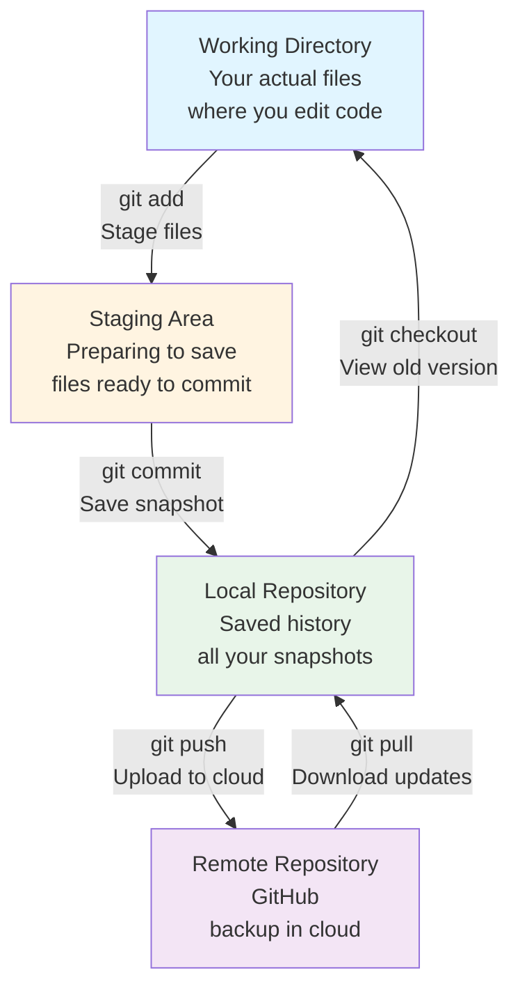
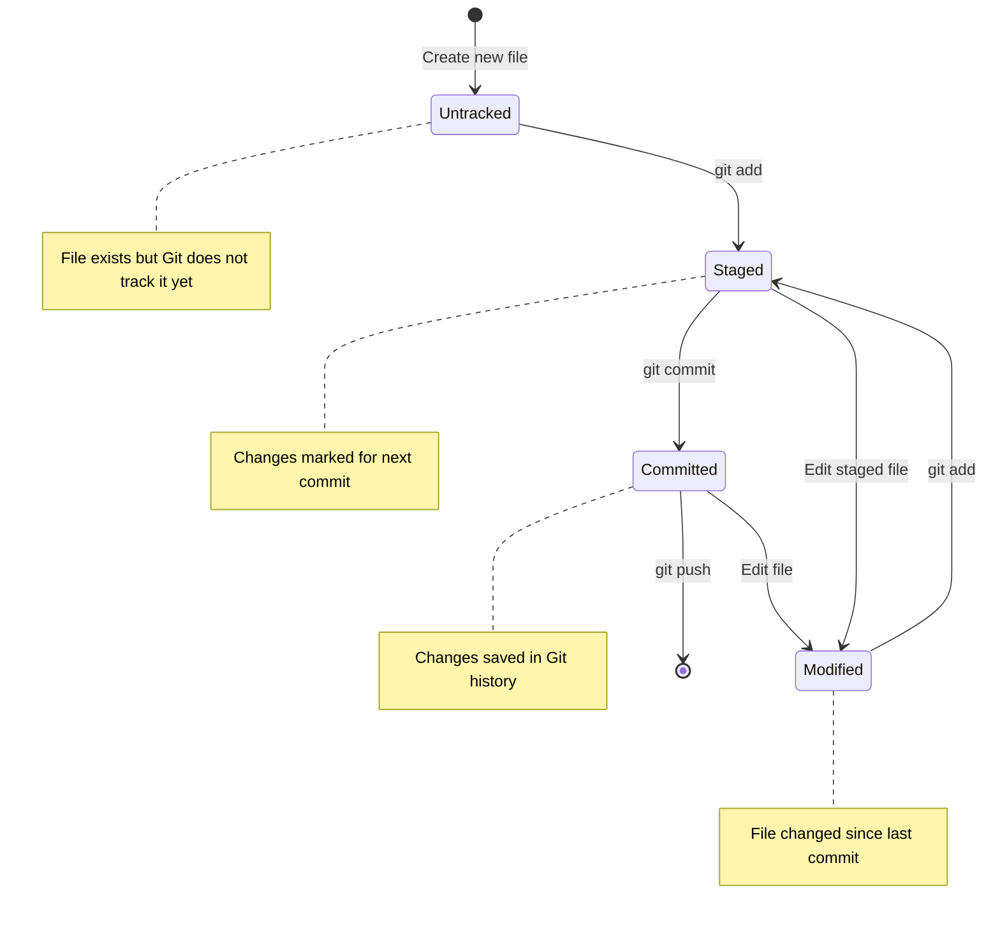
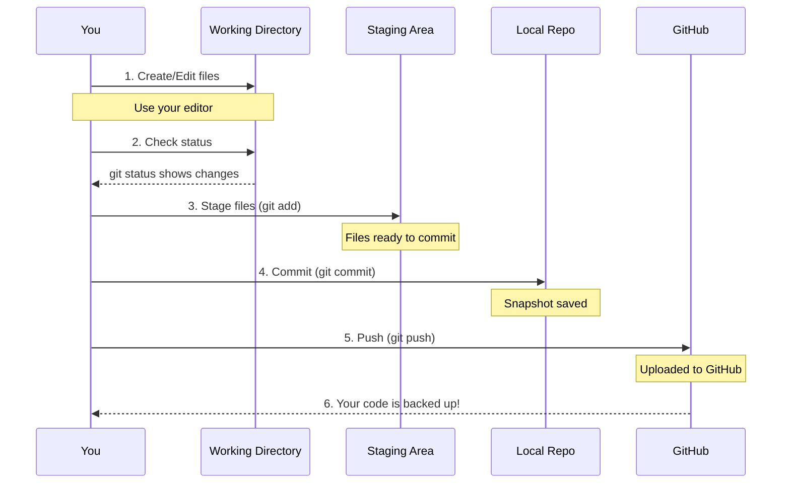
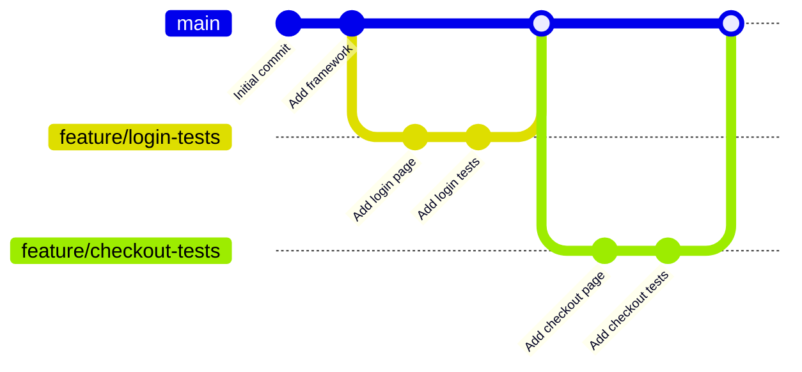
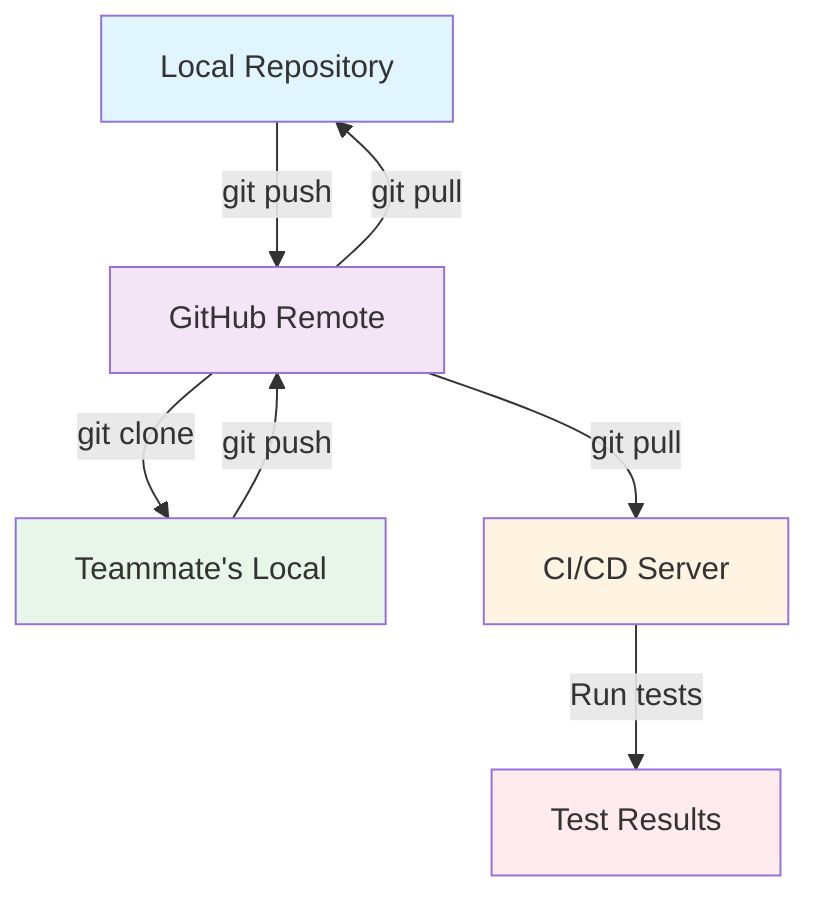
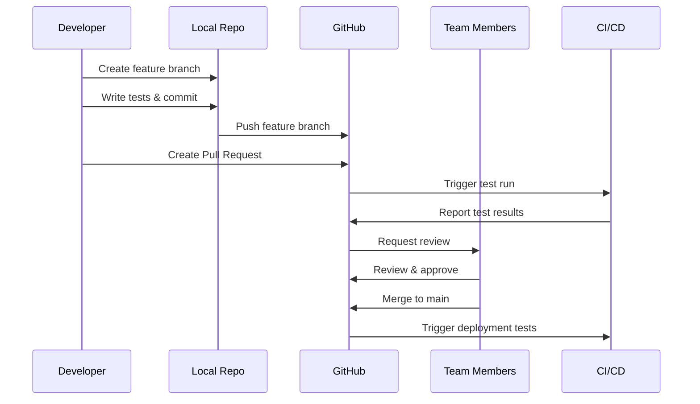
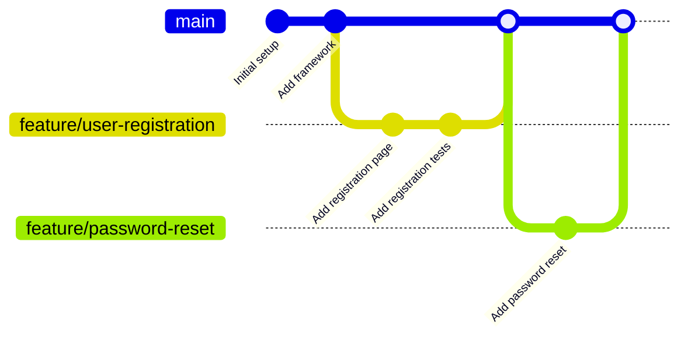
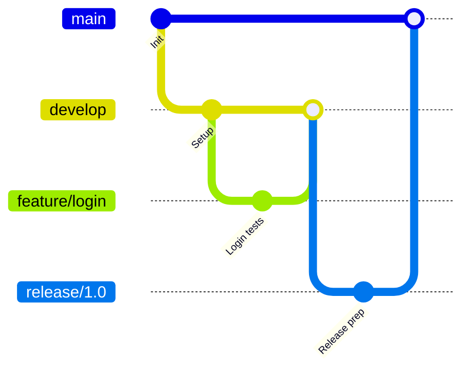
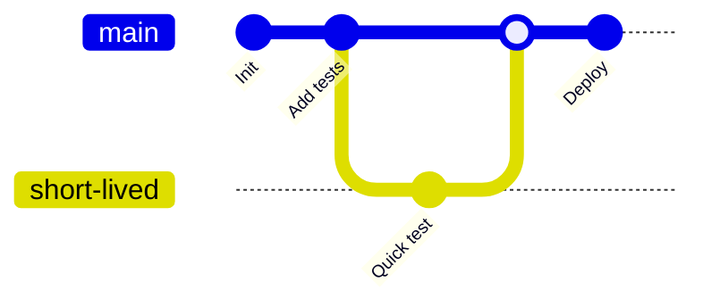

# Git & GitHub Mastery for Test Automation Engineers

**Last Updated:** February 2026  
**Target Audience:** Test automation engineers working with Playwright, Cypress, Selenium, and other test frameworks

---

## Table of Contents

1. [Introduction](#introduction)
2. [Installation & Setup](#installation--setup)
3. [Git Fundamentals](#git-fundamentals)
4. [Working with Branches](#working-with-branches)
5. [Collaboration with GitHub](#collaboration-with-github)
6. [Advanced Git Operations](#advanced-git-operations)
7. [Git Workflows for Test Automation](#git-workflows-for-test-automation)
8. [Best Practices](#best-practices)
9. [Troubleshooting](#troubleshooting)
10. [Assignments](#assignments)

---

## Introduction

### What is Version Control? (The Big Picture)

Imagine you're writing test automation scripts. You write a test, it works perfectly. Then you add more tests, and suddenly something breaks. You wish you could go back to when everything worked, right? Or maybe you're working with a team, and everyone is editing the same test files. How do you keep track of who changed what and when?

This is where **version control** comes in. Think of it like a time machine for your code that:
- Takes snapshots of your work at different points in time
- Lets you go back to any previous snapshot
- Shows you exactly what changed between snapshots
- Helps multiple people work on the same files without stepping on each other's toes

### What is Git? (Understanding the Basics)

**Git** is a version control system - think of it as a sophisticated "Save" button with superpowers.

#### Real-World Analogy:
Imagine you're writing a book:
- **Without Git:** You save files like `book.doc`, `book_v2.doc`, `book_final.doc`, `book_final_REALLY.doc`, `book_final_THIS_TIME_I_MEAN_IT.doc`
- **With Git:** You save ONE file called `book.doc`, but Git remembers every version you've ever saved, with notes about what you changed and why.

#### Why Git Matters for Test Automation:

**Scenario 1: The Broken Test**
```
Monday: You write login tests - everything works ✅
Tuesday: You add checkout tests - login tests still work ✅
Wednesday: You refactor page objects - login tests break ❌

With Git: You can see EXACTLY what you changed on Wednesday and easily undo it
Without Git: You're manually comparing files trying to remember what you changed
```

**Scenario 2: Team Collaboration**
```
You and your teammate both need to update the same test file:
- Without Git: You email files back and forth, losing changes
- With Git: You both work on the file, Git helps merge your changes automatically
```

### What is GitHub? (Git's Best Friend)

If Git is a time machine for your code, **GitHub** is like a library where you store your time machine's data in the cloud.

#### Key Differences:
- **Git** = Software on your computer (local)
- **GitHub** = Website/service in the cloud (remote)

#### Real-World Analogy:
- **Git** = Your personal journal at home
- **GitHub** = Google Drive where you backup your journal and share it with others

#### Why GitHub Matters:
1. **Backup:** Your computer crashes? Your code is safe on GitHub
2. **Collaboration:** Your team can access the code from anywhere
3. **Review:** Team members can review your tests before they go live
4. **Automation:** Automatically run your tests when code changes

### Git Architecture (How Git Actually Works)

Git works with three main areas. Let's understand each one:



#### 1. Working Directory (Your Workspace)
This is where you actually work - the files and folders you see and edit on your computer.

**Example:**
```
my-test-project/
├── tests/
│   └── login.test.js  ← You're editing this file
├── pages/
│   └── LoginPage.js
```

**Think of it as:** Your messy desk where you're actively working on documents.

#### 2. Staging Area (The Preparation Zone)
This is like a box where you put files you want to save. Not every file you change has to be saved together - you choose which ones.

**Example Scenario:**
```
You changed 3 files:
✏️  login.test.js - Ready to save
✏️  checkout.test.js - Ready to save
✏️  config.js - Still experimenting, NOT ready to save

You "stage" (git add) only login.test.js and checkout.test.js
```

**Think of it as:** A shipping box where you put items you want to mail (commit). Items not in the box aren't shipped.

#### 3. Local Repository (Your Saved History)
This is Git's database on your computer. It stores all the snapshots (commits) you've made.

**Think of it as:** A photo album where each photo is a snapshot of your project at a specific moment in time.

#### 4. Remote Repository (The Cloud Backup)
This is your project stored on GitHub's servers. It's accessible from anywhere and by anyone you give permission to.

**Think of it as:** A shared family photo album on Google Photos that everyone can access.

---

## Core Git Concepts Explained

Before we dive into commands, let's understand the key concepts:

### 1. Repository (Repo)
**What it is:** A folder that Git is tracking.

**Real-world analogy:** A notebook where you're taking notes. The notebook itself is the repository.

**Example:**
```bash
my-test-automation/  ← This is a repository (because it has .git inside)
├── .git/           ← Hidden folder where Git stores all history
├── tests/
└── pages/
```

### 2. Commit
**What it is:** A snapshot of your project at a specific point in time.

**Real-world analogy:** Taking a photo of your notebook page after writing something important.

**Key facts:**
- Each commit has a unique ID (like a photo timestamp)
- Each commit has a message (like a photo caption)
- You can go back to any commit (like looking at old photos)

**Example:**
```
Commit #1 (Monday 9 AM): "Add login test"
Commit #2 (Monday 2 PM): "Add logout test"
Commit #3 (Tuesday 10 AM): "Fix login test timeout"
```

### 3. Branch
**What it is:** A parallel version of your project.

**Real-world analogy:** Imagine you're writing a book:
- **Main branch:** The official published version
- **Chapter-5-draft branch:** You're experimenting with Chapter 5
- **alternative-ending branch:** Trying a different ending

You can work on multiple branches without affecting the main book!

**Visual Example:**
```
main branch:    A --- B --- C --- D
                        \
feature branch:          X --- Y --- Z
```

**Why use branches?**
- Work on new features without breaking existing code
- Experiment safely
- Multiple people can work on different features simultaneously

### 4. Checkout
**What it is:** Switching between different branches or commits (like changing TV channels).

**Real-world analogy:** Opening a different notebook, or flipping to a different page.

**Example:**
```bash
git checkout main              # Switch to main branch
git checkout feature/new-test  # Switch to feature branch
git checkout abc1234           # Go back to old commit (time travel!)
```

### 5. Push
**What it is:** Uploading your commits from your computer to GitHub.

**Real-world analogy:** Uploading photos from your phone to Google Photos.

**Before push (only on your computer):**
```
Your Computer: 😊 Has commits A, B, C
GitHub:        😴 Only has commits A, B
```

**After push:**
```
Your Computer: 😊 Has commits A, B, C
GitHub:        😊 Has commits A, B, C (synchronized!)
```

### 6. Pull
**What it is:** Downloading commits from GitHub to your computer.

**Real-world analogy:** Downloading photos from Google Photos to your phone.

**Use case:**
```
Your teammate pushed new commits to GitHub.
You pull those commits to get the latest code.
```

### 7. Clone
**What it is:** Copying an entire repository from GitHub to your computer.

**Real-world analogy:** Downloading someone's entire Google Drive folder to your computer.

**Use case:**
```
Day 1: Your team creates a project on GitHub
Day 2: You clone it to start working
```

### 8. Merge
**What it is:** Combining changes from two branches into one.

**Real-world analogy:** You and a friend both edited different chapters of a book. Merging combines both edits into one final book.

**Visual Example:**
```
main:     A --- B --- C --------- M (merged!)
                \               /
feature:          X --- Y --- Z
```

### 9. Conflict
**What it is:** When Git can't automatically merge because the same lines were changed differently.

**Real-world analogy:** You and a friend both edited the same sentence in different ways. Git doesn't know which version to keep.

**Example:**
```javascript
// Your version:
test('login with valid user', () => { ... });

// Teammate's version:
test('login with correct credentials', () => { ... });

// Git says: "You both changed this line. Which one should I keep?"
```

### 10. Remote
**What it is:** A version of your repository hosted on GitHub (or another server).

**Common remote name:** `origin` (this is just a nickname for the GitHub URL)

**Think of it as:** A nickname for "the GitHub version of my project"

### Quick Reference Chart

| Term | Simple Explanation | Command Example |
|------|-------------------|-----------------|
| **Repository** | Project folder Git is tracking | `git init` |
| **Commit** | Save a snapshot of your work | `git commit -m "message"` |
| **Branch** | Separate line of development | `git branch feature-name` |
| **Checkout** | Switch branches or go to old version | `git checkout branch-name` |
| **Push** | Upload to GitHub | `git push origin main` |
| **Pull** | Download from GitHub | `git pull origin main` |
| **Clone** | Copy repo from GitHub | `git clone <url>` |
| **Merge** | Combine branches | `git merge feature-name` |
| **Add** | Stage files for commit | `git add filename` |
| **Status** | See what changed | `git status` |

---

## Installation & Setup

### Installing Git

#### Windows

**Method 1: Using Git for Windows (Recommended)**

1. Download Git from [git-scm.com](https://git-scm.com/download/win)
2. Run the installer
3. **Important selections during installation:**
   - Choose "Git from the command line and also from 3rd-party software"
   - Select "Use bundled OpenSSH"
   - Choose "Checkout Windows-style, commit Unix-style line endings"
   - Select "MinTTY" as terminal emulator
   - Enable Git Credential Manager

4. Verify installation:
```bash
git --version
# Expected output: git version 2.43.0 or higher
```

**Method 2: Using Winget (Windows 11)**

```powershell
winget install --id Git.Git -e --source winget
```

#### macOS

**Method 1: Using Homebrew (Recommended)**

```bash
# Install Homebrew if not already installed
/bin/bash -c "$(curl -fsSL https://raw.githubusercontent.com/Homebrew/install/HEAD/install.sh)"

# Install Git
brew install git

# Verify
git --version
```

**Method 2: Using Xcode Command Line Tools**

```bash
xcode-select --install
```

#### Linux (Ubuntu/Debian)

```bash
# Update package index
sudo apt update

# Install Git
sudo apt install git -y

# Verify
git --version
```

#### Linux (Fedora/RHEL/CentOS)

```bash
sudo dnf install git -y
# or for older versions
sudo yum install git -y
```

### Initial Git Configuration

After installation, configure your identity (same commands for all platforms):

```bash
# Set your name
git config --global user.name "Your Name"

# Set your email (use your GitHub email)
git config --global user.email "your.email@example.com"

# Set default branch name to main
git config --global init.defaultBranch main

# Set default editor (choose one)
git config --global core.editor "code --wait"  # VS Code
# git config --global core.editor "nano"       # Nano (Linux/Mac)
# git config --global core.editor "notepad"    # Notepad (Windows)

# Enable colored output
git config --global color.ui auto

# Verify configuration
git config --list
```

### Line Ending Configuration (Important for Cross-Platform Teams)

```bash
# Windows users
git config --global core.autocrlf true

# Mac/Linux users
git config --global core.autocrlf input
```

### Setting Up GitHub Account

1. **Create GitHub Account**
   - Visit [github.com](https://github.com)
   - Sign up with your email
   - Verify your email address

2. **Set Up SSH Authentication (Recommended)**

Generate SSH key (all platforms):

```bash
# Generate new SSH key
ssh-keygen -t ed25519 -C "your.email@example.com"

# When prompted, press Enter to accept default location
# Optionally set a passphrase (recommended)

# Start SSH agent
# Windows (Git Bash)
eval "$(ssh-agent -s)"

# macOS
eval "$(ssh-agent -s)"

# Linux
eval "$(ssh-agent -s)"

# Add SSH key to agent
ssh-add ~/.ssh/id_ed25519
```

Display your public key:

```bash
# Windows (Git Bash)
cat ~/.ssh/id_ed25519.pub

# macOS/Linux
cat ~/.ssh/id_ed25519.pub

# Windows (PowerShell)
Get-Content ~/.ssh/id_ed25519.pub
```

3. **Add SSH Key to GitHub**
   - Go to GitHub → Settings → SSH and GPG keys
   - Click "New SSH key"
   - Paste your public key
   - Click "Add SSH key"

4. **Test SSH Connection**

```bash
ssh -T git@github.com
# Expected: "Hi username! You've successfully authenticated..."
```

5. **Alternative: HTTPS with Personal Access Token (PAT)**

If you prefer HTTPS over SSH:

- Go to GitHub → Settings → Developer settings → Personal access tokens → Tokens (classic)
- Generate new token with `repo` scope
- Save the token securely (you won't see it again)
- Use this token as password when pushing to GitHub

---

## Git Fundamentals

### Understanding Git States (The File Lifecycle)

Every file in your Git project can be in one of these states:



#### State 1: Untracked
**What it means:** Git knows the file exists, but isn't keeping history of it.

**Real-world analogy:** A photo you took but haven't imported into your photo library yet.

**Example:**
```bash
# You create a new file
echo "console.log('test');" > newTest.js

# Git sees it but isn't tracking it yet
git status
# Output: Untracked files:
#   newTest.js
```

#### State 2: Staged
**What it means:** File is ready to be committed (in the "shipping box").

**Real-world analogy:** Items in your shopping cart, ready to checkout.

**Example:**
```bash
git add newTest.js
git status
# Output: Changes to be committed:
#   new file: newTest.js
```

#### State 3: Committed
**What it means:** File is saved in Git's history.

**Real-world analogy:** Photo is now in your album with a timestamp.

**Example:**
```bash
git commit -m "Add new test file"
git status
# Output: nothing to commit, working tree clean
```

#### State 4: Modified
**What it means:** File was committed before, but you've changed it since.

**Real-world analogy:** You edited a document that was already saved - it needs saving again.

**Example:**
```bash
# Edit the file
echo "// Added comment" >> newTest.js

git status
# Output: Changes not staged for commit:
#   modified: newTest.js
```

---

### Creating Your First Repository

**Scenario:** You're starting a new test automation project for an e-commerce application.

#### Step 1: Create a Project Folder

**Windows (Command Prompt or PowerShell):**
```bash
mkdir ecommerce-test-automation
cd ecommerce-test-automation
```

**macOS/Linux (Terminal):**
```bash
mkdir ecommerce-test-automation
cd ecommerce-test-automation
```

**What this does:**
- `mkdir` = "make directory" (create folder)
- `cd` = "change directory" (go into folder)

#### Step 2: Initialize Git

```bash
git init
```

**What this does:**
- Creates a hidden `.git` folder inside your project
- This folder is Git's "brain" - it stores all history
- Your folder is now a Git repository!

**See what happened:**
```bash
# Windows
dir /a

# macOS/Linux
ls -la

# You'll see a .git folder (it's hidden by default)
```

**Output explanation:**
```
.git/           ← Git's database (DON'T delete this!)
```

#### Step 3: Verify Repository Creation

```bash
git status
```

**What this command does:**
- Shows the current state of your repository
- Lists changed files
- Shows which files are staged
- Shows which files are untracked

**Expected output:**
```
On branch main

No commits yet

nothing to commit (create/copy files and use "git add" to track)
```

**Translation:**
- "On branch main" = You're on the main branch (default branch)
- "No commits yet" = No snapshots saved yet
- "nothing to commit" = No changes to save

---

### Basic Git Workflow (Step-by-Step)

Let me show you the complete workflow with detailed explanations:



#### Step 1: Create Files

Let's create a realistic test project structure:

```bash
# Create folders
mkdir -p tests/login
mkdir -p tests/checkout
mkdir -p pages
mkdir -p config

# Windows alternative (if mkdir -p doesn't work):
# mkdir tests
# mkdir tests\login
# mkdir tests\checkout
# mkdir pages
# mkdir config
```

**What `-p` does:** Creates parent directories if they don't exist (not available in Windows Command Prompt, but works in Git Bash and PowerShell).

Now create some test files:

```bash
# Create a login test file
cat > tests/login/login.spec.js << 'EOF'
/**
 * Login Test Suite
 * Tests user authentication functionality
 */

describe('Login Functionality', () => {
  
  test('should successfully login with valid credentials', async () => {
    // Navigate to login page
    await page.goto('https://example.com/login');
    
    // Fill in credentials
    await page.fill('#username', 'testuser@example.com');
    await page.fill('#password', 'SecurePass123!');
    
    // Click login button
    await page.click('#login-button');
    
    // Verify successful login
    await expect(page).toHaveURL('https://example.com/dashboard');
    await expect(page.locator('.welcome-message')).toBeVisible();
  });

  test('should show error with invalid credentials', async () => {
    await page.goto('https://example.com/login');
    await page.fill('#username', 'wrong@example.com');
    await page.fill('#password', 'wrongpassword');
    await page.click('#login-button');
    
    // Verify error message appears
    await expect(page.locator('.error-message')).toContainText('Invalid credentials');
  });

});
EOF
```

**Note for Windows users:** If the `cat` command doesn't work, you can:
1. Use a text editor (VS Code, Notepad) to create the file manually
2. Use PowerShell with `Out-File` command
3. Use Git Bash (recommended)

Create a `.gitignore` file:

```bash
cat > .gitignore << 'EOF'
# Dependencies
node_modules/
package-lock.json

# Test results
test-results/
reports/
screenshots/
videos/
playwright-report/

# Environment files
.env
.env.local
.env.*.local

# IDE files
.vscode/
.idea/
*.swp
*.swo
.DS_Store

# Logs
*.log
npm-debug.log*

# Coverage
coverage/
.nyc_output/
EOF
```

**What is .gitignore?**
This file tells Git which files/folders to IGNORE. For example:
- `node_modules/` - Dependencies (huge folder, can be reinstalled)
- `.env` - Secret keys and passwords (NEVER commit these!)
- `test-results/` - Generated files (can be recreated)

#### Step 2: Check Status

```bash
git status
```

**Expected output:**
```
On branch main

No commits yet

Untracked files:
  (use "git add <file>..." to include in what will be committed)
        .gitignore
        tests/

nothing added to commit but untracked files present (use "git add" to track)
```

**Translation:**
- "Untracked files" = Git sees these files but isn't tracking them yet
- "use git add" = Git is telling you what to do next

#### Step 3: Stage Files (Add to "Shipping Box")

**Add specific file:**
```bash
git add tests/login/login.spec.js
```

**Add all files in a directory:**
```bash
git add tests/
```

**Add ALL files:**
```bash
git add .
```

**The dot (.) means "everything in current directory and subdirectories"**

Let's add everything:
```bash
git add .
```

**Check status again:**
```bash
git status
```

**Expected output:**
```
On branch main

No commits yet

Changes to be committed:
  (use "git rm --cached <file>..." to unstage)
        new file:   .gitignore
        new file:   tests/login/login.spec.js
```

**Translation:**
- "Changes to be committed" = These files are staged (in the shipping box)
- Files are now ready to be committed (saved as a snapshot)

#### Step 4: Commit (Save Snapshot)

```bash
git commit -m "Add login test suite with basic scenarios"
```

**Command breakdown:**
- `git commit` = Save a snapshot
- `-m` = "message" flag (let's you add a message)
- `"Add login test suite..."` = Your message describing what you did

**Expected output:**
```
[main (root-commit) abc1234] Add login test suite with basic scenarios
 2 files changed, 45 insertions(+)
 create mode 100644 .gitignore
 create mode 100644 tests/login/login.spec.js
```

**Translation:**
- `[main ...]` = Committed to main branch
- `abc1234` = Unique ID for this commit (yours will be different)
- `2 files changed` = You added 2 new files
- `45 insertions(+)` = You added 45 lines of code

**Check status again:**
```bash
git status
```

**Expected output:**
```
On branch main
nothing to commit, working tree clean
```

**Translation:** Everything is committed! No pending changes.

---

### Understanding Commit Messages (IMPORTANT!)

Commit messages are like diary entries for your code. They should explain WHAT you did and WHY.

#### ❌ Bad Commit Messages:
```bash
git commit -m "update"
git commit -m "fix"
git commit -m "changes"
git commit -m "asdf"
git commit -m "stuff"
```

**Why bad?** In 6 months, you won't remember what you changed!

#### ✅ Good Commit Messages:
```bash
git commit -m "Add login test for valid user credentials"
git commit -m "Fix timeout issue in checkout test"
git commit -m "Refactor page object to use modern selectors"
git commit -m "Add data-driven tests for multiple payment methods"
```

**Why good?** You can instantly understand what was changed.

#### Detailed Commit Message Format:

```bash
git commit -m "Short summary (50 chars or less)" -m "Detailed explanation

- Bullet point 1
- Bullet point 2
- Bullet point 3

Fixes: #123"
```

**Example:**
```bash
git commit -m "Add comprehensive checkout test suite" -m "Details:
- Test credit card payment flow
- Test PayPal payment flow  
- Test guest checkout
- Add validation for required fields
- Include negative test cases

This addresses the coverage gap identified in sprint planning.
Relates to ticket JIRA-456"
```

---

### Viewing Your History

#### Command: `git log`

**See all commits:**
```bash
git log
```

**Sample output:**
```
commit abc123def456 (HEAD -> main)
Author: Your Name <your.email@example.com>
Date:   Mon Feb 10 10:30:00 2026 -0800

    Add login test suite with basic scenarios
    
    - Add test for valid credentials
    - Add test for invalid credentials
    - Include proper assertions

commit 789ghi012jkl
Author: Your Name <your.email@example.com>
Date:   Mon Feb 10 09:15:00 2026 -0800

    Initial project setup
```

**Understanding the output:**
- `commit abc123def456` = Unique ID (hash) for this commit
- `(HEAD -> main)` = You're currently viewing the main branch, and HEAD points here
- `Author` = Who made the commit
- `Date` = When it was made
- The message you wrote

#### Command: `git log --oneline` (Compact View)

```bash
git log --oneline
```

**Output:**
```
abc1234 Add login test suite with basic scenarios
789ghi0 Initial project setup
```

**Much easier to read!** Shows just the commit ID (short version) and message.

#### Command: `git log --graph` (Visual Branching)

```bash
git log --oneline --graph --all
```

**Output:**
```
* abc1234 (HEAD -> main) Add login test suite
* 789ghi0 Initial project setup
```

**When you have branches, it looks like:**
```
*   abc1234 (HEAD -> main) Merge feature/checkout
|\  
| * def5678 (feature/checkout) Add checkout tests
| * ghi9012 Add checkout page object
|/  
* 789jkl3 Add login tests
* 456mno7 Initial setup
```

This shows the branch structure visually!

#### View Specific Number of Commits:

```bash
# Last 5 commits
git log -5

# Last 3 commits
git log -3 --oneline
```

#### Filter by Author:

```bash
git log --author="Your Name"
```

#### Search Commit Messages:

```bash
# Find commits mentioning "login"
git log --grep="login"

# Find commits mentioning "fix"
git log --grep="fix"
```

#### View Changes in Each Commit:

```bash
git log --stat
```

**Shows which files changed and how many lines:**
```
commit abc1234
Author: Your Name
Date: Mon Feb 10

    Add login tests

 tests/login/login.spec.js | 45 ++++++++++++++++++++++++
 1 file changed, 45 insertions(+)
```

---

### Checking Differences (What Changed?)

#### Command: `git diff`

**See unstaged changes (what you edited but haven't added):**
```bash
git diff
```

**Example output:**
```diff
diff --git a/tests/login/login.spec.js b/tests/login/login.spec.js
index abc1234..def5678 100644
--- a/tests/login/login.spec.js
+++ b/tests/login/login.spec.js
@@ -10,7 +10,8 @@ describe('Login Functionality', () => {
     await page.fill('#password', 'SecurePass123!');
     await page.click('#login-button');
     
-    await expect(page).toHaveURL('https://example.com/dashboard');
+    // Updated assertion with better wait
+    await expect(page).toHaveURL('https://example.com/dashboard', { timeout: 5000 });
   });
```

**Understanding the output:**
- `---` = Old version (before your changes)
- `+++` = New version (after your changes)
- `-` = Lines removed (in red typically)
- `+` = Lines added (in green typically)
- `@@ -10,7 +10,8 @@` = Line numbers (don't worry about this)

#### See Staged Changes:

```bash
git diff --staged
# or
git diff --cached
```

Shows what will be included in your next commit.

#### Compare Specific File:

```bash
git diff tests/login/login.spec.js
```

Only shows changes in that one file.

#### Compare Two Commits:

```bash
# First, get commit IDs
git log --oneline

# Output:
# abc1234 Latest commit
# def5678 Previous commit
# ghi9012 Even older commit

# Compare two commits
git diff ghi9012 abc1234
```

Shows ALL changes between those two commits.

#### Compare Branches:

```bash
git diff main feature/new-tests
```

Shows what's different between main branch and feature branch.

---

### Quick Reference: Basic Commands

| What You Want | Command | What It Does |
|---------------|---------|--------------|
| Start tracking a project | `git init` | Creates .git folder, starts Git |
| See what changed | `git status` | Shows modified/staged/untracked files |
| Stage ONE file | `git add filename.js` | Puts one file in "shipping box" |
| Stage ALL files | `git add .` | Puts all files in "shipping box" |
| Save snapshot | `git commit -m "message"` | Creates a commit (snapshot) |
| See history | `git log` | Shows all commits |
| See compact history | `git log --oneline` | Shows commits in one line each |
| See what you edited | `git diff` | Shows unstaged changes |
| See staged changes | `git diff --staged` | Shows what's ready to commit |
| Undo staging | `git restore --staged file` | Remove file from staging area |
| Discard changes | `git restore file` | Undo changes to file |

---

### Common Workflow Example

Here's a typical work session:

```bash
# 1. Check current status
git status

# 2. Make changes to files (use your editor)
# ... edit tests/login/login.spec.js ...

# 3. See what you changed
git diff

# 4. Stage the changes
git add tests/login/login.spec.js

# 5. Check staged changes
git diff --staged

# 6. Commit with a good message
git commit -m "Add timeout to login test assertion"

# 7. Check history
git log --oneline

# 8. Continue working...
```

---

## Working with Branches

### What are Branches? (The Complete Picture)

Imagine you're writing a book:
- **Main branch** = The official published version everyone reads
- **Chapter-draft branch** = You're experimenting with a new chapter
- **Alternative-ending branch** = Trying a completely different ending

You can work on all three simultaneously without affecting each other!

#### Why Branches are Essential for Test Automation

**Scenario 1: Working on New Features**
```
❌ Without branches:
- You start adding new checkout tests
- Halfway through, tests are broken
- Your teammate needs to run tests NOW
- You have broken code in the main codebase
- Everyone is blocked!

✅ With branches:
- You create feature/checkout-tests branch
- Break things all you want in your branch
- Main branch still has working tests
- Your teammate runs tests from main branch
- Everyone is happy!
```

**Scenario 2: Multiple People Working**
```
Team situation:
- You: Working on login tests
- Teammate A: Working on checkout tests  
- Teammate B: Working on API tests

With branches:
- You each work in your own branch
- Nobody steps on each other's toes
- Merge branches when ready
- No conflicts!
```

### Understanding Branches Visually



**What this shows:**
1. Main branch is the "trunk"
2. Feature branches split off to work on specific features
3. Branches merge back into main when complete
4. Work happens in parallel
5. Main branch remains stable

---

### Branch Commands Explained

#### 1. Viewing Branches

**See all local branches:**
```bash
git branch
```

**Output:**
```
* main
  feature/login-tests
  feature/checkout-tests
```

**The `*` shows which branch you're currently on** (called the "active" or "checked out" branch).

**See ALL branches (including remote):**
```bash
git branch -a
```

**Output:**
```
* main
  feature/login-tests
  feature/checkout-tests
  remotes/origin/main
  remotes/origin/feature/api-tests
```

**Understanding the output:**
- Local branches (on your computer)
- Remote branches (on GitHub) start with `remotes/origin/`

**See branches with last commit:**
```bash
git branch -v
```

**Output:**
```
* main                 abc1234 Add login tests
  feature/login-tests  def5678 Update login assertions
  feature/checkout      ghi9012 Add checkout page object
```

This shows the latest commit on each branch!

---

#### 2. Creating Branches

**Create a new branch:**
```bash
git branch feature/search-tests
```

**What this does:**
- Creates a new branch named `feature/search-tests`
- The new branch starts from wherever you are now
- Does NOT switch to the new branch

**Verify it was created:**
```bash
git branch
```

**Output:**
```
  feature/search-tests
* main
```

See? You're still on `main` (the `*`).

---

#### 3. Switching Branches

**Method 1: Using `checkout` (Traditional)**
```bash
git checkout feature/search-tests
```

**Output:**
```
Switched to branch 'feature/search-tests'
```

**Verify you switched:**
```bash
git branch
```

**Output:**
```
* feature/search-tests
  main
```

Now the `*` is next to `feature/search-tests`!

**Method 2: Using `switch` (Modern, Git 2.23+)**
```bash
git switch feature/search-tests
```

**Same result, clearer command name!**

**Why two commands?**
- `checkout` is older and does many things (confusing)
- `switch` is newer and specifically for switching branches (clearer)
- Both work fine!

---

#### 4. Create and Switch in One Command

**Traditional way:**
```bash
git branch feature/payment-tests
git checkout feature/payment-tests
```

**Shortcut using checkout:**
```bash
git checkout -b feature/payment-tests
```

**Shortcut using switch:**
```bash
git switch -c feature/payment-tests
```

**What `-b` and `-c` mean:**
- `-b` = "create a new **b**ranch"
- `-c` = "**c**reate a new branch"

**Practical example:**
```bash
# You're on main branch
git branch
# * main

# Create and switch to new branch in one command
git checkout -b feature/api-tests

# Verify
git branch
# * feature/api-tests
#   main
```

---

#### 5. Renaming Branches

**Rename current branch:**
```bash
git branch -m new-branch-name
```

**Rename a different branch:**
```bash
git branch -m old-name new-name
```

**Example:**
```bash
# You named it wrong
git branch feature/lgin-tests  # Typo: "lgin" instead of "login"

# Fix the typo
git branch -m feature/lgin-tests feature/login-tests

# Verify
git branch
```

**What `-m` means:** "**m**ove/rename"

---

#### 6. Deleting Branches

**Safe delete (warns if unmerged):**
```bash
git branch -d feature/completed-tests
```

**What this does:**
- Deletes the branch
- BUT only if it's been merged to main
- Protects you from losing work!

**Example of safe delete:**
```bash
# Create and merge a branch
git checkout -b feature/temp
echo "test" > temp.txt
git add temp.txt
git commit -m "temp commit"
git checkout main
git merge feature/temp

# Now delete it (safe)
git branch -d feature/temp
# Output: Deleted branch feature/temp
```

**Force delete (even if unmerged):**
```bash
git branch -D feature/abandoned-tests
```

**What `-D` means:** "Force delete" (capital D = dangerous!)

**Example when safe delete fails:**
```bash
# Create branch with uncommitted work
git checkout -b feature/experimental
echo "test" > exp.txt
git add exp.txt
git commit -m "experimental work"
git checkout main

# Try safe delete
git branch -d feature/experimental
# Output: error: The branch 'feature/experimental' is not fully merged.

# Force delete if you're sure
git branch -D feature/experimental
# Output: Deleted branch feature/experimental (was abc1234).
```

---

### Complete Branching Workflow Example

Let's walk through a complete real-world scenario:

**Scenario:** You need to add search functionality tests to your automation suite.

#### Step 1: Start from Main Branch

```bash
# Make sure you're on main
git checkout main

# Get the latest code from GitHub
git pull origin main
```

**Why start from main?**
- You want the most recent code
- This avoids conflicts later

#### Step 2: Create Feature Branch

```bash
git checkout -b feature/search-tests
```

**Branch naming conventions:**
```
feature/   → New feature
bugfix/    → Fixing a bug
hotfix/    → Urgent fix
refactor/  → Code improvement
test/      → Test-related changes

Examples:
feature/search-tests
bugfix/flaky-login-test
hotfix/critical-timeout
refactor/page-objects
```

#### Step 3: Work on Your Branch

```bash
# Create search test file
cat > tests/search/search.spec.js << 'EOF'
describe('Search Functionality', () => {
  
  test('should find products by name', async () => {
    await page.goto('https://example.com');
    await page.fill('#search-input', 'laptop');
    await page.click('#search-button');
    await expect(page.locator('.product-card')).toHaveCount(5);
  });

  test('should show no results for invalid search', async () => {
    await page.goto('https://example.com');
    await page.fill('#search-input', 'xyzabc123nonexistent');
    await page.click('#search-button');
    await expect(page.locator('.no-results')).toBeVisible();
  });

});
EOF

# Check status
git status
```

**Output:**
```
On branch feature/search-tests
Untracked files:
  tests/search/search.spec.js
```

#### Step 4: Commit Your Work

```bash
# Stage files
git add tests/search/

# Commit
git commit -m "Add search functionality tests"

# Continue working, make more commits
echo "// Add more tests" >> tests/search/search.spec.js
git add tests/search/search.spec.js
git commit -m "Add negative test cases for search"
```

**Check your branch's history:**
```bash
git log --oneline
```

**Output:**
```
def5678 (HEAD -> feature/search-tests) Add negative test cases for search
abc1234 Add search functionality tests
ghi9012 (main) Previous commit on main
```

See? Your branch has commits that main doesn't have yet!

#### Step 5: Switch Back to Main (Without Losing Your Work)

```bash
git checkout main
```

**What happens:**
- Your files return to how they were on main
- Your search tests "disappear" temporarily
- BUT they're safe in the feature/search-tests branch!

**Verify:**
```bash
ls tests/
# You won't see the search/ directory!

# Switch back to your branch
git checkout feature/search-tests

ls tests/
# Now you see search/ directory again!
```

**This is the magic of branches!** Your work is preserved but isolated.

---

### Merging Branches (Bringing Work Together)

**Merging** combines two branches into one. Think of it like combining two document versions into a final version.

#### Types of Merges

**1. Fast-Forward Merge (Simple)**

This happens when no changes were made to the target branch:

```
Before merge:
main:    A --- B --- C
                      \
feature:                D --- E

After merge:
main:    A --- B --- C --- D --- E
```

**2. Three-Way Merge (Common)**

This happens when both branches have new commits:

```
Before merge:
main:    A --- B --- C --- F
                  \
feature:            D --- E

After merge:
main:    A --- B --- C --- F --- M
                  \             /
feature:            D --- E ---
```

`M` is a "merge commit" that combines both branches.

#### How to Merge

**Step 1: Switch to target branch (where you want the changes)**

```bash
git checkout main
```

**Remember:** Always merge INTO the branch you're currently on!

**Step 2: Merge the feature branch**

```bash
git merge feature/search-tests
```

**Possible outcomes:**

**Outcome A: Success (Fast-Forward)**
```
Updating abc1234..def5678
Fast-forward
 tests/search/search.spec.js | 45 +++++++++++++++++++++
 1 file changed, 45 insertions(+)
 create mode 100644 tests/search/search.spec.js
```

**Translation:** Merge successful! Your changes are now in main.

**Outcome B: Success (Three-Way Merge)**
```
Merge made by the 'recursive' strategy.
 tests/search/search.spec.js | 45 +++++++++++++++++++++
 1 file changed, 45 insertions(+)
```

You might be asked to enter a commit message (default is "Merge branch 'feature/search-tests'").

**Outcome C: Conflict (Needs Resolution)**
```
Auto-merging tests/search/search.spec.js
CONFLICT (content): Merge conflict in tests/search/search.spec.js
Automatic merge failed; fix conflicts and then commit the result.
```

**Translation:** Git found changes in the same lines and doesn't know which to keep. You need to resolve manually! (We'll cover this next)

#### Step 3: Verify Merge

```bash
git log --oneline --graph
```

**You should see:**
```
*   abc1234 (HEAD -> main) Merge branch 'feature/search-tests'
|\  
| * def5678 (feature/search-tests) Add negative test cases
| * ghi9012 Add search tests
|/  
* jkl3456 Previous commit on main
```

#### Step 4: Push to GitHub

```bash
git push origin main
```

#### Step 5: Clean Up (Delete Feature Branch)

```bash
git branch -d feature/search-tests
```

**Now it's safe to delete because the work is merged into main!**

---

### Handling Merge Conflicts (Don't Panic!)

Conflicts happen when:
- Same file changed in both branches
- Same lines changed differently
- Git doesn't know which version to keep

#### Example Conflict Scenario

**Setup:**
```bash
# On main branch
git checkout main
cat > tests/config.js << 'EOF'
module.exports = {
  timeout: 5000,
  browser: 'chromium'
};
EOF
git add tests/config.js
git commit -m "Add config file"

# Create feature branch
git checkout -b feature/update-config

# Change timeout in feature branch
cat > tests/config.js << 'EOF'
module.exports = {
  timeout: 10000,  // Changed to 10000
  browser: 'chromium'
};
EOF
git add tests/config.js
git commit -m "Increase timeout to 10 seconds"

# Go back to main and change the SAME line differently
git checkout main
cat > tests/config.js << 'EOF'
module.exports = {
  timeout: 3000,  // Changed to 3000
  browser: 'chromium'
};
EOF
git add tests/config.js
git commit -m "Decrease timeout to 3 seconds"

# Try to merge feature branch
git merge feature/update-config
```

**Output:**
```
Auto-merging tests/config.js
CONFLICT (content): Merge conflict in tests/config.js
Automatic merge failed; fix conflicts and then commit the result.
```

#### Identifying Conflicts

```bash
git status
```

**Output:**
```
On branch main
You have unmerged paths.
  (fix conflicts and run "git commit")
  (use "git merge --abort" to abort the merge)

Unmerged paths:
  (use "git add <file>..." to mark resolution)
        both modified:   tests/config.js
```

**Translation:** `tests/config.js` has conflicts!

#### Viewing the Conflict

Open `tests/config.js`:

```javascript
module.exports = {
<<<<<<< HEAD
  timeout: 3000,  // main branch version
=======
  timeout: 10000,  // feature branch version
>>>>>>> feature/update-config
  browser: 'chromium'
};
```

**Conflict markers:**
- `<<<<<<< HEAD` = Start of current branch's version (main)
- `=======` = Separator
- `>>>>>>> feature/update-config` = End of merging branch's version

#### Resolving the Conflict

**Option 1: Keep main's version (3000)**
```javascript
module.exports = {
  timeout: 3000,
  browser: 'chromium'
};
```

**Option 2: Keep feature's version (10000)**
```javascript
module.exports = {
  timeout: 10000,
  browser: 'chromium'
};
```

**Option 3: Choose a compromise (7000)**
```javascript
module.exports = {
  timeout: 7000,  // Compromise between 3000 and 10000
  browser: 'chromium'
};
```

**Remove ALL conflict markers!** The final file should have no `<<<<<<<`, `=======`, or `>>>>>>>`.

#### Complete the Merge

```bash
# Stage the resolved file
git add tests/config.js

# Check status
git status
```

**Output:**
```
On branch main
All conflicts fixed but you are still merging.
  (use "git commit" to conclude merge)
```

**Commit the merge:**
```bash
git commit -m "Merge feature/update-config, set timeout to 7000ms"
```

**Done!** Conflict resolved and merge complete.

#### Aborting a Merge

If you want to cancel the merge and start over:

```bash
git merge --abort
```

**This returns everything to before you started the merge.**

---

### Branch Best Practices

#### 1. Branch Naming

```bash
✅ Good:
feature/add-login-tests
feature/api-integration
bugfix/flaky-search-test
hotfix/critical-timeout
refactor/page-objects

❌ Bad:
test
new-branch
my-changes
asdf
```

#### 2. Keep Branches Short-Lived

```bash
✅ Good workflow:
- Create branch
- Work for a few days
- Merge back to main
- Delete branch

❌ Bad workflow:
- Create branch
- Work for 2 months
- Main has changed dramatically
- Merge becomes a nightmare
```

#### 3. Pull Before Creating Branch

```bash
# ✅ Always do this:
git checkout main
git pull origin main
git checkout -b feature/new-work

# ❌ Don't create branches from old code:
git checkout -b feature/new-work  # Without pulling first
```

#### 4. One Feature Per Branch

```bash
✅ Good:
feature/add-login-tests → Only login tests

❌ Bad:
feature/many-things → Login tests + checkout tests + API tests + config changes
```

---

### Common Branching Scenarios

#### Scenario 1: Need to Switch Branches But Have Uncommitted Work

```bash
# You're working on feature/search-tests
# Files are modified but not committed

git checkout main
# Error: Your local changes would be overwritten by checkout

# Solution 1: Commit your work
git add .
git commit -m "WIP: Partial search test implementation"
git checkout main

# Solution 2: Stash your work (temporary save)
git stash
git checkout main
# Later, return and restore:
git checkout feature/search-tests
git stash pop
```

#### Scenario 2: Wrong Branch!

```bash
# Oh no! You made commits on main instead of a feature branch!

# See your commits
git log --oneline
# abc1234 (HEAD -> main) Oops, this should be in a branch
# def5678 Previous commit

# Create branch from current position
git branch feature/accidental-work

# Reset main to before your commits
git reset --hard def5678

# Switch to your new branch
git checkout feature/accidental-work

# Your commits are now in the right branch!
```

#### Scenario 3: Comparing Branches

```bash
# See what's different between main and your branch
git diff main..feature/search-tests

# See list of commits in feature but not in main
git log main..feature/search-tests --oneline
```

---

### Quick Reference: Branch Commands

| What You Want | Command | Notes |
|---------------|---------|-------|
| List branches | `git branch` | `*` shows current branch |
| List all branches | `git branch -a` | Includes remote branches |
| Create branch | `git branch name` | Doesn't switch to it |
| Switch branch | `git checkout name` | Traditional way |
| Switch branch | `git switch name` | Modern way (Git 2.23+) |
| Create + switch | `git checkout -b name` | Traditional shortcut |
| Create + switch | `git switch -c name` | Modern shortcut |
| Rename branch | `git branch -m old new` | Rename any branch |
| Delete branch | `git branch -d name` | Safe delete (merged only) |
| Force delete | `git branch -D name` | Delete even if unmerged |
| Merge branch | `git merge name` | Merge name INTO current branch |
| Abort merge | `git merge --abort` | Cancel a merge with conflicts |

---

## Collaboration with GitHub

### Working with Remote Repositories



### Pushing to GitHub

```bash
# Add remote repository (first time)
git remote add origin git@github.com:username/ecommerce-tests.git

# Verify remote
git remote -v

# Push to remote (first time)
git push -u origin main

# Subsequent pushes
git push

# Push specific branch
git push origin feature/new-tests

# Push all branches
git push --all

# Force push (use with caution!)
git push --force
```

### Cloning Repositories

```bash
# Clone via SSH (recommended)
git clone git@github.com:username/test-automation-project.git

# Clone via HTTPS
git clone https://github.com/username/test-automation-project.git

# Clone to specific directory
git clone git@github.com:username/project.git my-local-folder

# Clone specific branch
git clone -b develop git@github.com:username/project.git
```

### Fetching and Pulling

```bash
# Fetch updates from remote (doesn't merge)
git fetch origin

# Fetch all remotes
git fetch --all

# Pull updates (fetch + merge)
git pull

# Pull specific branch
git pull origin main

# Pull with rebase
git pull --rebase

# Pull all branches
git pull --all
```

### Pull Requests Workflow



**Creating a Pull Request:**

1. Push your branch to GitHub:
```bash
git push origin feature/checkout-tests
```

2. Go to GitHub repository
3. Click "Pull requests" → "New pull request"
4. Select base branch (usually `main`) and compare branch (your feature)
5. Add title and description:

```markdown
## Description
Add comprehensive checkout tests covering multiple payment methods

## Changes
- Add page objects for checkout flow
- Implement tests for credit card payment
- Implement tests for PayPal payment
- Add tests for guest checkout
- Add data-driven tests for different countries

## Test Coverage
- Payment methods: Credit Card, PayPal, Apple Pay
- User types: Guest, Registered, Premium
- Edge cases: Invalid cards, expired cards, insufficient funds

## How to Test
1. Install dependencies: `npm install`
2. Run tests: `npm test checkout`
3. View report: `npm run report`

## Screenshots/Videos
[Attach if applicable]
```

6. Request reviewers
7. Wait for CI checks and reviews
8. Address feedback if needed
9. Merge when approved

### Forking Workflow

```bash
# Fork repository on GitHub (click Fork button)

# Clone your fork
git clone git@github.com:yourusername/original-project.git
cd original-project

# Add upstream remote
git remote add upstream git@github.com:originalowner/original-project.git

# Verify remotes
git remote -v

# Fetch upstream changes
git fetch upstream

# Merge upstream changes
git checkout main
git merge upstream/main

# Push to your fork
git push origin main
```

---

## Advanced Git Operations

### Stashing Changes

```bash
# Stash current changes
git stash

# Stash with message
git stash save "WIP: Refactoring login tests"

# List stashes
git stash list

# Apply latest stash
git stash apply

# Apply specific stash
git stash apply stash@{2}

# Apply and remove from stash
git stash pop

# Drop stash
git stash drop stash@{1}

# Clear all stashes
git stash clear

# Stash including untracked files
git stash -u
```

**Use Case:** You're working on new tests but need to quickly fix a bug in another branch:

```bash
git stash save "WIP: New API tests"
git checkout main
git checkout -b bugfix/failing-test
# Fix the bug
git add .
git commit -m "Fix flaky authentication test"
git push origin bugfix/failing-test
git checkout feature/api-tests
git stash pop
```

### Cherry-Picking

```bash
# Cherry-pick specific commit
git cherry-pick abc1234

# Cherry-pick multiple commits
git cherry-pick abc1234 def5678

# Cherry-pick without committing
git cherry-pick -n abc1234
```

**Use Case:** You fixed a bug in feature branch but need it in main immediately:

```bash
git checkout main
git cherry-pick abc1234  # Commit hash from feature branch
git push origin main
```

### Resetting and Reverting

```bash
# Soft reset (keep changes staged)
git reset --soft HEAD~1

# Mixed reset (keep changes unstaged) - DEFAULT
git reset HEAD~1

# Hard reset (discard changes)
git reset --hard HEAD~1

# Reset to specific commit
git reset --hard abc1234

# Revert commit (creates new commit)
git revert abc1234

# Revert without committing
git revert -n abc1234
```

### Tags (Versioning Test Suites)

```bash
# Create lightweight tag
git tag v1.0.0

# Create annotated tag (recommended)
git tag -a v1.0.0 -m "Release version 1.0.0 - Complete login suite"

# List tags
git tag

# Show tag details
git show v1.0.0

# Tag specific commit
git tag -a v1.0.1 abc1234 -m "Hotfix release"

# Push tags
git push origin v1.0.0

# Push all tags
git push origin --tags

# Delete local tag
git tag -d v1.0.0

# Delete remote tag
git push origin --delete v1.0.0

# Checkout tag
git checkout v1.0.0
```

### Submodules (Managing Shared Test Libraries)

```bash
# Add submodule
git submodule add git@github.com:company/test-utilities.git libs/test-utils

# Clone repository with submodules
git clone --recursive git@github.com:company/main-tests.git

# Initialize submodules in existing clone
git submodule init
git submodule update

# Update submodules
git submodule update --remote

# Remove submodule
git submodule deinit libs/test-utils
git rm libs/test-utils
```

---

## Git Workflows for Test Automation

### Feature Branch Workflow



**Typical workflow:**

```bash
# 1. Start from updated main
git checkout main
git pull origin main

# 2. Create feature branch
git checkout -b feature/shopping-cart-tests

# 3. Work on tests
# ... make changes ...

# 4. Commit frequently
git add .
git commit -m "Add cart page object"
# ... more work ...
git commit -m "Add add-to-cart tests"

# 5. Push to remote
git push origin feature/shopping-cart-tests

# 6. Create Pull Request on GitHub

# 7. After review and merge, cleanup
git checkout main
git pull origin main
git branch -d feature/shopping-cart-tests
```

### Gitflow Workflow



**Branch types:**
- `main` - Production-ready test suite
- `develop` - Integration branch for features
- `feature/*` - New test features
- `release/*` - Preparing test release
- `hotfix/*` - Critical test fixes

### Trunk-Based Development



**Principles:**
- Very short-lived branches (hours, not days)
- Commit to main frequently
- Use feature flags for incomplete tests
- Heavy reliance on CI/CD

---

## Best Practices

### Commit Best Practices

1. **Commit frequently but meaningfully**
```bash
# Good frequency
git commit -m "Add login page object"
git commit -m "Add login test with valid credentials"
git commit -m "Add login test with invalid credentials"

# Too granular
git commit -m "Add import"
git commit -m "Add variable"
git commit -m "Add comment"

# Too broad
git commit -m "Complete entire test suite"
```

2. **Write clear commit messages**

Follow the convention:
```
<type>: <subject>

<body>

<footer>
```

Types for test automation:
- `test:` - Adding or updating tests
- `fix:` - Fixing test issues
- `refactor:` - Refactoring test code
- `docs:` - Documentation updates
- `config:` - Configuration changes
- `perf:` - Performance improvements

Example:
```
test: add comprehensive checkout flow tests

- Add tests for guest checkout
- Add tests for registered user checkout
- Add tests for multiple payment methods
- Cover edge cases for invalid cards

Closes #123
```

3. **Keep commits atomic**
   - One logical change per commit
   - Should be able to revert cleanly
   - Tests should pass after each commit

### Branch Naming Conventions

```bash
# Feature branches
feature/add-login-tests
feature/api-integration
feature/cross-browser-tests

# Bug fix branches
bugfix/flaky-search-test
bugfix/timeout-issue
fix/element-locator

# Hotfix branches
hotfix/critical-auth-test
hotfix/ci-failure

# Refactor branches
refactor/page-objects
refactor/test-data-management

# Include ticket number
feature/JIRA-123-add-payment-tests
bugfix/JIRA-456-fix-login-test
```

### .gitignore for Test Automation

```bash
# Create comprehensive .gitignore
cat > .gitignore << 'EOF'
# Node.js / JavaScript test frameworks
node_modules/
package-lock.json
yarn.lock
.npm
.yarn

# Python test frameworks
__pycache__/
*.py[cod]
*$py.class
.pytest_cache/
.tox/
venv/
env/
ENV/
*.egg-info/
dist/
build/

# Java test frameworks
target/
*.class
*.jar
*.war
!gradle-wrapper.jar
.gradle/
build/
.classpath
.project
.settings/

# Test results and reports
test-results/
allure-results/
allure-report/
reports/
coverage/
.nyc_output/
htmlcov/
junit.xml
test-output/
screenshots/
videos/
traces/
downloads/

# IDE and editor files
.vscode/
.idea/
*.swp
*.swo
*~
.DS_Store
Thumbs.db

# Environment and config files
.env
.env.local
.env.*.local
config.local.js
secrets.yml

# Logs
*.log
npm-debug.log*
yarn-debug.log*
logs/

# OS files
.DS_Store
.DS_Store?
._*
.Spotlight-V100
.Trashes
ehthumbs.db
Thumbs.db

# Temporary files
*.tmp
*.temp
.cache/
EOF
```

### Repository Structure for Test Automation

```
test-automation-project/
├── .github/
│   └── workflows/
│       └── test.yml          # CI/CD configuration
├── tests/
│   ├── e2e/
│   │   ├── login/
│   │   ├── checkout/
│   │   └── search/
│   ├── api/
│   │   ├── users/
│   │   └── products/
│   └── integration/
├── pages/                    # Page Object Models
│   ├── LoginPage.js
│   ├── CheckoutPage.js
│   └── BasePage.js
├── fixtures/                 # Test data
│   ├── users.json
│   └── products.json
├── utils/                    # Helper functions
│   ├── testHelper.js
│   └── dataGenerator.js
├── config/
│   ├── config.js
│   └── environments.js
├── .gitignore
├── README.md
├── package.json
└── playwright.config.js
```

### Protecting Important Branches

**On GitHub:**

1. Go to repository Settings → Branches
2. Add branch protection rule for `main`:
   - Require pull request reviews (at least 1)
   - Require status checks to pass (CI tests)
   - Require branches to be up to date
   - Restrict who can push
   - Require signed commits (optional)

### Managing Test Data with Git LFS

For large test files (videos, screenshots):

```bash
# Install Git LFS
# Windows: Included with Git for Windows
# Mac: brew install git-lfs
# Linux: sudo apt install git-lfs

# Initialize Git LFS
git lfs install

# Track large files
git lfs track "*.mp4"
git lfs track "*.png"
git lfs track "*.jpg"
git lfs track "test-data/*.csv"

# Verify tracking
cat .gitattributes

# Commit .gitattributes
git add .gitattributes
git commit -m "Configure Git LFS"

# Use normally
git add videos/test-recording.mp4
git commit -m "Add test recording"
git push
```

---

## Troubleshooting

### Common Issues and Solutions

#### Issue 1: Push Rejected (Non-fast-forward)

```bash
# Error message
! [rejected]        main -> main (non-fast-forward)

# Solution 1: Pull and merge
git pull origin main
# Resolve any conflicts
git push origin main

# Solution 2: Rebase
git pull --rebase origin main
# Resolve conflicts if any
git push origin main

# Solution 3: Force push (DANGEROUS - use only if sure)
git push --force origin main
```

#### Issue 2: Committed to Wrong Branch

```bash
# Reset last commit but keep changes
git reset --soft HEAD~1

# Switch to correct branch
git checkout correct-branch

# Re-commit
git add .
git commit -m "Your message"
```

#### Issue 3: Forgot to Add File to Last Commit

```bash
# Add forgotten file
git add forgotten-file.js

# Amend last commit
git commit --amend --no-edit

# If already pushed, force push (if no one else pulled)
git push --force origin feature-branch
```

#### Issue 4: Need to Undo Last Commit

```bash
# Keep changes, undo commit
git reset --soft HEAD~1

# Discard changes and commit
git reset --hard HEAD~1

# Already pushed? Create revert commit
git revert HEAD
git push origin branch-name
```

#### Issue 5: Accidentally Deleted Branch

```bash
# Find deleted branch commit
git reflog

# Find the commit (look for branch name)
# Output shows: abc1234 HEAD@{2}: commit: Last commit on deleted branch

# Restore branch
git checkout -b recovered-branch abc1234
```

#### Issue 6: Merge Conflicts

```bash
# See conflicted files
git status

# For each conflicted file:
# 1. Open in editor
# 2. Find conflict markers: <<<<<<<, =======, >>>>>>>
# 3. Resolve manually
# 4. Remove markers
# 5. Save file

# Stage resolved files
git add resolved-file.js

# Continue merge
git commit

# Or abort merge
git merge --abort
```

#### Issue 7: Detached HEAD State

```bash
# You're in detached HEAD if you see:
# HEAD detached at abc1234

# Create branch from current state
git checkout -b temp-branch

# Or return to a branch
git checkout main
```

#### Issue 8: Wrong Remote URL

```bash
# Check current remote
git remote -v

# Change remote URL
git remote set-url origin git@github.com:correct-user/correct-repo.git

# Verify
git remote -v
```

### Git Aliases for Efficiency

```bash
# Add helpful aliases
git config --global alias.co checkout
git config --global alias.br branch
git config --global alias.ci commit
git config --global alias.st status
git config --global alias.unstage 'reset HEAD --'
git config --global alias.last 'log -1 HEAD'
git config --global alias.visual 'log --oneline --graph --all'
git config --global alias.amend 'commit --amend --no-edit'

# Usage
git co main              # Instead of: git checkout main
git br -a               # Instead of: git branch -a
git visual              # Instead of: git log --oneline --graph --all
```

### Cleaning Up Repository

```bash
# Remove untracked files (dry run first)
git clean -n

# Remove untracked files
git clean -f

# Remove untracked files and directories
git clean -fd

# Remove ignored files too
git clean -fdx

# Prune remote-tracking branches
git remote prune origin

# Remove local branches that were deleted on remote
git fetch --prune

# List branches merged to main
git branch --merged main

# Delete merged branches (be careful!)
git branch --merged main | grep -v "main" | xargs git branch -d
```

---

## Assignments

### Assignment 1: Initial Setup ⭐

**Objective:** Set up Git and GitHub on your machine

**Tasks:**
1. Install Git on your operating system
2. Configure your Git identity (name and email)
3. Create a GitHub account
4. Set up SSH authentication
5. Test SSH connection to GitHub

**Deliverables:**
- Screenshot showing `git --version`
- Screenshot showing `git config --list`
- Screenshot showing successful SSH test

**Verification:**
```bash
git --version
git config user.name
git config user.email
ssh -T git@github.com
```

---

### Assignment 2: First Repository 🌟

**Objective:** Create and push your first Git repository

**Tasks:**
1. Create a directory named `calculator-tests`
2. Initialize Git repository
3. Create the following structure:
   ```
   calculator-tests/
   ├── tests/
   │   └── calculator.test.js
   ├── src/
   │   └── calculator.js
   ├── .gitignore
   └── README.md
   ```
4. Add sample content to files:

   **src/calculator.js:**
   ```javascript
   function add(a, b) {
     return a + b;
   }
   
   function subtract(a, b) {
     return a - b;
   }
   
   module.exports = { add, subtract };
   ```

   **tests/calculator.test.js:**
   ```javascript
   const { add, subtract } = require('../src/calculator');
   
   test('adds 1 + 2 to equal 3', () => {
     expect(add(1, 2)).toBe(3);
   });
   
   test('subtracts 5 - 2 to equal 3', () => {
     expect(subtract(5, 2)).toBe(3);
   });
   ```

5. Create appropriate `.gitignore`
6. Make initial commit
7. Create repository on GitHub
8. Push to GitHub

**Deliverables:**
- GitHub repository URL
- Screenshot of commit history

**Commands to use:**
```bash
git init
git add .
git commit -m "Initial commit"
git remote add origin [your-repo-url]
git push -u origin main
```

---

### Assignment 3: Branching and Merging 🌳

**Objective:** Practice branch operations and merging

**Scenario:** You need to add multiplication and division functions

**Tasks:**
1. Clone your calculator-tests repository (or use existing)
2. Create branch `feature/multiplication`
3. Add multiplication function to calculator.js
4. Add multiplication tests
5. Commit changes
6. Switch to main branch
7. Create branch `feature/division`
8. Add division function and tests
9. Commit changes
10. Merge both branches to main
11. Push to GitHub

**Challenge:** Create a merge conflict intentionally and resolve it
- Modify the same line in both branches
- Merge one branch first
- Then merge second branch and resolve conflict

**Deliverables:**
- GitHub repository with both features merged
- Screenshot showing branch graph
- Description of how you resolved conflict (if any)

**Commands:**
```bash
git checkout -b feature/multiplication
# Make changes
git add .
git commit -m "Add multiplication feature"
git checkout main
git merge feature/multiplication
```

---

### Assignment 4: Collaborative Workflow 🤝

**Objective:** Practice GitHub collaboration features

**Tasks:**
1. Fork a repository (use a public test automation repo or create a demo repo)
2. Clone your fork
3. Create a feature branch
4. Make changes (add new test or fix existing one)
5. Push to your fork
6. Create a Pull Request
7. Add detailed PR description
8. Make changes based on review (simulate by making additional commits)
9. Merge PR

**PR Description should include:**
```markdown
## What does this PR do?
[Brief description]

## Changes made
- [ ] Added new test cases
- [ ] Updated page objects
- [ ] Fixed flaky tests

## How to test
1. Step 1
2. Step 2
3. Expected result

## Screenshots
[If applicable]
```

**Deliverables:**
- Link to your forked repository
- Link to Pull Request
- Screenshot of PR conversation

---

### Assignment 5: Real Test Automation Project 🚀

**Objective:** Create a complete test automation repository

**Scenario:** Create test automation for a public website (e.g., saucedemo.com, automationexercise.com)

**Tasks:**
1. Create new repository: `ecommerce-test-automation`
2. Initialize with appropriate structure:
   ```
   ecommerce-test-automation/
   ├── .github/
   │   └── workflows/
   │       └── tests.yml
   ├── tests/
   │   ├── login/
   │   ├── products/
   │   └── checkout/
   ├── pages/
   ├── fixtures/
   ├── utils/
   ├── config/
   ├── .gitignore
   ├── README.md
   └── package.json (or requirements.txt for Python)
   ```

3. Implement at least 3 test scenarios
4. Use proper branching strategy
5. Create meaningful commits
6. Write comprehensive README with:
   - Project description
   - Setup instructions
   - How to run tests
   - Project structure explanation

7. Set up branch protection on main branch
8. Create at least 2 pull requests showing your workflow

**Deliverables:**
- GitHub repository URL
- README with clear documentation
- At least 5 meaningful commits
- At least 2 merged pull requests

---

### Assignment 6: Handling Conflicts 💥

**Objective:** Practice conflict resolution

**Tasks:**
1. Create repository with a test file
2. Create two branches from main
3. In both branches, modify the same test in different ways
4. Merge first branch to main
5. Try to merge second branch (conflict will occur)
6. Resolve conflict manually
7. Complete the merge

**Example conflict scenario:**

Branch 1 changes:
```javascript
test('user login', () => {
  // Login with valid credentials
  login('user@example.com', 'password123');
});
```

Branch 2 changes:
```javascript
test('user login', () => {
  // Authenticate user
  authenticateUser('user@example.com', 'password123');
});
```

**Deliverables:**
- Repository URL
- Screenshot of conflict
- Screenshot of resolved conflict
- Explanation of how you decided which changes to keep

---

### Assignment 7: Advanced Git Operations 🎯

**Objective:** Practice stashing, cherry-picking, and rebasing

**Tasks:**

**Part 1: Stashing**
1. Start working on new feature
2. Make changes but don't commit
3. Urgent bug fix needed
4. Stash your changes
5. Fix bug in different branch
6. Return and apply stash

**Part 2: Cherry-picking**
1. Create feature branch
2. Make 3 commits
3. One commit is a bug fix needed in main immediately
4. Cherry-pick that commit to main

**Part 3: Rebasing**
1. Create feature branch
2. Make 3 commits
3. Meanwhile, main branch has new commits
4. Rebase your feature branch onto updated main
5. Resolve any conflicts

**Deliverables:**
- Repository demonstrating all three operations
- Screenshots of each operation
- Explanation of when you would use each technique

---

### Assignment 8: Complete Workflow Simulation 🏆

**Objective:** Simulate real-world test automation development workflow

**Scenario:** You're part of a QA team. Multiple features need testing simultaneously.

**Tasks:**

1. **Setup**
   - Create organization/team repository
   - Set up branch protection
   - Create project board

2. **Sprint Simulation**
   - Create 4 issues for test scenarios:
     - Login functionality
     - Product search
     - Add to cart
     - Checkout process

3. **Development**
   - For each issue:
     - Create feature branch
     - Implement tests
     - Make multiple commits
     - Push to GitHub
     - Create Pull Request
     - Request review (self-review for this assignment)
     - Make review changes if needed
     - Merge to main

4. **Emergency Fix**
   - While working on a feature, a critical bug is reported
   - Stash your work
   - Create hotfix branch from main
   - Fix and merge
   - Return to feature work

5. **Release**
   - Tag the release
   - Generate release notes

**Deliverables:**
- Repository URL
- Link to project board
- At least 4 closed Pull Requests
- At least 1 release with tag
- Complete README with workflow documentation

---

### Assignment 9: CI/CD Integration 🔄

**Objective:** Integrate Git workflow with GitHub Actions

**Tasks:**

1. Create `.github/workflows/test.yml`:

```yaml
name: Test Automation

on:
  push:
    branches: [ main, develop ]
  pull_request:
    branches: [ main ]

jobs:
  test:
    runs-on: ubuntu-latest
    
    steps:
    - uses: actions/checkout@v4
    
    - name: Setup Node.js
      uses: actions/setup-node@v4
      with:
        node-version: '20'
    
    - name: Install dependencies
      run: npm ci
    
    - name: Run tests
      run: npm test
    
    - name: Upload test results
      if: always()
      uses: actions/upload-artifact@v4
      with:
        name: test-results
        path: test-results/
```

2. Configure tests to run automatically on:
   - Every push to main
   - Every pull request
   - Scheduled runs (daily)

3. Add status badge to README

**Deliverables:**
- Repository with working CI/CD
- Screenshot of successful workflow run
- Screenshot of failed workflow (intentionally break a test)
- Badge in README showing build status

---

### Assignment 10: Code Review Practice 👥

**Objective:** Practice code review process

**Tasks:**

1. **Setup Review Guidelines**
   - Create `CONTRIBUTING.md` with:
     - Code standards
     - Commit message format
     - PR template
     - Review checklist

2. **Create PR Template**
   
   `.github/pull_request_template.md`:
   ```markdown
   ## Description
   [Describe what this PR does]

   ## Type of Change
   - [ ] New test suite
   - [ ] Bug fix
   - [ ] Refactoring
   - [ ] Documentation

   ## Test Coverage
   - [ ] All tests pass locally
   - [ ] New tests added
   - [ ] Existing tests updated

   ## Checklist
   - [ ] Code follows style guidelines
   - [ ] Self-review completed
   - [ ] Comments added for complex logic
   - [ ] No sensitive data committed
   - [ ] Tests are not flaky
   ```

3. **Review Process**
   - Create 3 PRs with different scenarios:
     - Perfect PR (should be approved)
     - PR with issues (request changes)
     - PR with questions (request clarifications)
   
4. **Self-Review**
   - Add review comments to your own PRs
   - Document what you would look for

**Deliverables:**
- Repository with CONTRIBUTING.md
- PR template configured
- 3 example PRs with review comments
- Document listing review checklist items

---

## Additional Resources

### Learning Resources

**Documentation:**
- [Official Git Documentation](https://git-scm.com/doc)
- [GitHub Documentation](https://docs.github.com)
- [Atlassian Git Tutorials](https://www.atlassian.com/git/tutorials)

**Interactive Learning:**
- [Learn Git Branching](https://learngitbranching.js.org/)
- [GitHub Skills](https://skills.github.com/)

**Books:**
- "Pro Git" by Scott Chacon (free online)
- "Git for Teams" by Emma Jane Hogbin Westby

**Videos:**
- [Git and GitHub for Beginners - Crash Course](https://www.youtube.com/watch?v=RGOj5yH7evk)
- [Advanced Git Tutorial](https://www.youtube.com/watch?v=qsTthZi23VE)

### Git Cheat Sheet

```bash
# Setup
git config --global user.name "Name"
git config --global user.email "email@example.com"

# Create
git init
git clone <url>

# Status & History
git status
git log
git log --oneline --graph --all
git diff

# Branch
git branch <name>
git checkout <name>
git checkout -b <name>
git merge <branch>
git branch -d <name>

# Update
git add <file>
git add .
git commit -m "message"
git commit -am "message"

# Remote
git remote add origin <url>
git push origin <branch>
git pull origin <branch>
git fetch

# Undo
git reset HEAD <file>
git reset --soft HEAD~1
git reset --hard HEAD~1
git revert <commit>

# Stash
git stash
git stash pop
git stash list

# Tags
git tag <name>
git push origin <tag>
```

---

## Conclusion

This guide covers the essential Git and GitHub workflows for test automation engineers. Practice the assignments systematically, and you'll develop strong version control skills that are crucial for professional test automation development.

Remember:
- Commit frequently with meaningful messages
- Use branches for all new work
- Keep your main branch stable
- Review code before merging
- Document your processes
- Collaborate effectively with your team

**Happy testing and version controlling! 🚀**

---

**Version:** 1.0  
**Last Updated:** February 2026  
**Maintained by:** Test Automation Community  
**License:** MIT

For questions or contributions, please create an issue in the repository or submit a pull request.
